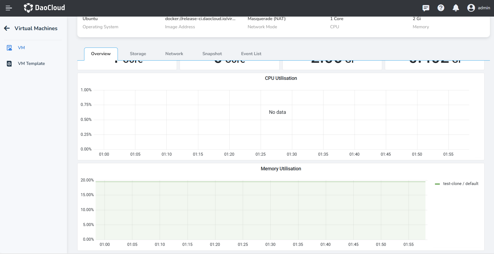

# Virtual Machine Details

After successfully [creating a virtual machine](../quickstart/index.md), you can enter the VM Detail page to view 
Basic Information, Settings, GPU Settings, Overview, Storage, Network, Snapshot and Event List.

Click __Container Management__ in the left navigation bar, then click __Clusters__ to enter the page of the cluster 
where the virtual machine is located. Click the VM Name to view the virtual machine details.

### Basic Information

The basic information of VM includes Status, Alias, Cluster, Namespace, IP, Label, Annotation, Node, Username, Password, and Create Time.

- Status: The current running state of the virtual machine (Running / Processing / Power Off / Error).
- IP: The IP of the virtual machine. For virtual machines with multiple network interfaces, multiple IP will be assigned.

### Settings & GPU Settings

Settings includes:

- Operating System: The operating system installed on the virtual machine to execute programs.
- Image Address: A link to a virtual hard disk file or operating system installation media, which is used to 
  load and install the operating system in the virtual machine software.
- Network Mode: The network mode configured for the virtual machine, including `Bridge` or `Masquerade(NAT)`.
- CPU & Memory: The resources allocated to the virtual machine.

GPU Settings includes: GPU Type, GPU Model and GPU Counts

### Other Information

=== "Overview"

    It allows you to view its insight content. Please note that if insight-agent is not installed, 
    overview information cannot be obtained.

    

=== "Storage"

    It displays the storage used by the virtual machine, including information about the system disk and data disk.

    

=== "Network"

    It displays the network settings of the virtual machine, including Multus CR, NIC Name, IP Address and so on.

    

=== "Snapshots"

    If you have [created snapshots](../vm/snapshot.md), this part will display relative information. 
    Restoring the virtual machine from snapshots is supported.

    

=== "Event List"

    The event list includes various state changes, operation records, and system messages during the lifecycle 
    of the virtual machine.

    
