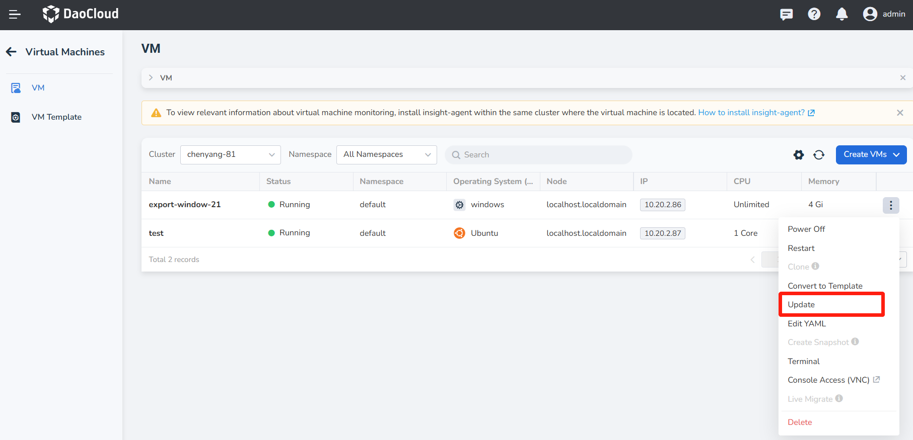
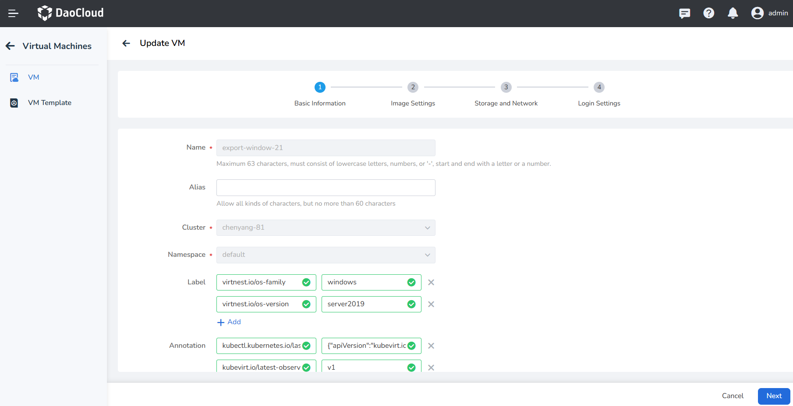
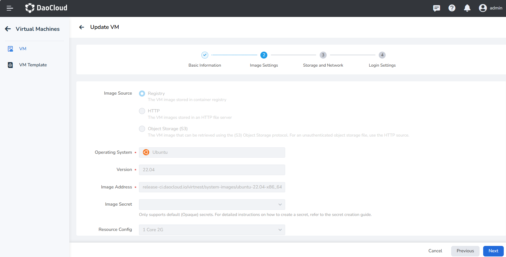
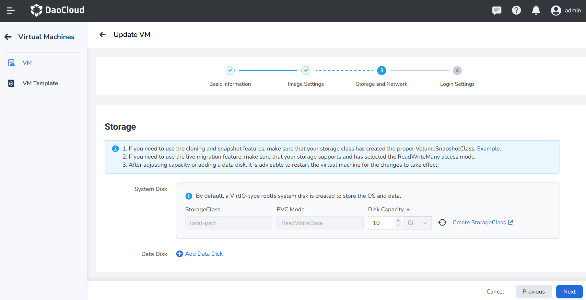
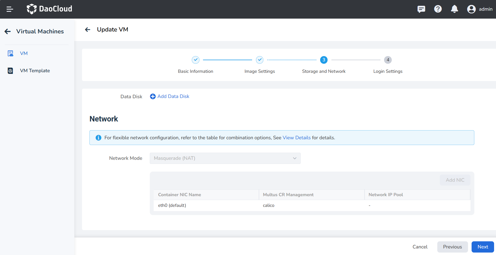
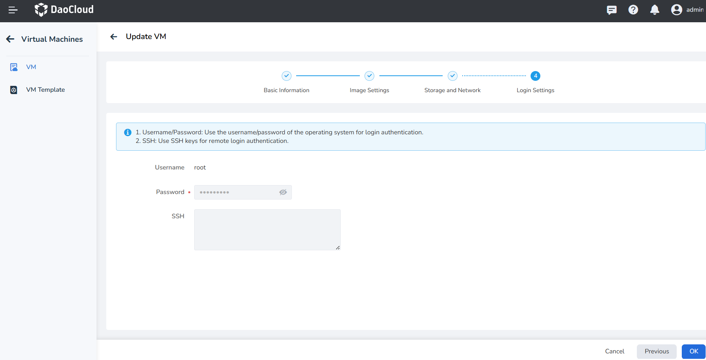
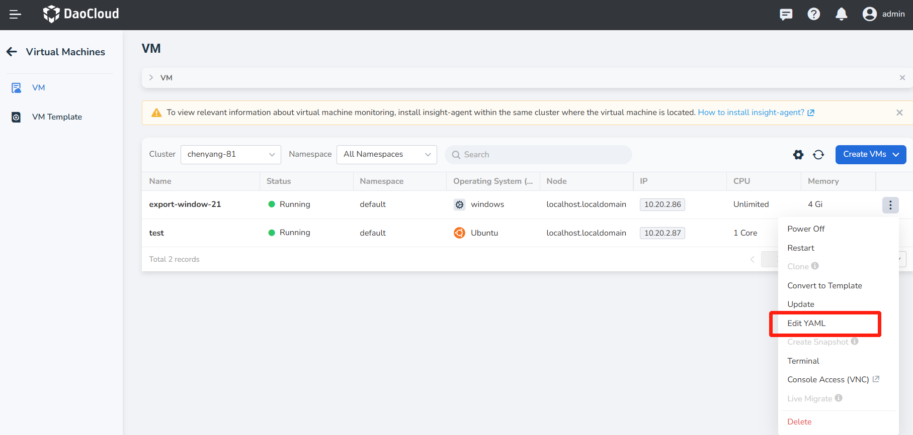
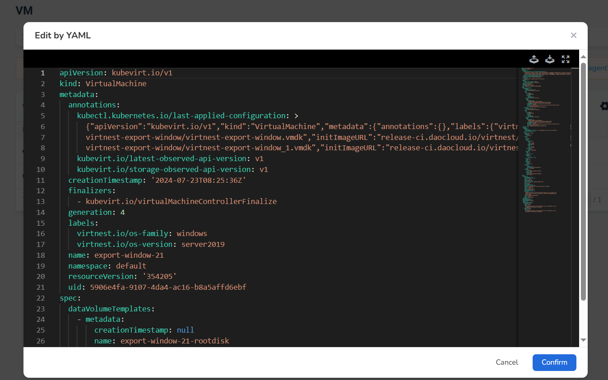

# Update Virtual Machine

This page is about how to update a virtual machine using both forms and YAML files.

## Prerequisite

Before updating the CPU, memory, and data disks of the VM while it is powered on, the following prerequisite must be met:

- Live migration is supported.

## Update Virtual Machine via Form

On the virtual machine list page, click __Update__ to enter the Update VM page.

### Basic Information

On this page, __Alias__ , __Label__ and __Annotation__ can be updated, while other information cannot. 
After completing the updates, click __Next__ to proceed to the Image Settings page.

### Image Settings

On this page, parameters such as Image Address, Operating System, and Version cannot be changed once selected. 
Users are allowed to update the __GPU Quota__, including enabling or disabling GPU support, selecting the GPU type, 
specifying the required model, and configuring the number of GPU. A restart is required for taking effect. 
After completing the updates, click __Next__ to proceed to the Storage and Network page.

### Storage and Network

On the Storage and Network page, the StorageClass and PVC Mode for the System Disk cannot be changed once selected. 
You can increase Disk Capacity, but reducing it is not supported. And you can freely add or remove Data Disk. 
Network updates are not supported. After completing the updates, click __Next__ to proceed to the Login Settings page.

!!! note

    It is recommended to restart the virtual machine after modifying storage capacity or adding data disks to 
    ensure the configuration takes effect.

### Login Settings

On the Login Settings page, Username, Password, and SSH cannot be changed once set. 
After confirming your login information is correct, click __OK__ to complete the update process.

## Edit YAML

In addition to updating the virtual machine via forms, you can also quickly update it using a YAML file.

Go to the virtual machine list page and click the __Edit YAML__ button.

