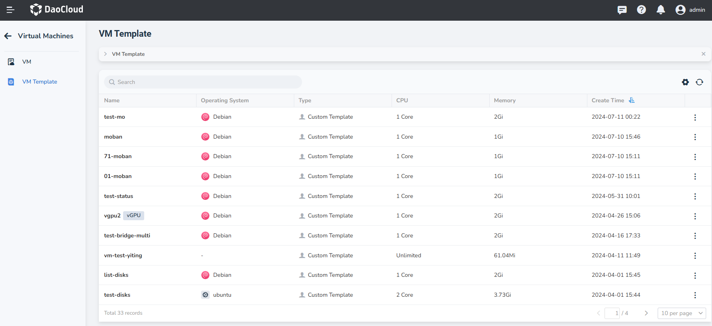
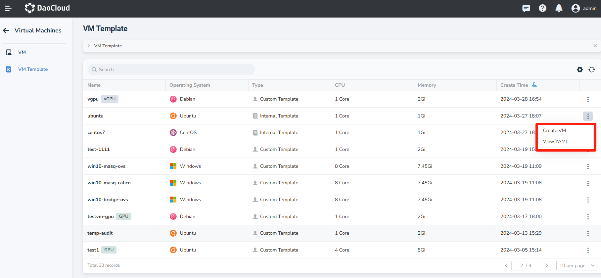
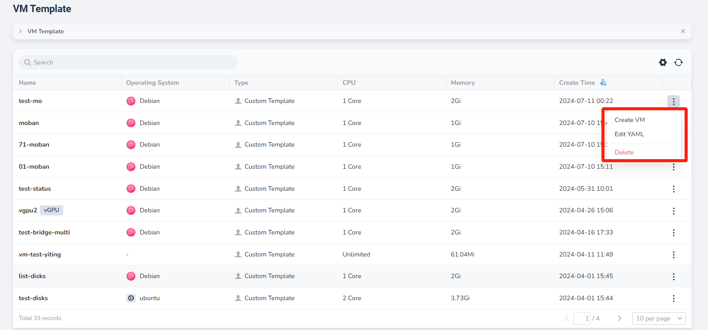
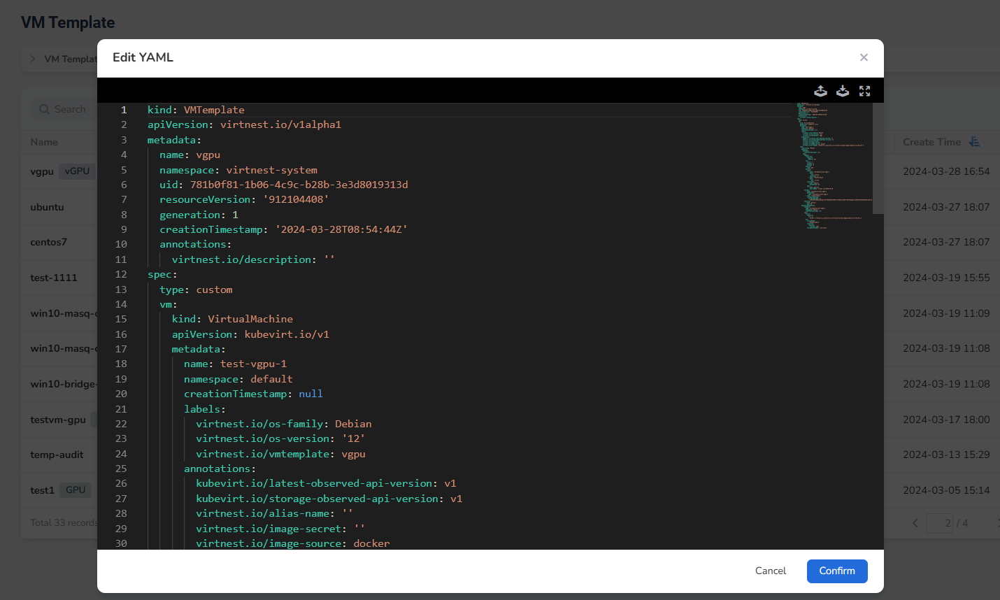
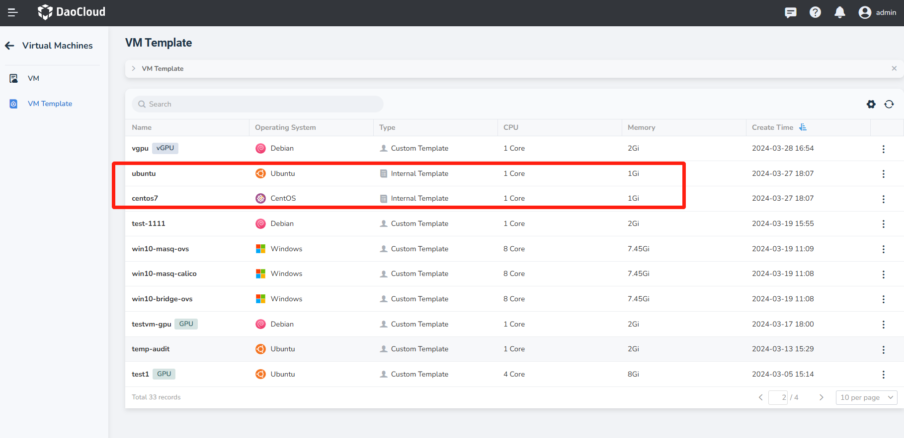
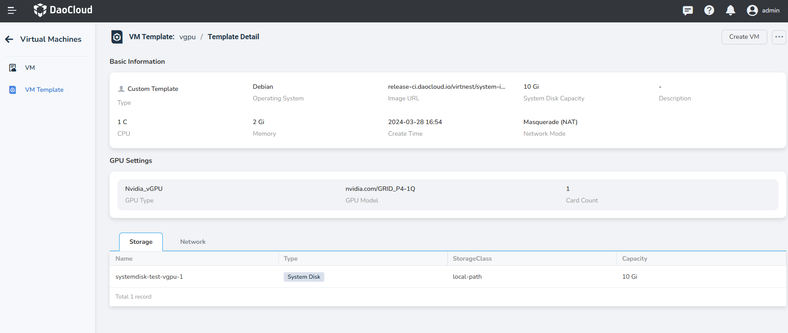

# VM Template

This guide explains the usage of internal VM templates and custom VM templates.

Using both internal and custom templates, users can easily create new VMs.
Additionally, we provide the ability to convert existing VMs into VM templates,
allowing users to manage and utilize resources more flexibly.

## VM Templates

1. Click __Container Management__ in the left navigation menu, then click __VM Template__ to access the __VM Template__ page. If the template is converted from a virtual machine configured with a GPU, the template will also include GPU information and will be displayed in the template list.

    

2. Click the __┇__ on the right side of a template in the list. For internal templates, you can create VM and view YAML.
   For custom templates, you can create VM, edit YAML and delete template.

    

    

    

### Internal Template

- The platform provides CentOS and Ubuntu as templates.

    

### Custom Template

Custom templates are created from VM configurations. The following steps explain how to convert a VM configuration
into a template.

1. Click __Container Management__ in the left navigation menu, then click __Virtual Machines__ to access the list page.
   Click the __┇__ on the right side of a VM in the list to convert the configuration into a template. Only running
   or stopped VMs can be converted.

    

2. Provide a name for the new template. A notification will indicate that the original VM will be preserved and
   remain available. After a successful conversion, a new entry will be added to the template list.

    

### Template Details

After successfully creating a template, you can click the template name to view the details of the VM,
including Basic Information, GPU Settings, Storage, Network, and more. If you need to quickly deploy a
new VM based on that template, simply click the __Create VM__ button in the upper right corner of the
page for easy operation.

