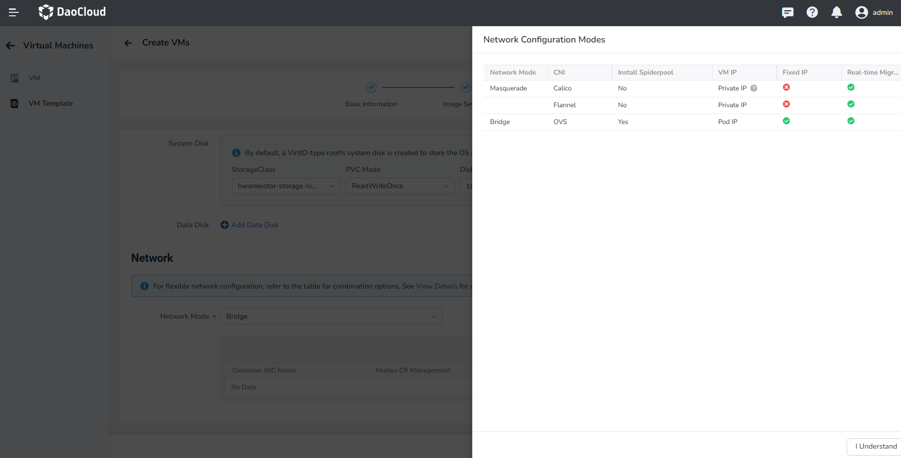
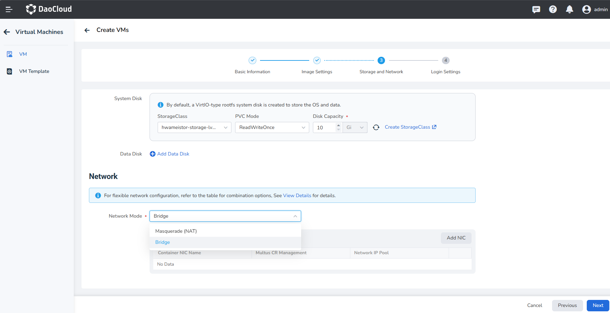
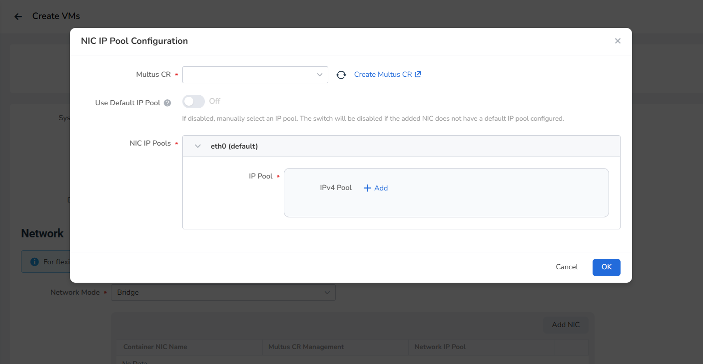

# Create Virtual Machine

This article will explain how to create a virtual machine using two methods: image and YAML file.

Virtual machine, based on KubeVirt, manage virtual machines as cloud native applications,
seamlessly integrating with containers. This allows users to easily deploy virtual machine applications and
enjoy a smooth experience similar to containerized applications.

## Prerequisites

Before creating a virtual machine, make sure you meet the following prerequisites:

- Install the virtnest-agent within the cluster.
- Create a [namespace](../../kpanda/user-guide/namespaces/createns.md) and [user](../../ghippo/user-guide/access-control/user.md).
- The current user should have [Cluster Admin](../../kpanda/user-guide/permissions/permission-brief.md#cluster-admin)
  or higher permissions. Refer to the documentation on
  [namespace authorization](../../kpanda/user-guide/namespaces/createns.md) for more details.
- Prepare the required images in advance.

## Create image

Follow the steps below to create a virtual machine using an image.

1. Click __Container Management__ on the left navigation bar, then click __Virtual Machine__ to enter the __VM__ page.

    

2. On the virtual machine list page, click __Create VMs__ and select __Create with Image__.

    

3. Fill the basic information, image settings, storage and network, login settings, and click __OK__ at the bottom right corner to complete the creation.

    The system will automatically return to the virtual machine list. By clicking the __︙__ button
    on the right side of the list, you can perform operations such as power on/off, restart,
    clone, update, create snapshots, console access (VNC), and delete virtual machines.
    Cloning and snapshot capabilities depend on the selected StorageClass.

    

### Basic Information

In the __Create VMs__ page, enter the information according to the table below and click __Next__.


- Name: Up to 63 characters, can only contain lowercase letters, numbers, and hyphens ( __-__ ),
  and must start and end with a lowercase letter or number. The name must be unique within the
  namespace, and cannot be changed once the virtual machine is created.
- Alias: Allows any characters, up to 60 characters.
- Cluster: Select the cluster to deploy the newly created virtual machine.
- Namespace: Select the namespace to deploy the newly created virtual machine.
  If the desired namespace is not found, you can create a new namespace according to the prompts on the page.
- Label/Annotation: Select the desired labels/annotations to add to the virtual machine.

### Image Settings

Fill in the image-related information according to the table below, then click __Next__.

  

- Image Source: Supports three types of sources.

    - Repository: Images stored in the container image repository, supporting the option
      to enable or disable using system-built images. When enabled, you can use the platform's
      built-in images. When disabled, you can select images from the image repository as needed.
    - HTTP: Images stored in a file server using the HTTP protocol, supporting both
      __HTTPS://__ and __HTTP://__ prefixes.
    - Object Storage (S3): Virtual machine images obtained through the object storage protocol (S3).
      For non-authenticated object storage files, please use the HTTP source.

- Currently, the following operating systems and versions are supported.

    | Operating System | Version | Image Address |
    | :--------------: | :------------------: | ------------- |
    |      CentOS      |       CentOS 8.3      | release-ci.daocloud.io/virtnest/system-images/centos-7.9-x86_64:v1 |
    |      Ubuntu      |     Ubuntu 22.04      | release-ci.daocloud.io/virtnest/system-images/ubuntu-22.04-x86_64:v1 |
    |      Debian      |       Debian 12       | release-ci.daocloud.io/virtnest/system-images/debian-12-x86_64:v1 |

- Image Secret: Only supports the default (Opaque) type of key, for specific operations you can refer to [Create Secret](../vm/create-secret.md).

- Resource Config: For CPU, it is recommended to use whole numbers.
  If a decimal is entered, it will be rounded up.

### Storage and Network

  

- Storage:
  
    - Storage is closely related to the function of the virtual machine. Mainly by using Kubernetes' persistent volumes and storage classes, it provides flexible and scalable virtual machine storage capabilities. For example, the virtual machine image is stored in the PVC, and it supports cloning, snapshotting, etc. with other data.

    - System Disk: The system automatically creates a VirtIO type rootfs system disk for storing the operating system and data.

    - Data Disk: The data disk is a storage device in the virtual machine used to store user data, application data, or other non-operating system related files. Compared with the system disk, the data disk is optional and can be dynamically added or removed as needed. The capacity of the data disk can also be flexibly configured according to demand.
    
    - Block storage is used by default. If you need to use the clone and snapshot functions, make sure that your storage pool has created the corresponding VolumeSnapshotClass, which you can refer to the following example. If you need to use the live migration function, make sure your storage supports and selects the ReadWriteMany access mode.

        In most cases, the storage will not automatically create such a VolumeSnapshotClass during the installation process, so you need to manually create a VolumeSnapshotClass.
        The following is an example of HwameiStor creating a VolumeSnapshotClass:
        
          ```yaml
          kind: VolumeSnapshotClass
          apiVersion: snapshot.storage.k8s.io/v1
          metadata:
            name: hwameistor-storage-lvm-snapshot
            annotations:
              snapshot.storage.kubernetes.io/is-default-class: "true"
          parameters:
            snapsize: "1073741824"
          driver: lvm.hwameistor.io
          deletionPolicy: Delete
          ```
        
    - Run the following command to check if the VolumeSnapshotClass was created successfully.
        
        ```sh
        kubectl get VolumeSnapshotClass
        ```
        
    - View the created Snapshotclass and confirm that the provisioner property is consistent with the Driver property in the storage pool.
  
- Network:

    - Network setting can be combined as needed according to the table information. If you need to use the live migration function, you need to use the Masquerade network mode.
  
        | Network Mode         | CNI     | Install Spiderpool | Network Card Mode | Fixed IP    | Live Migration |
        | -------------------- | ------- | ------------------ | ----------------- | ----------- | -------------- |
        | Masquerade (NAT)     | Calico  | ❌                | Single Network Card | ❌         | ✅             |
        |                      | Cilium  | ❌                | Single Network Card | ❌         | ✅             |
        |                      | Flannel | ❌                | Single Network Card | ❌         | ✅             |
        | Passthrough       | macvlan | ✅                | Single Network Card | ✅         | ❌             |
        |                      | ipvlan  | ✅                | Multiple Network Card | ✅       | ❌             |
        | Bridge     | OVS     | ✅                | Multiple Network Card | ✅       | ❌             |
    
        
  
    - Network modes are divided into Masquerade (NAT), Passthrough, Bridge, the latter two modes need to be installed after the spiderpool component can be used.
  
        - The network mode of Masquerade (NAT) is selected by default, using the default network card eth0.
        - If the spiderpool component is installed in the cluster, you can choose the Passthrough / Bridge mode, and the Bridge mode supports the multi-network card format.
  
        
    
    - Add Network Card
    
        - Passthrough / Bridge mode supports manual addition of network cards. Click __Add NIC__ to configure the network card IP pool. Choose the Multus CR that matches the network mode, if not, you need to create it yourself.
        - If you turn on the __Use Default IP Pool__ switch, use the default IP pool in the multus CR setting. If the switch is off, manually select the IP pool.
   
        

### Login Settings

- Username/Password: Allows login to the virtual machine using a username and password.
- SSH: When selecting the SSH login method, you can bind an SSH key to the virtual machine for future login.


## Create with YAML

In addition to creating virtual machines using images, you can also create them more quickly using YAML files.

Go to the Virtual Machine list page and click the __Create with YAML__ button.


??? note "Click to view an example YAML for creating a virtual machine"

    ```yaml
    apiVersion: kubevirt.io/v1
    kind: VirtualMachine
    metadata:
      name: example
      namespace: default
    spec:
      dataVolumeTemplates:
        - metadata:
            name: systemdisk-example
          spec:
            pvc:
              accessModes:
                - ReadWriteOnce
              resources:
                requests:
                  storage: 10Gi
              storageClassName: rook-ceph-block
            source:
              registry:
                url: >-
                  docker://release-ci.daocloud.io/virtnest/system-images/centos-7.9-x86_64:v1
      runStrategy: Always
      template:
        spec:
          domain:
            cpu:
              cores: 1
            devices:
              disks:
                - disk:
                    bus: virtio
                  name: systemdisk-example
                - disk:
                    bus: virtio
                  name: cloudinitdisk
              interfaces:
                - masquerade: {}
                  name: default
            machine:
              type: q35
            resources:
              requests:
                memory: 1Gi
          networks:
            - name: default
              pod: {}
          volumes:
            - dataVolume:
                name: systemdisk-example
              name: systemdisk-example
    ```
