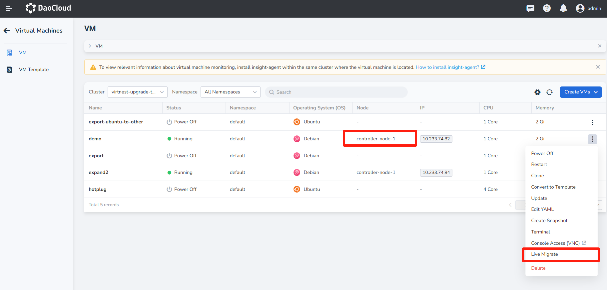
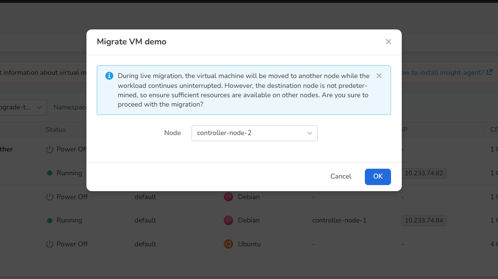
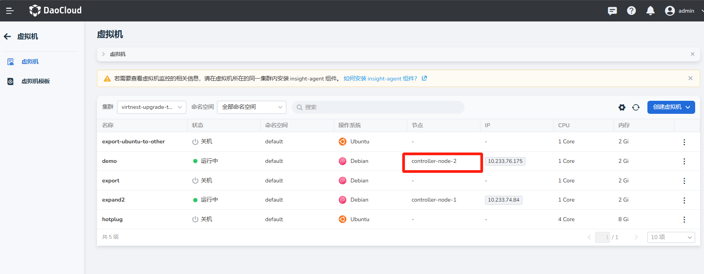

# Live Migration

This article will explain how to migrate a virtual machine from one node to another.

When a node needs maintenance or upgrades, users can seamlessly migrate running virtual machines to other nodes 
while ensuring business continuity and data security.

## Prerequisites

Before using live migration, the following prerequisites must be met:

- Only running virtual machines can use the live migration feature.
- If you need to use live migration, make sure that your PVC access mode is ReadWriteMany.
- The current cluster must have at least 2 usable nodes.
- When using the feature of live migration, Masquerade or Bridge can be selected as the network mode.

## Live Migration

1. Click __Container Management__ on the left navigation bar, then click __Virtual Machines__ to enter the list page. 
   Click __┇__ on the right side of the list to migrate running virtual machines. Currently, 
   the virtual machine is on the node __controller-node-1__ .

    

2. A pop-up box will appear, indicating that during live migration, the running virtual machine instances will be 
   migrated to another node, but the target node cannot be predetermined. Please ensure that other nodes 
   have sufficient resources.

    

3. After a successful migration, you can view the node information in the virtual machine list. At this time, the node has been migrated to __controller-node-2__ .

    
