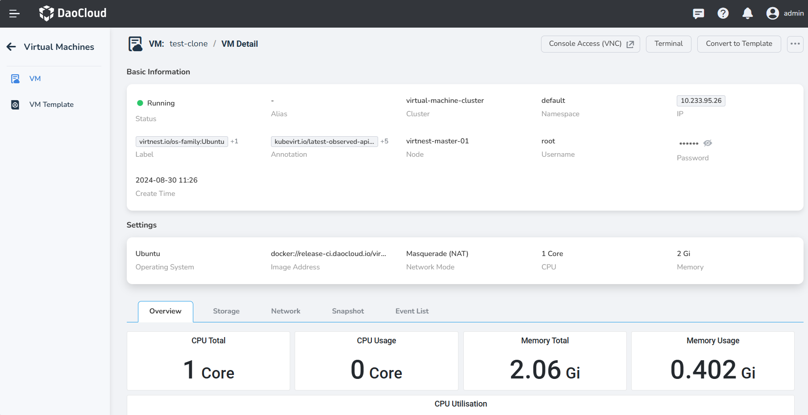
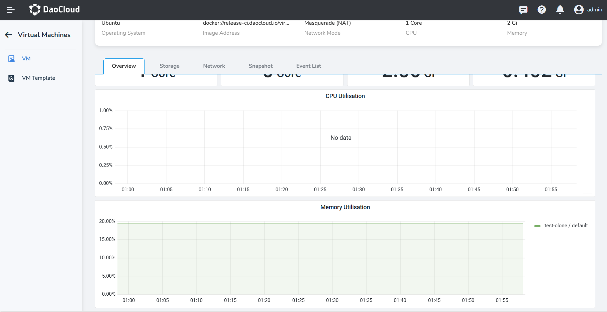
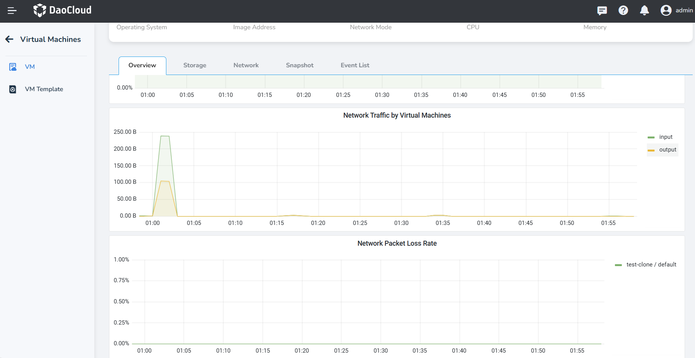
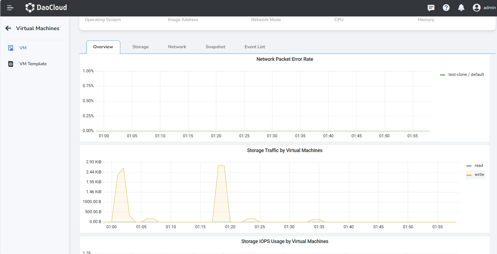
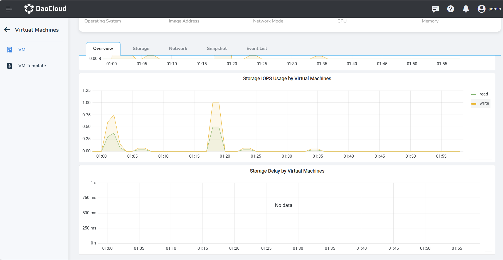

# Virtual Machine Monitoring

The virtual machine's monitoring is based on the Grafana Dashboard open-sourced by Kubevirt, 
which generates monitoring dashboards for each virtual machine.

Monitoring information of the virtual machine can provide better insights into the resource consumption 
of the virtual machine, such as CPU, memory, storage, and network resource usage. These information can 
help optimize and plan resources, improving overall resource utilization efficiency.

## Prerequisites

Before viewing the virtual machine monitoring information, the following prerequisites need to be met:

- The insight-agent component needs to be installed in the same cluster where the virtual machine is located.

## Virtual Machine Monitoring

Navigate to the VM Detail page and click __Overview__ to view the monitoring content of the virtual machine. 
Please note that without the insight-agent component installed, monitoring information cannot be obtained. 
Below are the detailed information:

- Total CPU, CPU Usage, Memory Total, Memory Usage.

    

- CPU Utilisation: the percentage of CPU resources currently used by the virtual machine;
- Memory Utilisation: the percentage of memory resources currently used by the virtual machine out of 
  the total available memory.

    

- Network Traffic by Virtual Machines: the amount of network data sent and received by the virtual machine 
  during a specific time period;
- Network Packet Loss Rate: the proportion of lost data packets during data transmission out of the total sent data packets.

    

- Network Packet Error Rate: the rate of errors that occur during network transmission;
- Storage Traffic: the speed and capacity at which the virtual machine system reads and writes to the disk 
  within a certain time period.

    

- Storage IOPS: the number of input/output operations the virtual machine system performs in one second.
- Storage Delay: the time delay experienced by the virtual machine system when performing disk read and write operations.

    
