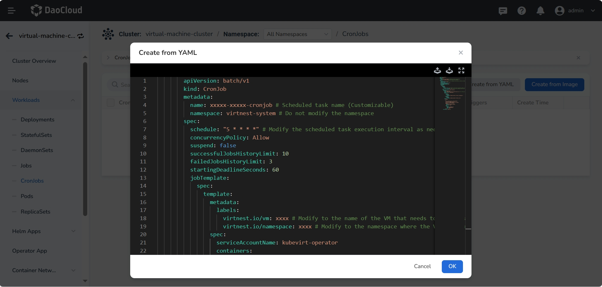
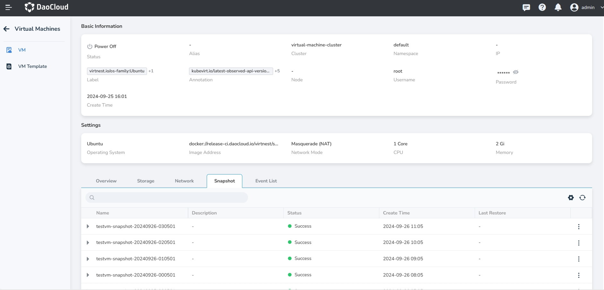

# Scheduled Snapshot

This article introduces how to create snapshots for VMs on a schedule.

You can create scheduled snapshots for VMs, providing continuous protection for data and ensuring
effective data recovery in case of data loss, corruption, or deletion.

## Steps

1. In the left navigation bar, click __Container Management__ -> __Clusters__ to select the proper
   cluster where the target VM is located.
   After entering the cluster, click __Workloads__ -> __CronJobs__, and choose __Create from YAML__
   to create a scheduled task. Refer to the following YAML example to create snapshots for the specified
   VM on a schedule.

    

    ??? note "Click to view the YAML example for creating a scheduled task"

        ```yaml
        apiVersion: batch/v1
        kind: CronJob
        metadata:
          name: xxxxx-xxxxx-cronjob # Scheduled task name (Customizable)
          namespace: virtnest-system # Do not modify the namespace
        spec:
          schedule: "5 * * * *" # Modify the scheduled task execution interval as needed
          concurrencyPolicy: Allow
          suspend: false
          successfulJobsHistoryLimit: 10
          failedJobsHistoryLimit: 3
          startingDeadlineSeconds: 60
          jobTemplate:
            spec:
              template:
                metadata:
                  labels:
                    virtnest.io/vm: xxxx # Modify to the name of the VM that needs to be snapshotted
                    virtnest.io/namespace: xxxx # Modify to the namespace where the VM is located
                spec:
                  serviceAccountName: kubevirt-operator
                  containers:
                    - name: snapshot-job
                      image: release.daocloud.io/virtnest/tools:v0.1.5 # For offline environments, modify the registry address to the proper registry address of the cluster
                      imagePullPolicy: IfNotPresent
                      env:
                        - name: NS
                          valueFrom:
                            fieldRef:
                              fieldPath: metadata.labels['virtnest.io/namespace']
                        - name: VM
                          valueFrom:
                            fieldRef:
                              fieldPath: metadata.labels['virtnest.io/vm']
                      command:
                        - /bin/sh
                        - -c
                        - |
                          export SUFFIX=$(date +"%Y%m%d-%H%M%S")
                          cat <<EOF | kubectl apply -f -
                          apiVersion: snapshot.kubevirt.io/v1alpha1
                          kind: VirtualMachineSnapshot
                          metadata:
                            name: $(VM)-snapshot-$SUFFIX
                            namespace: $(NS)
                          spec:
                            source:
                              apiGroup: kubevirt.io
                              kind: VirtualMachine
                              name: $(VM)
                          EOF
                  restartPolicy: OnFailure
        ```

1. After creating the scheduled task and running it successfully, you can click __Virtual Machines__
   in the list page to select the target VM. After entering the details, you can view the snapshot list.

    
