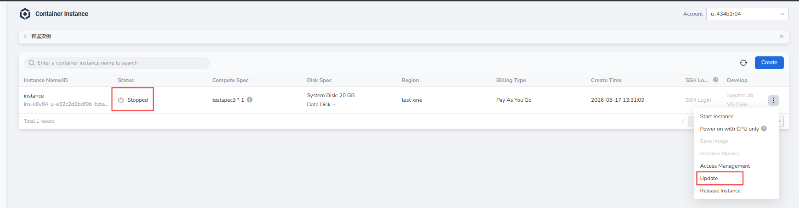

# Update Container Instance Configuration

After a container instance is powered off, you can select a new SKU through **Update** to scale the instance up or down.

## Prerequisite

The container instance has been created and is in the **Stopped** state.

## Steps

1. Go to **Compute Cloud** -> **Container Instances**, find an instance in the **Stopped** state, click the **┇** on the right side of the list, and choose **Update** from the dropdown list.

    

2. On the **Update** page, select a new SKU, confirm the GPU type, GPU memory, GPU count, compute resources, disk configuration, and price, then click **OK** to complete the update.

    

!!! note

    - Configuration updates are supported only when the container instance is powered off.
    - After the scale-up or scale-down is complete, the container instance remains powered off. Manually choose **Start Instance** to power it on.
