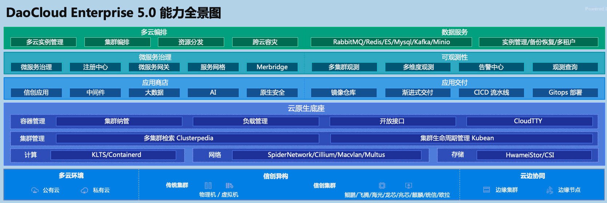
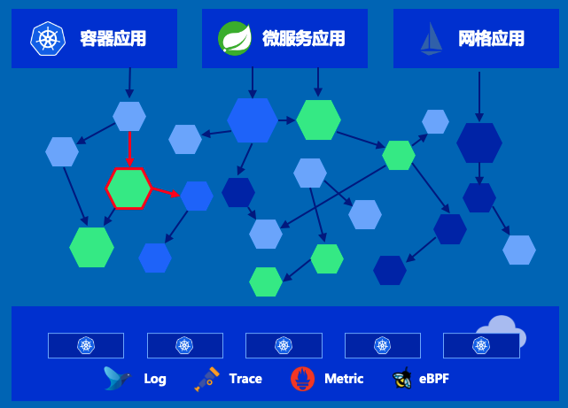

---
hide:
  - navigation
  - toc
---

# DaoCloud Enterprise 5.0

2022 年金秋送爽之际，「DaoCloud 道客」融合开源社区最流行的众多云原生技术，由上百位行业大咖经过为期两年日夜不辍的开发、测试和验证，理想主义的花最终盛开在了浪漫主义的地里，现隆重推出新一代云原生容器化综合平台，引领时下正如火如荼的云原生浪潮。

DaoCloud Enterprise 5.0 是高性能可扩展的云原生操作系统，在任何基础设施上、任意环境上提供一致、稳定的体验，支持信创异构、边云协同、多云编排，融合前沿的服务网格和微服务技术，将可观测性贯穿于每一个流量生发的始终，助力洞察集群、节点、应用和服务的详细指标，通过动态仪表盘和拓扑大图可视化掌握应用健康状态。原生支持 DevOps 开发运维模式，实现应用交付的全流程标准化和自动化，原生集成各类精选数据库和中间件，使得运维治理更高效。DCE 5.0 的各个产品模块独立解耦，灵活升级，业务无感知，开放对接超百家云原生生态产品，形成完整的解决方案体系，经近千家行业客户生产场景锤炼，构建坚实可靠的数字底座，释放云原生生产力，助力企业定义数字边界。

DCE 5.0 云原生操作系统提供了 9 大能力，自由搭配各种模块，可以应对海量应用场景。

=== "多云编排"

    **适用场景**：某企业多云多集群部署成为常态，希望能够具备多云统一发布以及跨云容灾备份的能力。

    **方案优势**：采用创新性技术完成跨云编排容灾备份，此方案跨云资源检索并发性能高，结合容器平台的能力适配边缘、信创等场景，能够帮助 IT 部门快速规划并实现容灾备份能力。

    **涉及的模块**：[容器管理](zh/kpanda/03ProductBrief/WhatisKPanda.md)、[多云编排](zh/kairship/01product/whatiskair.md)、边云协同、信创异构

    

=== "数据服务"

    **适用场景**：某企业的应用架构依赖主流中间件能力，希望能统一运行并维护中间件，并且得到较为专业的关于中间件规划、运维的支持能力。

    **方案优势**：一致性管理云原生化精选中间件，借助专为有状态应用设计的云原生本地存储能力，统一平台管理云原生中间件，提供多租户、部署、观测、备份、运维的全生命周期的中间件管理能力，结合容器平台的能力适配边缘、信创场景。

    **涉及的模块**：[容器管理](zh/kpanda/03ProductBrief/WhatisKPanda.md)、[云原生本地存储](zh/hwameistor/intro/what.md)、[云原生中间件](zh/middleware/midware.md)

    

=== "微服务治理"

    **适用场景**

    某企业的应用架构决定采用微服务架构或已经采用微服务，希望得到全方位的微服务框架等技术支持及运维兜底能力，或希望引入服务网格技术，并且在技术更迭的过程中实现平滑过度。

    - 该企业什么都不想改，只想通过产品层面的全景视图来查看服务的各类状态，希望通过链路和日志进行排障
    - 该企业有从传统微服务框架转向 mesh 的想法，但较为保守，希望慢慢转换有一个过渡期，此时比较适合使用网格解决方案
    - 该企业希望直接转 mesh，剔除 Eureka 相关组件，直接使用微服务引擎和服务网格即可
    - 该企业不想从传统微服务转向 mesh，但又希望能做东西流量治理

    **方案优势**

    无缝融合治理新旧微服务技术，无缝融合以 SpringCloud、Dubbo 为代表的初代微服务与 Istio 服务网格代表的新一代微服务技术，完成从开发、部署、接入、对外、观测、运维全生命周期微服务管理能力。
    无缝接入企业现有微服务体系，提供托管微服务治理的完整能力，提供高性能云原生微服务网关。

    **涉及的模块**：[容器管理](zh/kpanda/03ProductBrief/WhatisKPanda.md)、[微服务引擎](zh/skoala/intro/features.md)、[服务网格](zh/mspider/01Intro/What'smSpider.md)、[可观测性](zh/insight/03ProductBrief/WhatisInsight.md)、[应用工作台](zh/amamba/01ProductBrief/WhatisAmamba.md)

    

=== "可观测性"

    **适用场景**：某企业对运行的应用观测能力较弱，希望通过轻量级或无改造接入就能完成观测功能，以期完成全方位的应用运行观测（日志、指标、链路）。

    **方案优势**：深入精微地观测当前应用运行状况，统一汇总观测数据，一个控制面板就能查询到所有集群及负载观测数据，并且深入支持微服务架构、服务网格、网络 EBPF 等观测能力。

    **涉及的模块**：[容器管理](zh/kpanda/03ProductBrief/WhatisKPanda.md)、[可观测性](zh/insight/03ProductBrief/WhatisInsight.md)

    

=== "应用商店"

    **适用场景**：某企业希望获得专属场景开箱即用的云原生应用软件能力

    **方案优势**：开箱即用的生态应用软件能力，收录来自生态伙伴十大领域的软件产品，面向企业实际业务需求提供完整软件堆栈，可轻松查找、测试和部署在 DaoCloud Enterprise 上运行的消息中间件、数据中间件、低代码/无代码应用等。

    **涉及的模块**：[容器管理](zh/kpanda/03ProductBrief/WhatisKPanda.md)、应用商店、产品生态

=== "应用交付"

    **适用场景**：某企业大规模采用云原生技术，并且期望规范化、流程化结合 DevOps 理念将云原生技术推广至更广泛的应用项目组。

    **方案优势**：一致性可推广应用交付流程，支持层级多租户体系，无缝适配用户组织架构规划资源分配。通过 CI/CD 流水线能力自动化完成应用构建、部署工作。创新性地引入 GitOps 渐进式交付的能力体系，帮助应用进行更细致的交付管理能力。

    **涉及的模块**：[容器管理](zh/kpanda/03ProductBrief/WhatisKPanda.md)、[应用工作台](zh/amamba/01ProductBrief/WhatisAmamba.md)、镜像仓库

    

=== "云原生底座"

    **适用场景**：某企业的运维团队需要承接数十个至上百个集群的运维任务，且集群网络规划需满足传统网络监管要求。

    **方案优势**：

    突破 Kubernetes API 性能瓶颈，支持企业超大规模用户并发使用多集群，提供集群从部署、版本升级、证书变更、配置变更、回收等全生命周期管理管理能力。
    尽可能复用当前企业环境中网络基础设施，针对其环境针实施最佳方案：

    - MacVLAN 网络方案
    - SR-IOV 智能网卡加速方案
    - SpiderPool 云原生 IPAM 方案
    - Clilum eBPF 网络加速方案
    - Underlay 和 Overlay 协同网络方案

    通过自主开源的 Clusterpedia 统一控制平面来管理所有集群及负载信息，兼容标准 Kubernetes 集群接入，突破 Kubernetes API 性能瓶颈支持上千人同时使用。

    **涉及的模块**：[容器管理](zh/kpanda/03ProductBrief/WhatisKPanda.md)、[集群生命周期管理](zh/community/kubean.md)、[云原生全场景网络](zh/network/)、[云原生本地存储](zh/hwameistor/)

    

=== "信创异构"

    **适用场景**：某企业有信创需求，对底层基础设施及操作系统有特定要求，例如 CPU 处理器必须是 Loongson 龙芯、海光、飞腾、鲲鹏、Intel；而操作系统必须是麒麟、统信 UOS、OpenEuler 等

    **方案优势**：为国夯实信创云原生技术架构能力，北向支持国产芯片及服务器，南向支持容器内信创操作系统及信创应用生态体系

    **涉及的模块**：[容器管理](zh/kpanda/03ProductBrief/WhatisKPanda.md)、[集群生命周期管理](zh/community/kubean.md)、[信创中间件](zh/middleware/midware.md)

    

=== "云边协同"

    **适用场景**：某企业按照云、边、端方案设计边缘协同方案，边缘端为通用算力平台且边缘端有较强的算力需求。边缘端支持几种部署模式：边缘节点、边缘集群模式，数据中心算力下移，端设备算力上移

    **方案优势**：通用云原生框架延伸助力边缘算力，云端统一管控所有边缘节点、集群信息，在传统的云边端三层模式基础上，针对强边缘算力需求，增加边缘集群迭代边缘节点的方案，形成四层云边协同方案。

    **涉及的模块**：[容器管理](zh/kpanda/03ProductBrief/WhatisKPanda.md)、[集群生命周期管理](zh/community/kubean.md)、边缘节点、弱网集群

    

以上这些模块就像乐高搭积木一样，糅合社区最优秀的几十种开源技术，经过众多辩证选型、攻坚克难、编码调试、海量测试，“十年磨一剑，一朝试锋芒”，全新搭建的新一代容器化平台能够满足企业上云的各类场景需求。
