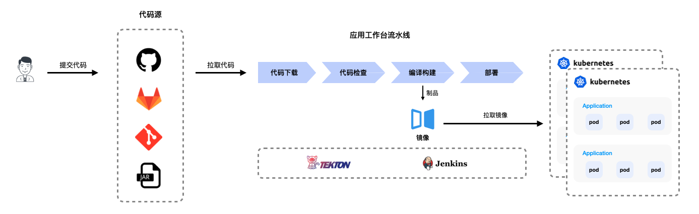
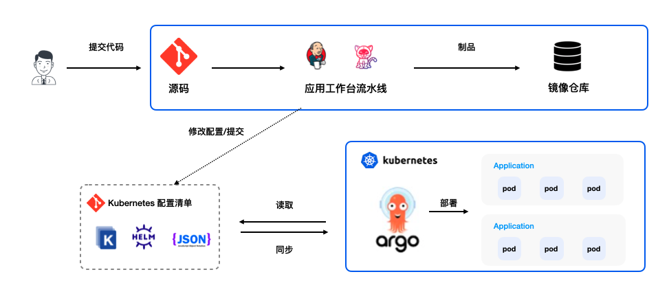

# 适用场景

## 持续交付流水线

对于复杂的业务系统，从项目创建、编译、构建、自验、集成验证、类生产验证、上线的各个阶段都需要耗费大量的人力和时间，并且容易受到人为因素影响而出错。
持续集成和持续交付由于具有标准化和自动化特点，以代码变更为流动单元，基于发布流水线，拉通开发、测试、运维所有职能，持续、快速、高可靠地发布软件，可以很好的解决该问题。

**自动化 CI/CD 流水线**

## 基于流水线 + GitOps 实现云原生下的应用持续交付

得益于 GitOps 理念, 因此采用开源软件 Argo CD 来实践 Kubernetes 的应用发布。
用户仅需将 Kubernetes 的 YAML 文件提交至代码仓库中，GitOps 会自动感知到 YAML 文件的变化，配合代码仓库的合并请求功能，将 YAML 文件的变更自动推送至集群中，整个过程无需学习 Kubernetes 的发布命令，也无需直接操作集群。

