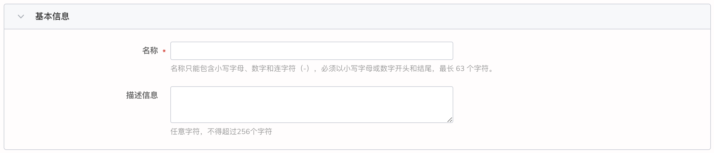
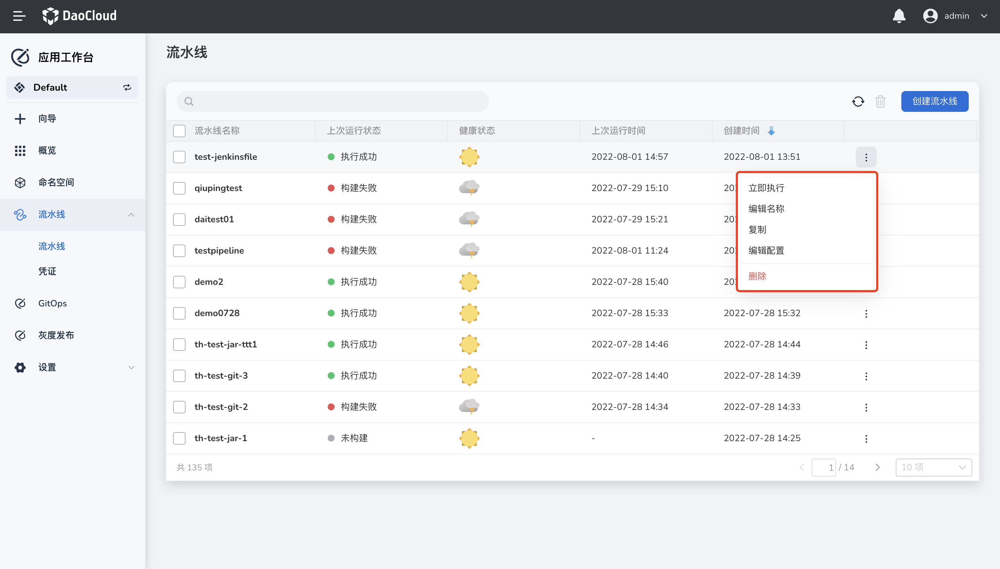

# 使用 Jenkinsfile 创建单代码分支流水线

应用工作台流水线支持使用代码仓库中的 Jenkinsfile 创建流水线。

## 前提条件

- 您需要创建一个工作空间和一个用户，必须邀请该用户至工作空间中且赋予 `workspace edit` 角色。可参考[创建工作空间](https://ndx.gitpages.daocloud.io/ghippo/zh/02QuickStart/CreateWorkspace.html)、[用户和角色](https://ndx.gitpages.daocloud.io/ghippo/zh/02QuickStart/CreateUser.html)。
- 您需要有一个代码仓库，并且代码仓库中的源码有一个 Jenkinsfile 文本文件。

## 操作步骤

1. 在流水线列表页点击`创建流水线`

    

2. 在弹出的对话框中，选择`自定义创建流水线`，点击`确定`

    

3. 进入`基于代码仓库的 Jenkinsfile 创建流水线` ，并配置相关参数

    

4. 填写基本信息。流水线的名称，同一个工作空间下名称必须唯一。

    

5. 填写代码仓库信息。

    

     - 代码仓库地址：填写远程代码仓库的地址。
     - 凭证：果您的远程仓库是私有的，请提前创建凭证并在使用时选择。
     - 分支：填写您想要拉取的代码所在的分支，不填默认拉去 master 分支。
    - 脚本路径：Jenkinsfile 文件在代码仓库中的绝对路径。

6. 填写构建设置。

    

    - 删除过期构建记录：确定何时删除分支下的构建记录，以节省 Jenkins 所使用的磁盘空间。
    - 不允许并发构建：如果开启，则不能并发运行多个构建。

7. 填写构建参数。参数化的构建过程允许您在开始运行流水线时传入一个或多个参数。

    默认提供五种参数类型，包括**字符串**、**多行字符串**、**布尔值**、**选项**以及**密码**。
    当参数化项目时，构建会被替换为参数化构建，其中将提示用户为每个定义的参数输入值。

    
8. 填写构建触发器。

    

    - 代码源触发：允许定期执行构建流水线。
    - 定时触发：允许定期执行扫描远程代码仓库，如果代码仓库有变更，则执行构建流水线。

9. 完成创建。确认所有参数输入完成后，点击`确定`按钮，完成自定义流水线创建，自动返回`流水线 列表`。点击列表右侧的 `︙`可以执行各项操作。

    
