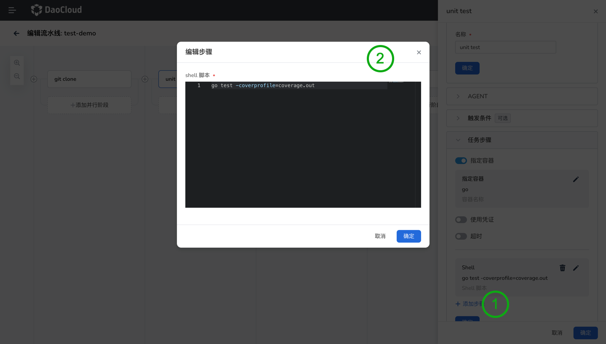
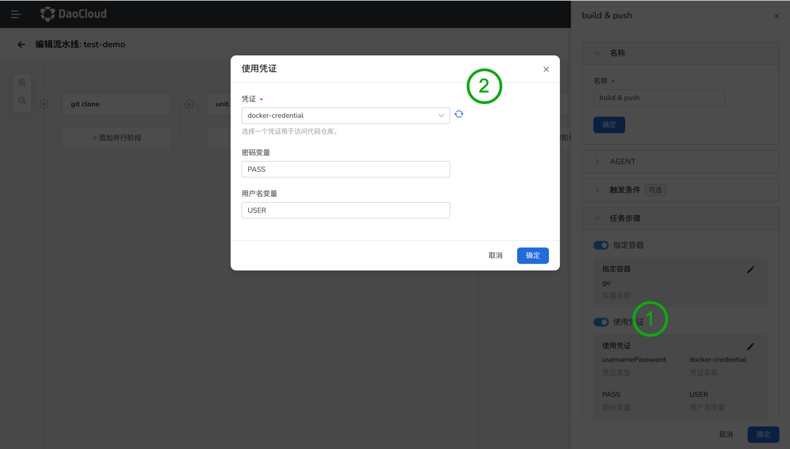
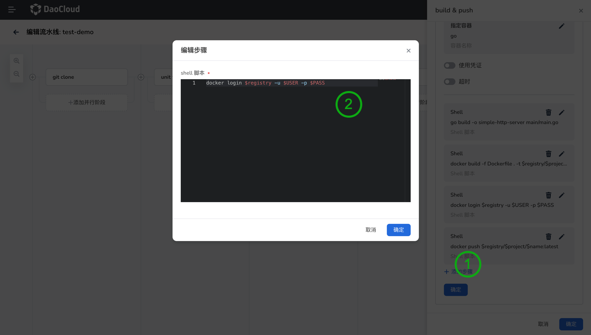
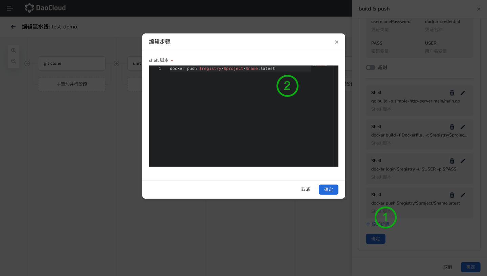
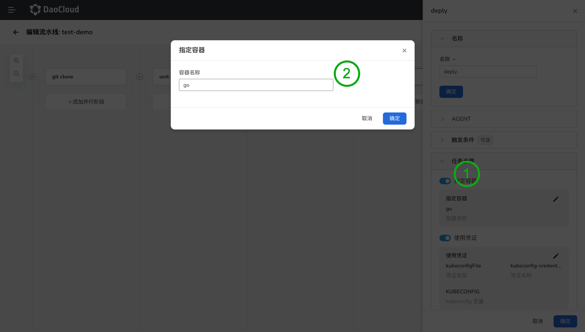
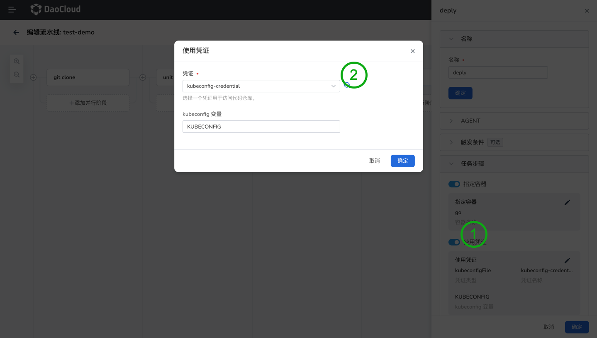
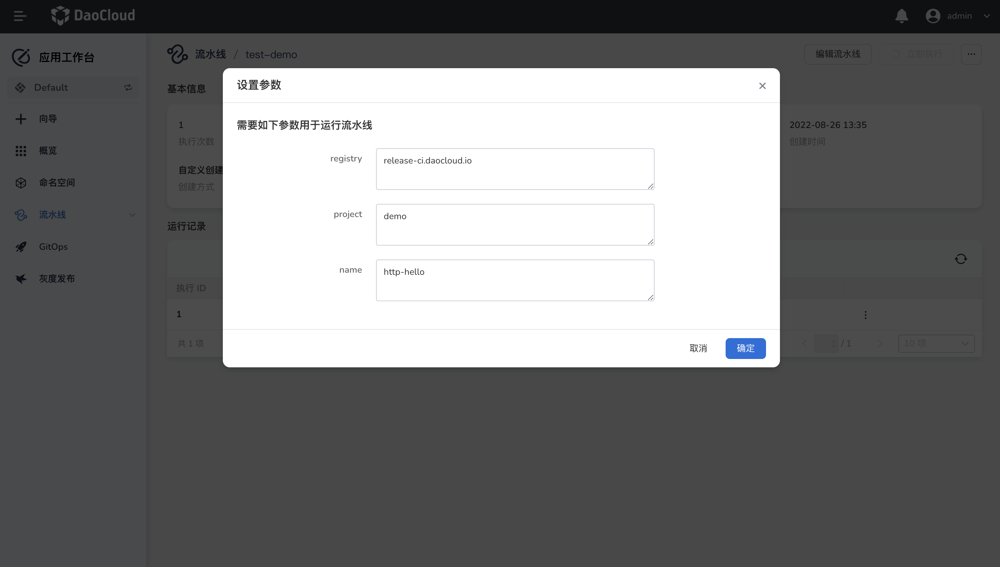
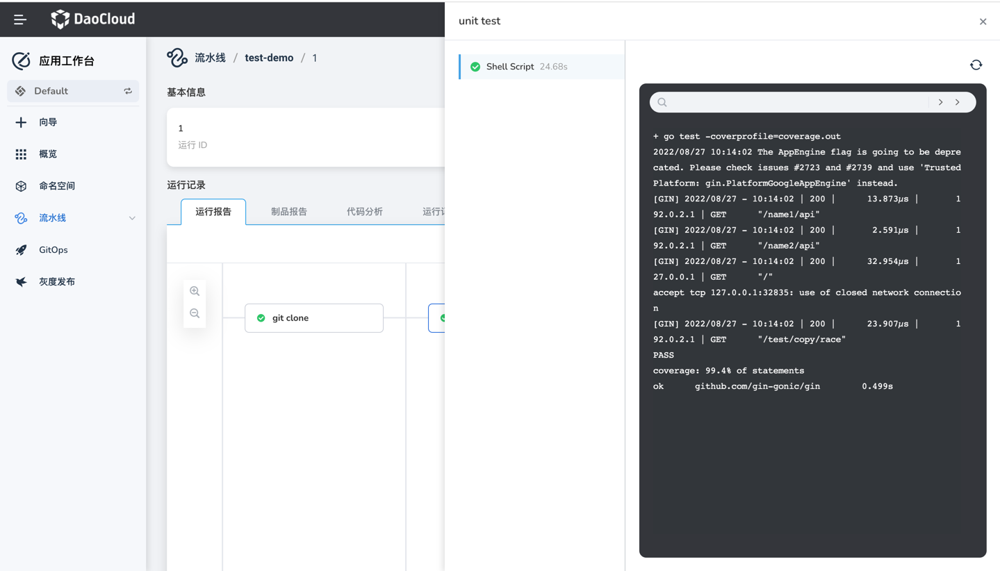

# 使用图形化编辑流水线

应用工作台设计了图形化流水线编辑视图，能够兼容编辑 Jenkinsfile 中的大部分自定义操作。
可以直观的让您可以看到流水线上的每个[阶段 (Stage)](https://www.jenkins.io/zh/doc/book/pipeline/#阶段)、每个[步骤 (Step)](https://www.jenkins.io/zh/doc/book/pipeline/#步骤)，从而实现所见即所得的流水线编辑体验。

## 前提条件

- 您需要创建一个工作空间和一个用户，必须邀请该用户至工作空间中且赋予 `workspace edit` 角色。可参考[创建工作空间](../../../ghippo/04UserGuide/02Workspace/Workspaces.md)、[用户和角色](../../../ghippo/04UserGuide/01UserandAccess/User.md)。

- 创建可以访问代码仓库、镜像仓库、集群的三个凭证，创建凭证的更多信息，请参考[凭证管理](Credential.md))。

- 创建一条自定义流水线，请参考[创建自定义流水线](createpipelinebyself.md)，其中创建自定义流水线时需要在构建参数中添加两个字符串参数，这些参数将用于镜像构建的命令中。参数说明如下：

| 参数类型 | 参数名称 | 描述信息                                          |
| -------- | -------- | ------------------------------------------------- |
| 字符串   | registry | 镜像仓库地址。本例中使用 `release-ci.daocloud.io` |
| 字符串   | project  | 镜像仓库中的项目名称。本例中使用 `demo`            |
| 字符串   | name     | 镜像的名称。本例中使用 `http-hello`                |

## 画布说明


图形化编辑页面包括两个区域：**画布** 和 **阶段设置**。

1. 点击 `+添加阶段`后，会生成一个串行阶段，点击后，会生成一个新的阶段，可以在该阶段中添加流水线步骤，通过选择步骤类型，可以快速创建当前阶段中的流水线步骤。

2. 点击`+添加并行阶段`后，会生成一个并行阶段，点击后，会生成一个新的阶段，可以在该阶段中添加流水线步骤，通过选择步骤类型，可以快速创建当前阶段中的流水线步骤。

3. 阶段创建后，点击`阶段`，可以用过阶段进行阶段配置。支持设置阶段的名称、Agent、触发条件、步骤。

## 操作步骤

点击创建好的自定义流水线进入其详情页面。点击`编辑流水线`，进入图形化编辑页面。该演示流水线包括以下阶段，请参考图示例设置每个阶段。

<缺少图片>

### 配置全局设置

点击全局代理，在全局代理抽屉上，从类型下拉列表中选择 node，从 label 下拉列表选择 go 16。


### 添加阶段 - 拉取源代码

1. 点击画布中的`添加阶段`。在右侧的阶段设置中设置名称：git clone。

2. 点击`添加步骤`，在弹出的对话框中步骤类型下选择 `git clone`，参照下表，对相关参数进行配置。

    - 仓库 URL：输入仓库地址。
    - 分支：不填写，默认为m aster 分支。
    - 凭证：如果您的仓库属于私有仓库则需要提供一个凭证。

    

### 添加阶段 - 单元测试

1. 点击画布中的`添加阶段`。在右侧的阶段设置中设置名称：unit test。

2. 在步骤模块中选择开启`指定容器`，在弹出的对话框中填写容器名称：go，然后点击`确定`。

    

3. 点击`添加步骤以对代码进行单元测试，并生成测试报告`，在弹出的对话框中步骤类型下选择 shell，并在命令行中输入以下命令，然后点击`确定`。

    ```go
    go test -coverprofile=coverage.out
    ```

    

### 添加阶段 - 构建并推送镜像

1. 点击画布中的`添加阶段`。在右侧的阶段设置中设置名称：build & push。

2. 在步骤模块中选择开启`指定容器`，在弹出的对话框中填写容器名称：go，然后点击`确定`。

    

3. 在步骤模块中选择开启`使用凭证`，在弹出的对话框中填写相关参数，然后点击`确定`。

    - 凭证：选择创建的 docker hub 凭证，用户访问镜像仓库。选择已创建好的 “docker-credential” 凭证。
    - 密码变量：PASS
    - 用户名变量：USER

    

4. 点击`添加步骤`进行代码构建，在弹出的对话框中步骤类型下选择 shell，参并在命令行中输入以下命令，然后点击`确定`。

    ```go
    go build -o simple-http-server main.go
    ```

5. 点击`添加步骤`以根据源码中的 Dockerfile 构建 Docker 镜像，在弹出的对话框中步骤类型下选择 shell，参并在命令行中输入以下命令，然后点击`确定`。

    ```docker
    docker build -f Dockerfile . -t $REGISTRY/$PROJECT/$NAME:latest
    ```

6. 点击`添加步骤`以登录镜像仓库并将镜像推送至镜像仓库中，在弹出的对话框中步骤类型下选择 shell，参并在命令行中输入以下命令，然后点击`确定`。

    ```docker
    docker login $REGISTRY -u $USER -p $PASS
    ```

    

6. 点击`添加步骤`以将镜像推送至镜像仓库中，在弹出的对话框中步骤类型下选择 shell，参并在命令行中输入以下命令，然后点击`确定`。

    ```docker
    docker push $REGISTRY/$PROJECT/$NAME:latest
    ```

    

!!! note
    
    镜像更新后还可以实现触发流水线，详细操作请[参考文档]()。

### 添加阶段 - 审核

1. 点击画布中的`添加阶段`。在右侧的阶段设置中设置名称：review。

2. 点击`添加步骤`，在弹出的对话框中步骤类型下选择`审核`，在消息字段中填入 `@admin`，即 `admin` 帐户在流水线运行到该阶段时会进行审核，然后点击`确定`。

    

### 添加阶段 - 部署至集群

1. 点击画布中的`添加阶段`。在右侧的阶段设置中设置名称：deploy。

2. 在步骤模块中选择开启`指定容器`，在弹出的对话框中填写容器名称：go，然后点击`确定`。

    

3. 在步骤模块中选择开启`使用凭证`，在弹出的对话框中填写相关参数，然后点击`确定`。

    - 凭证：选择 kubeconfig 类型的凭证。

    - kubeconfig 变量：如果使用的是 kubectl apply 的部署方式，变量值必须为 KUBECONFIG。                  |

    

4. 点击`添加步骤`以进行集群部署操作，在弹出的对话框中步骤类型下选择 shell，参并在命令行中输入以下命令，然后点击`确定`。

    ```yaml
    kubectl apply -f deploy.yaml
    ```

### 运行流水线

1. 在流水详情页面点击`立即执行`。在弹出的对话框中设置前提条件中定义的三个字符串参数，点击`确定`来运行流水线。

    

2. 成功开始运行后，页面会自动切换到流水线详情页面，点击当前运行的流水线记录。

3. 进入流水线记录详情页面后，您可以查看到当前流水线运行的过程，需要 admin 或者平台管理员来为流水线进行审核，审核成功后，资源会部署至集群。

    

### 验证集群资源

1. 如果流水线的每个阶段都成功运行，则会自动构建一个 Docker 镜像并推送至您的 Docker Hub 仓库。最终，流水线将在您事先设置的项目中自动创建一个无状态负载。

2. 前往容器管理平台，点击集群下的`工作负载`，您可以看到列表中显示的无状态工作负载。

    
   