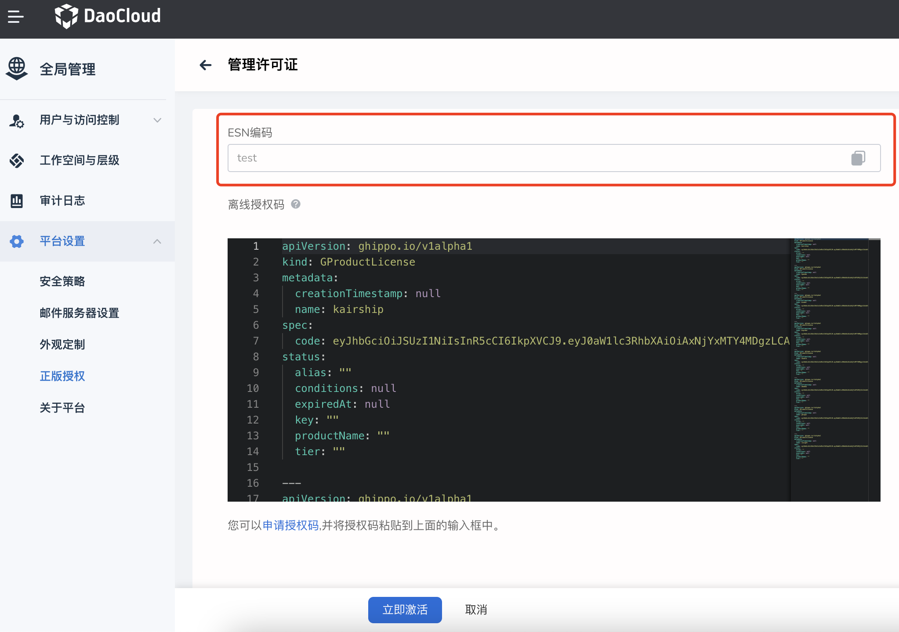

# 申请社区免费体验

DCE 5.0 目前开源的模块为[全局管理](../ghippo/01ProductBrief/WhatisGhippo.md)、[容器管理](../kpanda/03ProductBrief/WhatisKPanda.md)、[应用工作台](../amamba/01ProductBrief/WhatisAmamba.md)和[可观测性](../insight/03ProductBrief/WhatisKInsight.md)四个模块。
建议下载并安装好 DCE 5.0 之后，激活的大致步骤如下图所示。

具体操作步骤为：

1. 点击[这里](https://qingflow.com/f/58604bf8)开始申请许可证密钥，填写表单后点击`提交`。

    

2. 按屏幕提示，打开邮箱查看包含许可证密钥的邮件，然后点击`换取离线授权码`（或者点击[这里](https://license.daocloud.io/dce5-license)）。

    

3. 输入上一步的许可证密钥，输入设备独有的 ESN 后，点击`获取离线授权码`。

    

    其中 ESN 是集群系统独有的设备编码。
    具体获取方式为：打开 DCE，点击左侧导航栏`全局管理`->`平台设置`->`正版授权`，点击`管理许可证`按钮，打开`管理许可证`页面，复制 ESN 编码。

    

4. 复制并粘贴上一步换取的离线授权码，点击`立即激活`。恭喜你！现在可以探索全新的 DCE 5.0 啦！

📢 **温馨提示：**

有关激活过程中用到的几个 URL 如下：

- 申请许可证密钥：https://qingflow.com/f/58604bf8
- 换取离线授权码：https://license.daocloud.io/dce5-license
- 查看许可证密钥：https://license.daocloud.io/dce5-licenses
