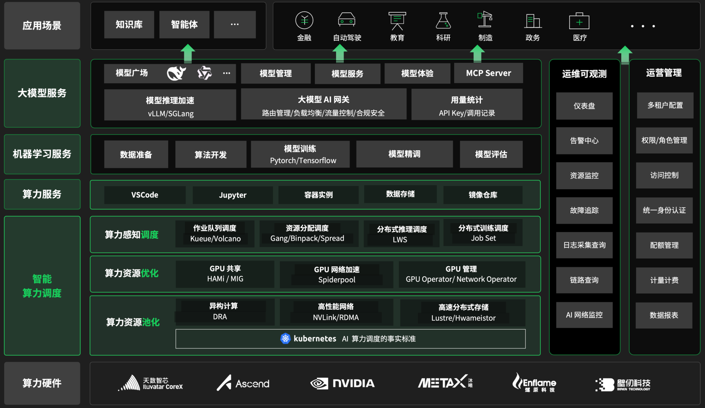

---
hide:
  - toc
---

  <h1 style="font-size: 30px; margin-bottom: 16px; font-weight: 800;">
    d.run AI 操作系统
  </h1>

  打通算力-模型-应用的企业级服务平台

  

    d.run 是一款新一代 <strong>AI 操作系统</strong>，将算力资源、AI 模型与应用统一纳入云原生运行体系， 
    让 AI 工作负载像操作系统进程一样被高效调度、管理与优化。
  

  

    从 GPU 到模型，从训练到应用，<strong>d.run 让 AI 基础设施真正实现系统化运行</strong>。
  

  <h2 style="font-size: 30px; margin-bottom: 16px; font-weight: 600;">
    产品架构
  </h2>

  <h2 style="font-size: 30px; margin-bottom: 16px; font-weight: 600;">
    产品模块
  </h2>

- :shrimp:{ .lg .middle } __ClawOS 智能体：新一代 Agent 运行时__

    ---

    主动规划任务、调用工具、自主执行，像一名真正的数字员工一样完成端到端的复杂工作

    - [安装 ClawOS](./clawos/install.md)
    - [ClawOS 快速入门](./clawos/quickstart.md)
    - [在飞书上即成 ClawOS](./clawos/feishu.md)
    - [ClawOS 常见问题](./clawos/faq.md)

- :material-developer-board:{ .lg .middle } __AI Lab：一站式机器学习服务__

    ---

    整合异构算力，优化 GPU 性能，实现算力资源统一调度和运营，最大化算力效用并降低算力开销

    - [安装 AI Lab 组件](./baize/intro/install.md)
    - [开发控制台 - 快速入门](./baize/developer/quick-start.md)
    - [运维管理](./baize/oam/index.md)
    - [部署 NFS 做数据集预热](./baize/best-practice/deploy-nfs-in-worker.md)
    - [使用 AI Lab 微调 ChatGLM3 模型](./baize/best-practice/finetunel-llm.md)

- :octicons-ai-model-16:{ .lg .middle } __大模型服务平台：企业级服务__

    ---

    从模型部署到运维管理的全生命周期服务，帮助企业和开发者高效地接入和使用各类大模型能力

    - [部署大模型服务平台](./hydra/intro/deploy-ws.md)
    - [模型广场](./hydra/index.md)
    - [模型体验](./hydra/exp.md)
    - [模型部署](./hydra/deploy/deploy.md)
    - [运维管理](./hydra/oam/index.md)

  d.run 是 AI 操作系统时代的底座，让算力、模型与 AI 应用在一个系统中统一运行，就像操作系统管理计算机一样管理 AI 世界。

[进一步了解 d.run](https://d.run/product/drun){ .md-button .md-button--primary }
