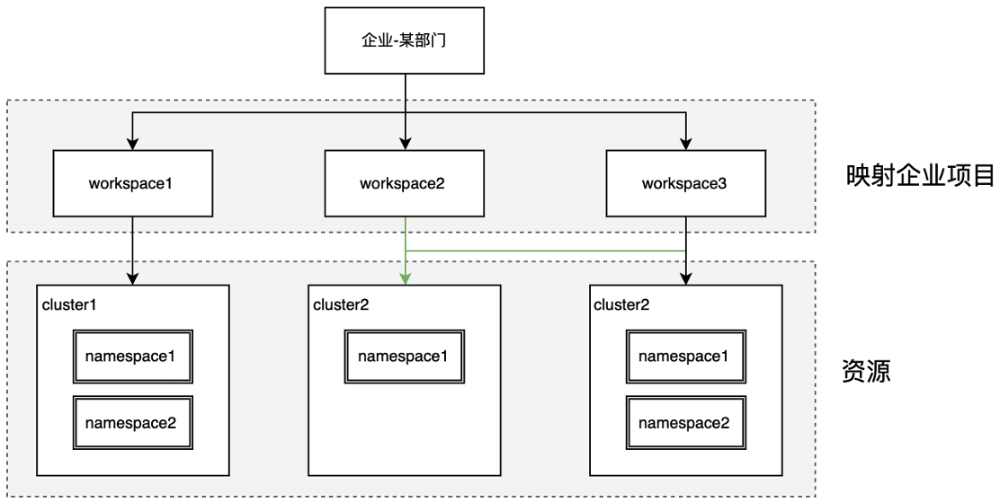
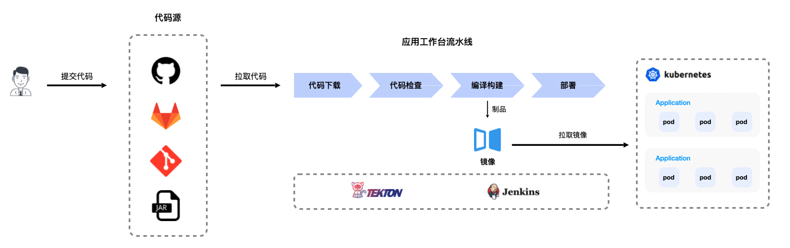
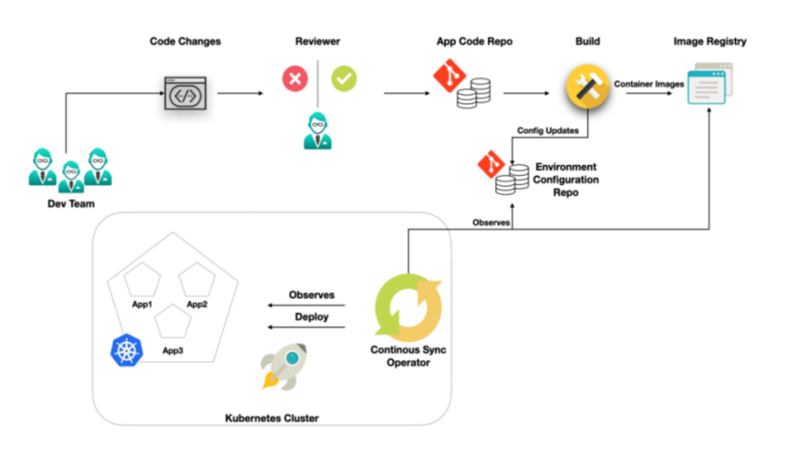
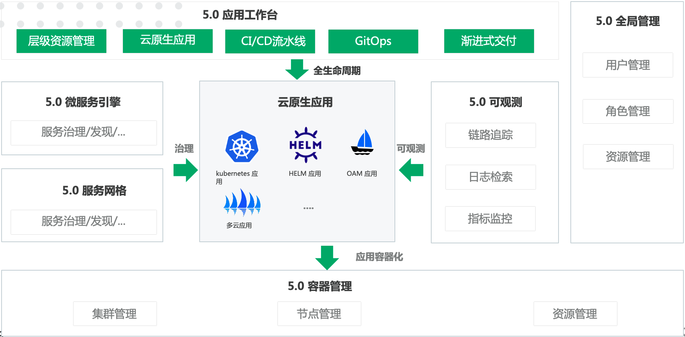

# 什么是应用工作台？

应用工作台是基于容器的 DevOps 云原生应用平台，提供了 DCE 5.0 应用创建的统一入口，完善的层级多租户方案，并且支持跨集群的资源部署。

应用工作台着重企业应用自动化交付和基础设施变更的过程，提供业务应用从“开发 -> 测试 -> 部署 -> 运维”的全生命周期管理，能有效帮助企业实现数字化转型，提升企业的 IT 交付能力和竞争力。

=== "层级多租户资源管理"

以[工作空间](../../ghippo/04UserGuide/02Workspace/ws-folder.md)作为最小的租户单元，不仅支持单集群的独享资源的能力，还支持跨集群共享资源的能力：

- 支持弱绑定集群，从而获得跨集群、跨命名空间共享资源的能力

- 支持强绑定集群，从而获得独享资源的能力

- 工作空间管理成员可以在关联的集群中创建命名空间资源

- 自助式资源创建的模式，用户可以在工作空间内自助创建命名空间来进行资源隔离



=== "以云原生应用为中心"

支持云原生场景下的“多形态”的云原生应用，包括 Kubernetes 原生应用、Helm 应用、OAM 应用等。
能够接入 SpingCloud、Dubbo、ServiceMesh 框架的微服务应用，实现微服务的治理，与 DCE 5.0 的[微服务引擎](../../skoala/intro/what.md)、[服务网格](../../mspider/01Intro/what.md)无缝集成。
支持云原生应用的全生命周期管理，例如应用的扩缩容、日志、监控查看、更新应用等等。


=== "高效的持续集成"

支持 Jenkins 和 Tekton 双流水线引擎系统。采用图形化方式编辑流水线，做到所见即所得的效果。可以用不同来源的代码构建应用。



=== "安全自动化渐进式交付"

应用工作台引入一种为云原生应用实现持续部署的理念 – GitOps，全面拥抱 GitOps，以集成渐进式交付组件 Argo Rollout，支持灰度发布，从而提高应用交付的稳定性和效率。



!!! info

    渐进式交付是一种将应用程序的新版本逐步暴露给最初的一小部分用户，然后逐渐变得越来越大的子集的做法，以减轻负面影响（例如错误）的风险。
    
    Argo-Rollout Kubernetes Progressive Delivery Controller，提供更强大的部署能力。包括灰度发布、蓝绿部署、更新测试 (experimentation)、渐进式交付 (progressive delivery) 等特性。

## 在 DCE 5.0 中的地位

应用工作台在 DCE 5.0 中的地位如下图所示。



以容器管理为底座，借助全局管理实现层级资源管理，以 CI/CD 流水线和 GitOps 流程增删改查云原生应用，实现渐进式交付。

## 部署方法

依次执行以下命令进行部署。

```bash
export VERSION=**** # 修改为实际部署的版本。
helm repo add mspider-release https://release.daocloud.io/chartrepo/amamba
helm repo update amamba
helm upgrade --install --create-namespace --cleanup-on-fail amamba amamba-release/amamba -n amamba-system --version=${VERSION}
```

[下载 DCE 5.0](../../download/dce5.md){ .md-button .md-button--primary }
[安装 DCE 5.0](../../install/intro.md){ .md-button .md-button--primary }
[申请社区免费体验](../../dce/license0.md){ .md-button .md-button--primary }
