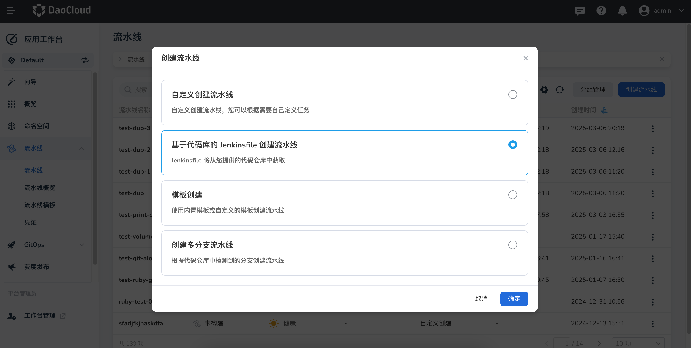
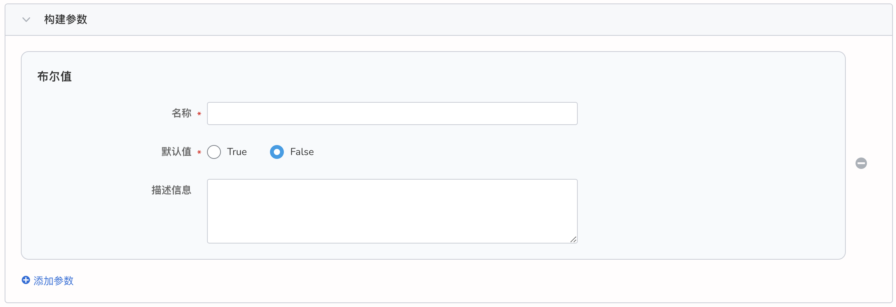
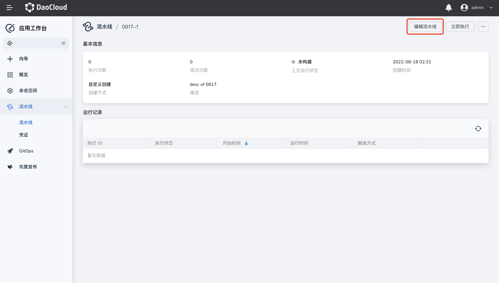
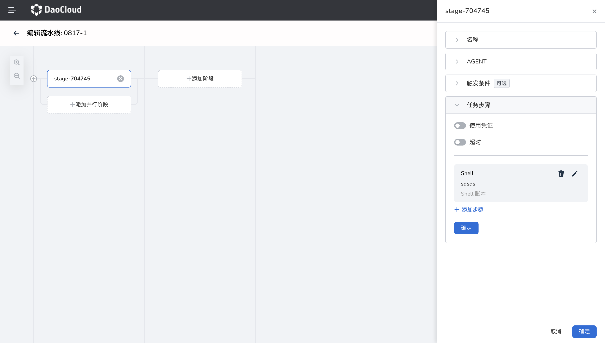

---
hide:
  - toc
---

# 创建自定义流水线

应用工作台流水线支持自定义创建，通过该方式创建的流水线，您可对流水线进行可视化编排。

您需要创建一个工作空间和一个用户，必须邀请该用户至工作空间中且赋予 `workspace edit` 角色。
可参考[创建工作空间](../../../ghippo/04UserGuide/02Workspace/Workspaces.md)、[用户和角色](../../../ghippo/04UserGuide/01UserandAccess/User.md)。

具体操作步骤如下：

1. 在流水线列表页点击`创建流水线`。

    

2. 在弹出的对话框中，选择`自定义创建流水线`，点击`确定`。

    

3. 进入`自定义创建流水页面` ，并配置相关参数。

    

4. 填写基本信息。流水线的名称，同一个工作空间下名称必须唯一。

    

5. 填写构建设置。

    

    - 删除过期构建记录：确定何时删除分支下的构建记录，以节省 Jenkins 所使用的磁盘空间。

    - 不允许并发构建：如果开启，则不能并发运行多个构建。

6. 填写构建参数。
   
    参数化的构建过程允许您在开始运行流水线时传入一个或多个参数。默认提供五种参数类型，包括`字符串`、`多行字符串`、`布尔值`、`选项`以及`密码`。
    当参数化项目时，构建会被替换为参数化构建，其中将提示用户为每个定义的参数输入值。

    

7. 填写构建触发器。

    

    - 代码源触发：允许定期执行构建流水线。

    - 定时触发：允许定期执行扫描远程代码仓库，如果代码仓库有变更，则执行构建流水线。

8. 完成创建。确认所有参数输入完成后，点击`确定`按钮，完成自定义流水线创建，自动返回流水线列表。点击列表右侧的 `︙` 可以执行各项操作。

    

## 编辑流水线

1. 自定义流水线创建完成后，您可在`流水线列表`页面点击该流水线进入`流水线详情`页面。然后点击`编辑流水线`。

    

2. 在编辑流水线页面您可以对该流水进行可视化编排，详细操作请参考文档[使用图形化编辑流水线](graphicaleditingpipeline.md)

    
