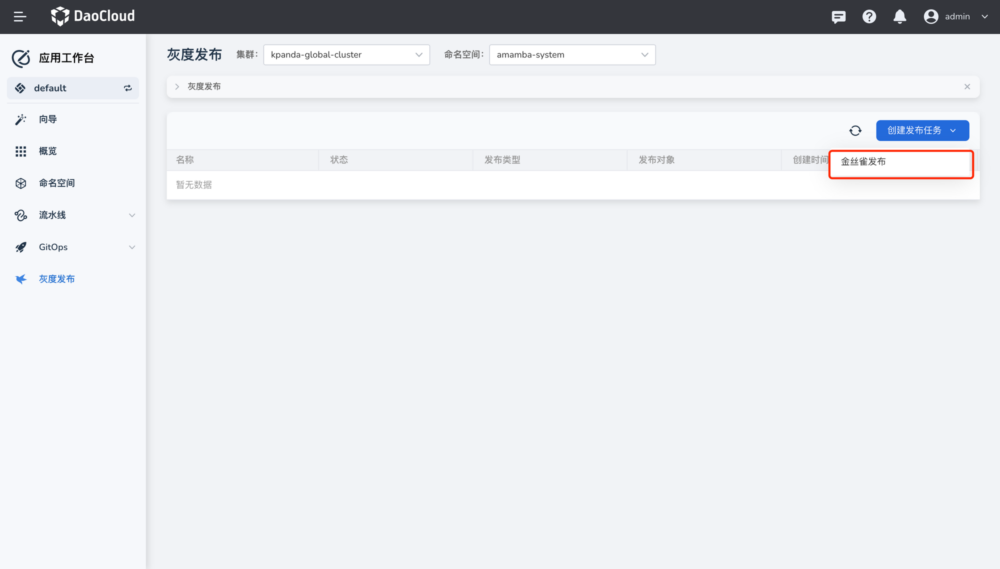
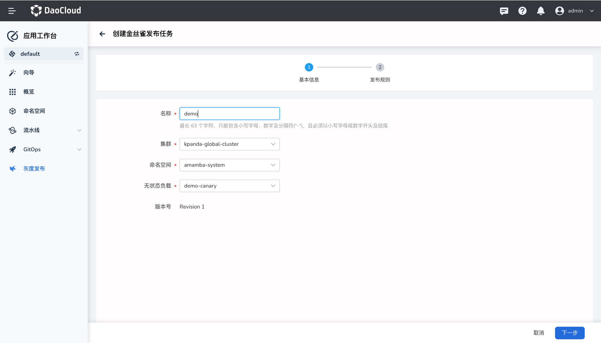
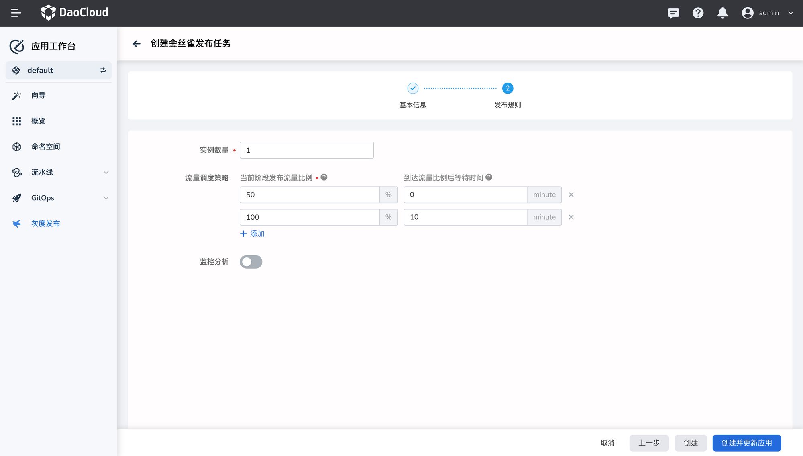
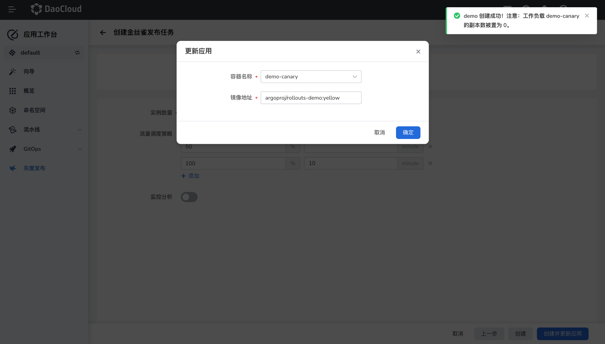
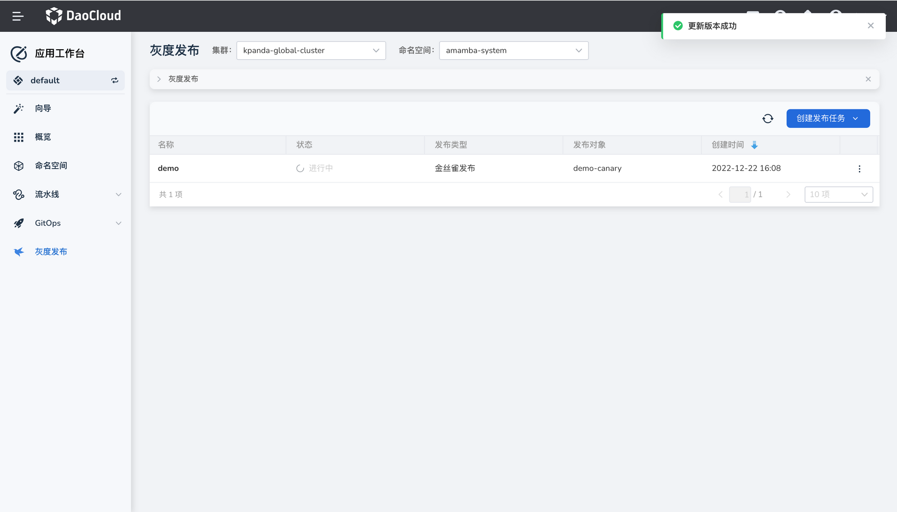

# 创建金丝雀发布任务

应用工作台基于开源项目 [Argo Rollout](https://argoproj.github.io/argo-rollouts/) 提供强大的灰度发布能力。灰度发布可以在不影响老版本的前提下，发布新的应用版本。按照预先定义的规则，渐进式地将流量切换到新版本，当新版本运行无问题后，最终自动将全部流量从老版本迁移至新版本。

## 前提条件

1. 创建一个[工作空间](../../../ghippo/04UserGuide/02Workspace/workspaces.md)和一个[用户](../../../ghippo/04UserGuide/01UserandAccess/user.md)，该用户需加入该工作空间并具备 `Workspace Editor` 角色。

- 创建一个应用并开启`灰度发布`，可参考[基于 Git 仓构建微服务应用](../wizard/create-git-based-ms.md)、[基于 Jar 包部署 Java 应用](../wizard/jar-java-app.md)。

- 发布对象所在的集群已经安装了 Istiod 和 Argo Rollout 两个组件。有关具体的安装方式，可参考[管理 Helm 应用](../../../kpanda/07UserGuide/helm/helm-app)。

## 操作步骤

1. 进入`应用工作台`模块，在左侧导航栏点击 `灰度发布`，然后在页面右上角点击`创建发布任务`->`金丝雀发布`。

    

2. 参考下列要求填写基本信息，然后点击`下一步`。

    - 名称：填写发布任务的名称。最长 63 个字符，只能包含小写字母、数字及分隔符("-")，且必须以小写字母或数字开头及结尾
    - 集群：选择发布对象所在的集群。需要确保该集群已经部署了 Istio 和 Argo Rollout。
    - 命名空间：选择发布对象所在的命名空间，且该命名空间中已经部署了开启了`灰度发布`的应用。
    - 无状态负载：选择具体的发布对象。

        

3. 参考下列说明配置发布规则。
    - 实例数量：进行灰度发布任务时应用的副本数量。
    - 流量调度策略：

        - 当前阶段发布流量比例：每个流量周期内，为灰度版本增加的流量比例。
        - 到达流量比例后等待时间：为灰度版本增加流量周期，即等待多久后自动进入下一个灰度流量比例。

            > 如果设置为 0 或不填写，发布任务执行到此步骤时会永久暂停。

    - 监控分析：开启后即可利用 Prometheus 的能力进行监控。根据预先定义的监控指标以及采集间隔，在整个发布过程中自动执行监控分析。如果不满足定义的规则，则自动回滚至旧版本，灰度发布失败。

        

4. 在页面底部点击`创建并更新应用`，然后在弹框中设置灰度版本的镜像地址并点击`确定`。

    此时原工作负载的副本数会被设置为 0。

    

5. 系统自动跳转至灰度发布的任务列表页面，提示`更新版本成功`。

    
