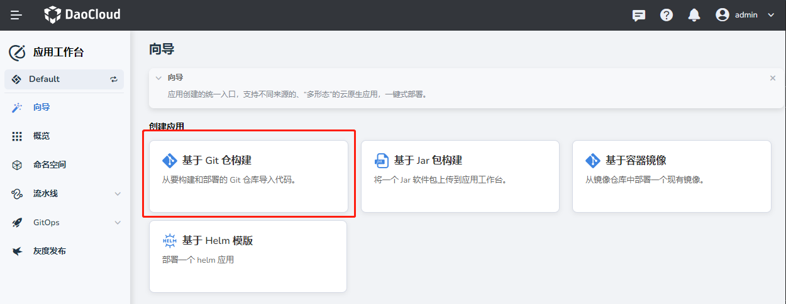
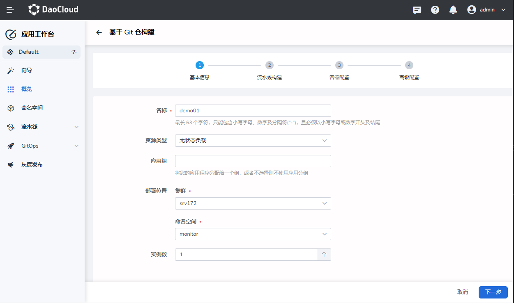
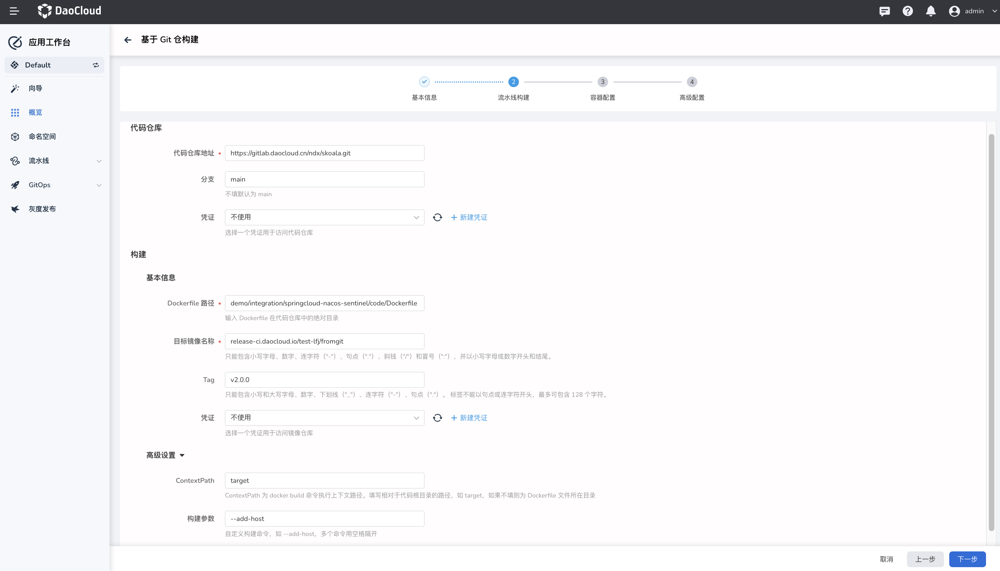
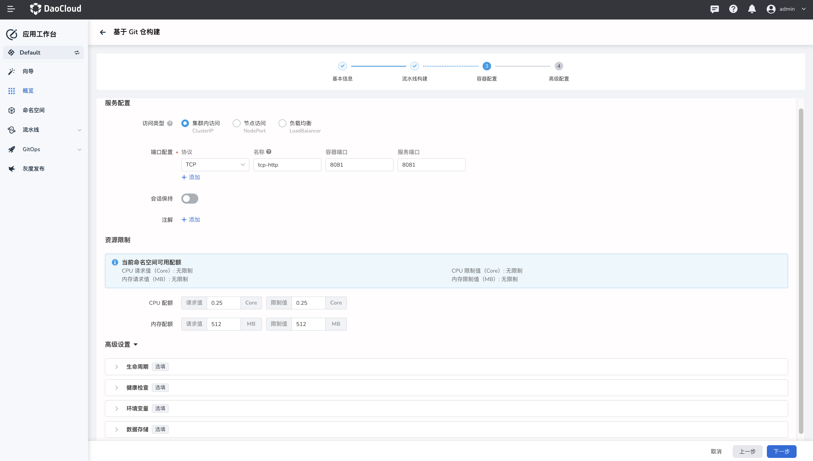
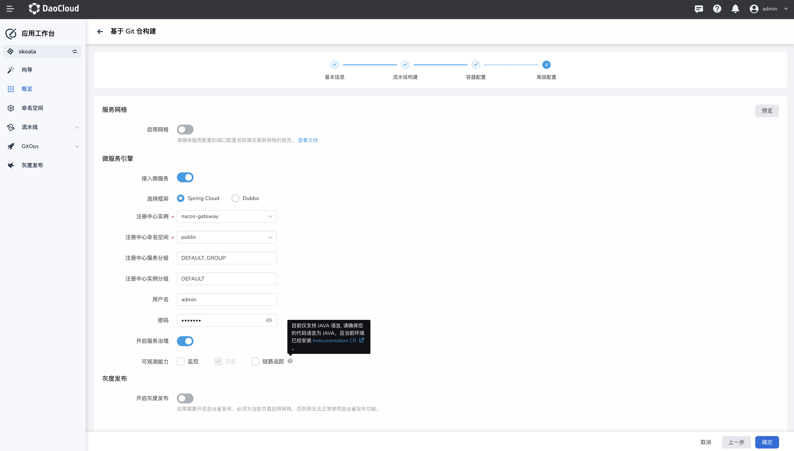
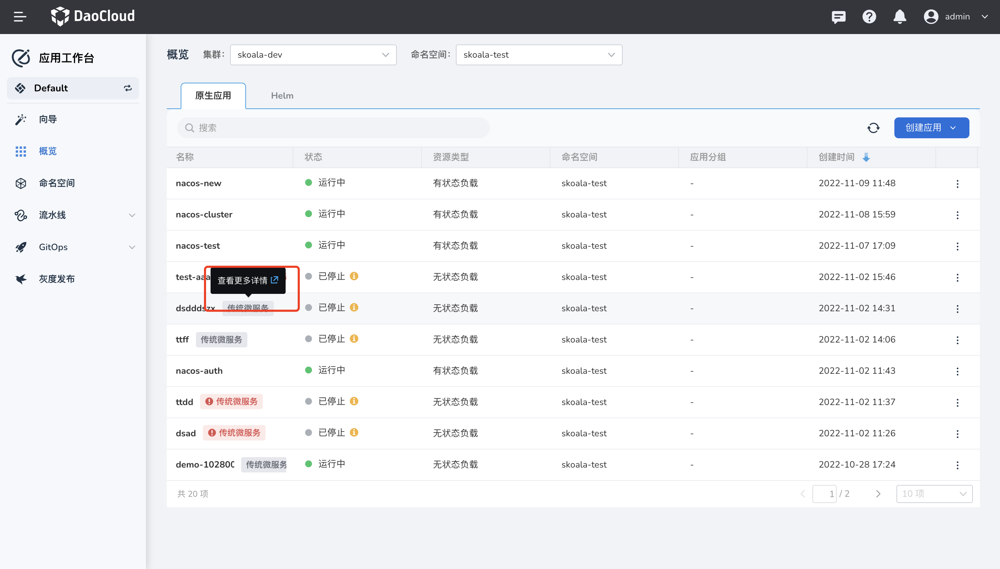

# 基于 Git 仓构建微服务应用

通过应用工作台基于 Git 仓库源码构建传统微服务应用，从而对应用进行流量治理，查看日志、监控、链路追踪等功能。

## 前提条件

- 需创建一个工作空间和一个用户，该用户需加入该工作空间并赋予 `workspace edit` 角色。
  参考[创建工作空间](../../../ghippo/04UserGuide/02Workspace/Workspaces.md)、[用户和角色](../../../ghippo/04UserGuide/01UserandAccess/User.md)。
- 创建可以访问代码仓库仓库、镜像仓库的两个凭证，分别命名为：`git-credential`、`registry`。创建凭证的更多信息，请参考[凭证管理](../Pipeline/Credential.md)。
- 准备一个 Gitlab 仓库、Harbor 仓库

## 创建凭证

1. 在`凭证`页面创建两个凭证：

    - git-credential：用户名和密码，用于访问代码仓库
    - registry-credential：用户名和密码，用于访问镜像仓库

1. 创建完成后，可以在`凭证列表`页面看到凭证信息。

## 基于 Git 创建微服务应用

1. 在`应用工作台` -> `向导`页面中，点击 `基于 Git 仓构建`。

    

1. 在`基于 Git 仓构建`页面中，设置以下基本信息后点击`下一步`：

    - 名称：填写应用的名称。
    - 资源类型：支持无状态负载、有状态负载，本演示选择无状态负载。
    - 输入或选择应用组。
    - 设置部署位置，如果要接入微服务，请确保当前工作空间下
        - 集群：选择应用需要部署的集群。
        - 命名空间：选择应用需要部署的命名空间。
    - 实例数：填写实例的数量，Pod 的数量。

    

1. 设置流水线构建信息后点击`下一步`。

    - 代码仓库
        - 代码仓库：输入 Git 仓库地址 `https://gitlab.daocloud.cn/ndx/skoala.git`。此处为示例地址，在实际操作中请使用自己的仓库地址。
        - 分支：默认为`main`，此处为`main`，无需更改
        - 凭证：选择访问代码仓库的凭证 `git-credential`，如果为公开仓库，则无需填写
    - 构建
        - Dockerfile 路径：输入 Dockerfile 在代码仓库中的绝对路径，此处示例地址 `demo/integration/springcloud-nacos-sentinel/code/Dockerfile`
        - 目标镜像名称：输入镜像仓库名称 [`release-ci.daocloud.io/test-lfj/fromgit`](http://release-ci.daocloud.io/test-lfj/fromgit) 。
        - Tag：输入镜像仓库版本 `v2.0.0`
        - 凭证：选择访问镜像仓库的凭证 `registry-credential`
    - 高级设置
        - ContextPath：ContextPath 为 docker build 命令执行上下文路径。填写相对于代码根目录的路径，如 target，如果不填则为 Dockerfile 文件所在目录。
        - 构建参数：构建参数会以 --build-arg 的形式传递到 build 命令的参数中，支持将上游制品下载地址、上游镜像下载地址设置为参数，同时支持自定义任意参数。

    

1. 进行容器配置后，点击`下一步`。

    - 服务配置
        - 访问类型：支持集群内访问、节点访问、负载均衡。示例值如下：

        ```
        - name: http             protocol: TCP      port: 8081      targetPort: 8081    
        - name: health-http      protocol: TCP      port: 8999      targetPort: 8999
        - name: service         protocol: TCP      port: 9555      targetPort: 9555
        ```

    - 资源限制
        - 指定应用能使用的资源上限，包括 CPU、内存。

    

1. 在`高级配置`页面选择`开启接入微服务`，配置以下字段后点击`确定`。

    - 选择框架：支持`Spring Cloud`、`Dubbo`，此处选择 `Spring Cloud` 。
    - 注册中心实例：目前仅支持[微服务引擎托管的 Nacos 注册中心实例]()。
    - 注册中心命名空间：微服务应用的 nacos 命名空间
    - 注册中心服务分组：微服务应用的服务分组
    - 注册中心实例分组：
    - 用户名/密码：如果该注册中心实例被认证，则需要填写用户名密码
    - 开启微服务治理：需要选择的注册中心实例支持开启，否则则无法开启
    - 可观测：
        - 监控：选择开启，开启后可查看服务相关监控信息
        - 日志：默认开启
        - 链路追踪：开启后可查看服务的链路追踪信息，目前仅支持 Java 语言

    

## 查看并访问微服务相关信息

1. 在左侧导航栏点击`概览`，在`原生应用`页签中，光标悬浮在某一个应用上，点击悬浮菜单`查看更多详情`。

    

1. 跳转到微服务引擎，查看服务详情。
