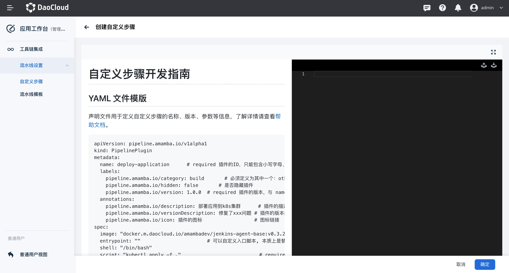
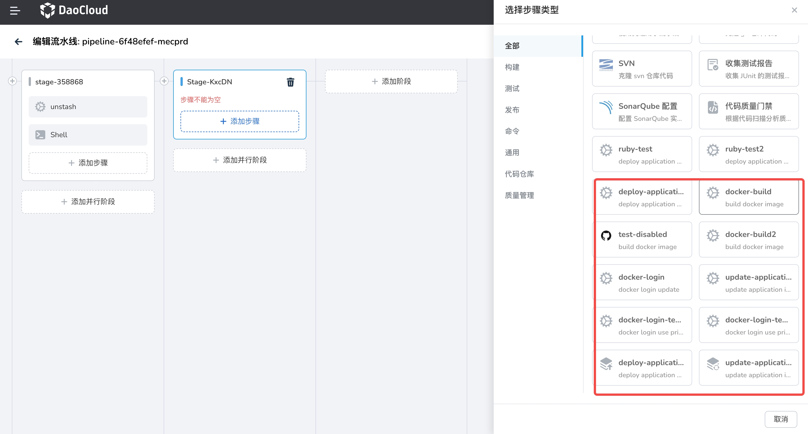

# 自定义步骤介绍

不同企业在流水线的定义中，由于存在各种各样的场景，所以对所需要的流水线步骤也不尽相同，工作台提供了自定义步骤的能力，方便企业来快速编写开发符合实际场景自定义步骤。

## 开发自定义步骤

自定义步骤的开发通过纯 YAML 的声明模式来定义，前往了解[自定义步骤开发指南](./customize-develop.md)。

另外 DCE 5.0 应用工作台提供了一些内置的自定义步骤来供用户使用。

## 创建自定义步骤

1. 前往 __应用工作台__ -> __工作台管理__ -> __流水线设置__ -> __自定义步骤__

2. 在 __自定义步骤列表__ 可以看到系统内置、平台定义两种来源的步骤，其中系统内置是由平台提供的自定义步骤

3. 点击界面的 __创建自定义步骤__ 按钮，进入到创建界面

4. 按照[自定义步骤开发指南](./customize-develop.md)开发好的声明文件填写至编辑器后，点击 __创建__ 。

    

## 开启与禁用自定义步骤

自定义步骤提供了步骤的状态：启用、未启用，在实际开发过程中，对于一些还不具备生产可用的步骤，建议标记为禁用状态。
对于已经调试完成的，管理员可以标记为开启状态，一旦开启后，所有工作空间下的成员均可使用该步骤。

## 使用自定义步骤

### 配置 Jenkins

自定义插件功能依赖于 Jenkins 的[共享库](https://www.jenkins.io/doc/book/pipeline/shared-libraries/)功能，
因此首先需要在 Jenkins 中配置共享库。

修改 Jenkins 的 casc 配置项使之开启：

1. 点击左上角的 __≡__ 打开导航栏，选择 __容器管理__ -> __集群列表__ ，找到需要安装 Jenkins 的集群，点击该集群的名称。
2. 找到 __配置与密钥__ -> __配置项__ ，命名空间选择 __amamba-system__ ，搜索 __global-jenkins-casc-config__ ，在操作列点击 __编辑 YAML__ 。
3. 在 __data__ -> __jenkins.yaml__ -> __unclassified__ 字段下添加如下内容：

    ```yaml
    unclassified:
      globalLibraries: # (1)!
        libraries:
          - name: amamba-shared-lib
            defaultVersion: main
            implicit: true # (2)!
            retriever:
              modernSCM:
                libraryPath: ./
                scm:
                  git:
                    remote: https://github.com/amamba-io/amamba-shared-lib.git # (3)!
    ```

    1. 共享库配置
    2. 表示该共享库会被默认引入到所有流水线中，在 Jenkinsfile 中就 __不再需要__ 使用 @Library 注解引入。
       如果开启了此参数将会对所有的流水线生效，会略微延长流水线的执行时间。
       如果不需要则设置为 false，后续如果某个流水线需要使用到自定义插件功能，
       则需要在 Jenkinsfile 中使用 `@Library('amamba-shared-lib@main') _` 引入。
    3. 表示工作台维护的共享库地址，是实现自定义插件的代码仓库地址。仓库地址是公开的。
       __在网络受限的环境下，您可以将其 clone 到内网的 git 服务器上，然后将地址改为内网地址。__

### 使用自定义插件

1. 选择一条流水线，进入详情，点击 __编辑流水线__

2. 点击 __添加步骤__ ，即可看到自定义步骤，选择后填写相关参数即可

    


注意，自定义步骤有以下限制：

- 必须要在一个包含 Docker 或者 Podman 的容器中运行，因此您需要选择 __使用容器__
- 因为本质上是在容器中执行脚本，某些脚本可能需要一些特殊的权限。当自定义步骤无法实现时，推荐使用 __执行 Shell__ 步骤，自行编写脚本。

自定义插件使用时会被渲染成如下的 Jenkinsfile 片段：

```groovy
container("base") {
    amambaCustomStep(
        pluginID: 'printEnv',      // 插件名称
        version: 'v1.0.0',         // 插件版本
        docker: [
            image: 'alpine',       // 插件使用的镜像
            shell: '/bin/bash',    // 解释器
            script: 'env',         // 在镜像中执行的脚本
        ],
        args: [
            key1: 'val',           // 插件中定义的参数
            key2: [
                'key3': 'val3'
            ],
            key4: ["val4", "val5"]
        ],
    )
}
```

args 中的所有参数都会以环境变量的形式传递到插件中，因此您可以在 script中 通过 `$key1` 的形式获取到参数的值。
如果参数的类型是 kv，参数的 key 会以 `_` 连接后传递到插件中，如 `key2_key3=val3`。
如果参数定义的是数组类型，则传递到插件中的值是 `["val4", "val5"]`，您需要按照不同的语言自行解析。

因此，即使您不采用 DAG 的形式编排，依旧可以按照上述标准在 Jenkinsfile 中使用自定义插件。
只是需要注意，参数的值类型为 string 时请使用单引号，避免无法替换环境变量的问题。

### 环境变量和凭证

在 Jenkinsfile 中定义的环境变量和凭证，都可以在插件中读取到，比如：

```groovy
withCredential([usernamePassword(credentialsId: 'my-credential', usernameVariable: 'USERNAME', passwordVariable: 'PASSWORD')]) {
    amambaCustomStep(
        pluginID: 'printEnv',
        version: 'v1.0.0',
        docker: [
            image: 'alpine',
            shell: '/bin/bash', // 可以在插件的 script 中读取到 USERNAME 和 PASSWORD 变量
            script: 'env',
        ],
        args: [],
    )
}
```

### 如何拉取私有镜像

如果您在定义插件时使用的是私有镜像，则需要通过以下方式使用自定义步骤：

1. 在工作台中创建一个用户名密码类型的凭证，用于存储私有镜像的用户名和密码。
2. 在使用自定义步骤之前，添加一个 __使用凭证__ 的步骤，用户名变量填写 `PLUGIN_REGISTRY_USER`，密码变量填写 `PLUGIN_REGISTRY_PASSWORD`。

渲染出的 Jenkinsfile 片段如下：

```groovy
withCredential([usernamePassword(credentialsId: 'my-credential', usernameVariable: 'PLUGIN_REGISTRY_USER', passwordVariable: 'PLUGIN_REGISTRY_PASSWORD')]) {
    amambaCustomStep(
        ...
    )
}
```

后续即可使用私有的镜像作为插件的基础镜像。
