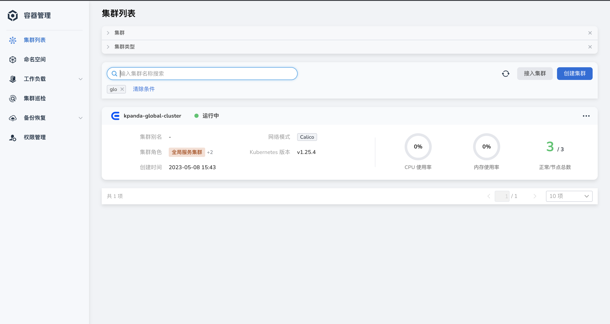
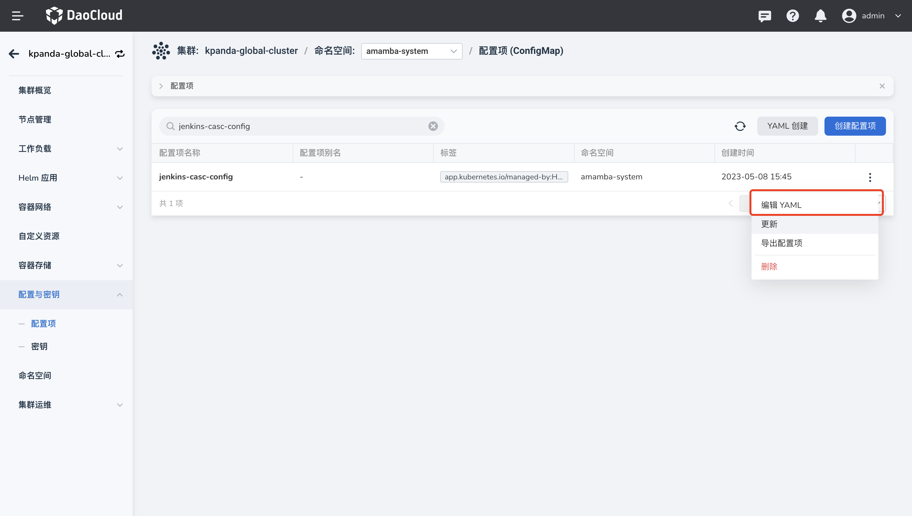
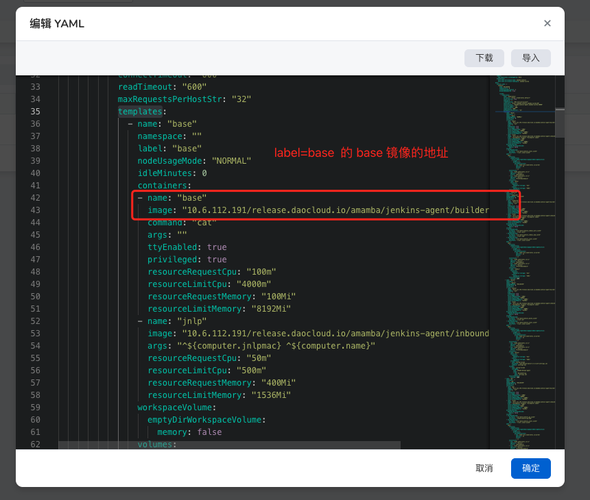
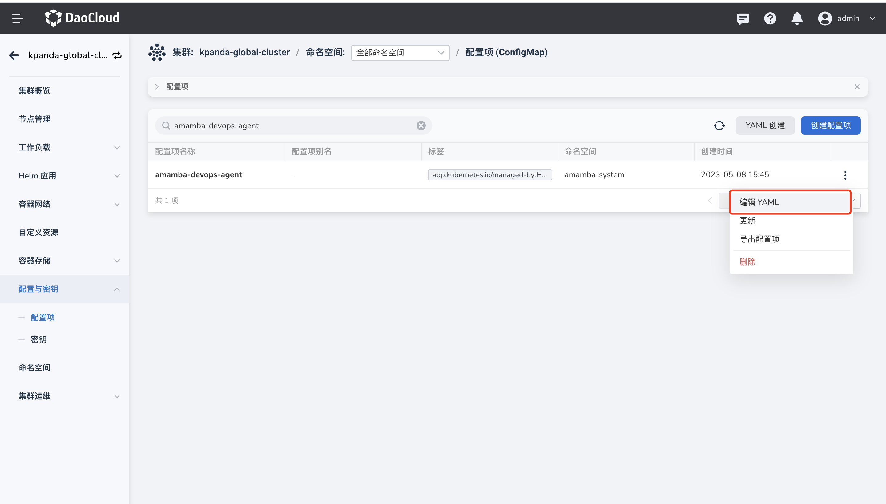
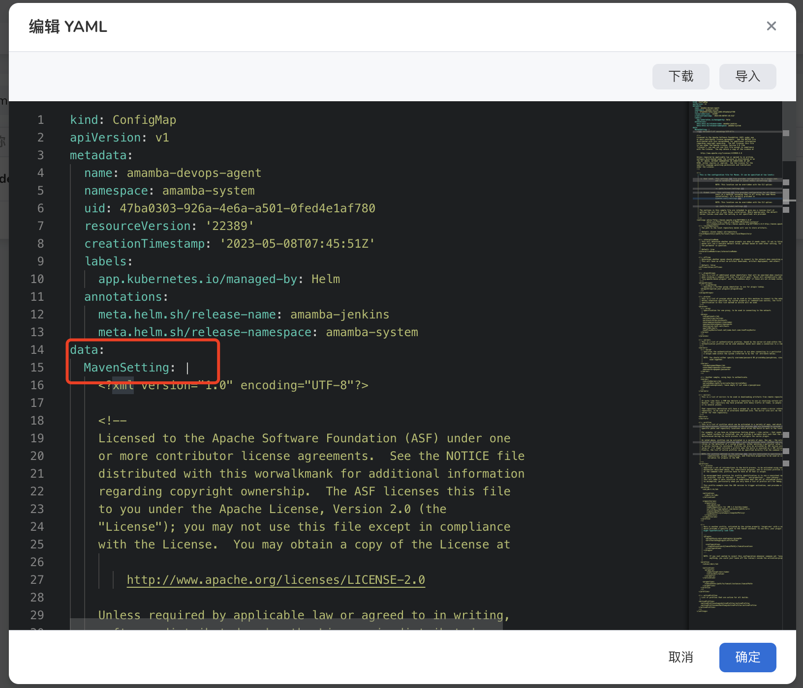
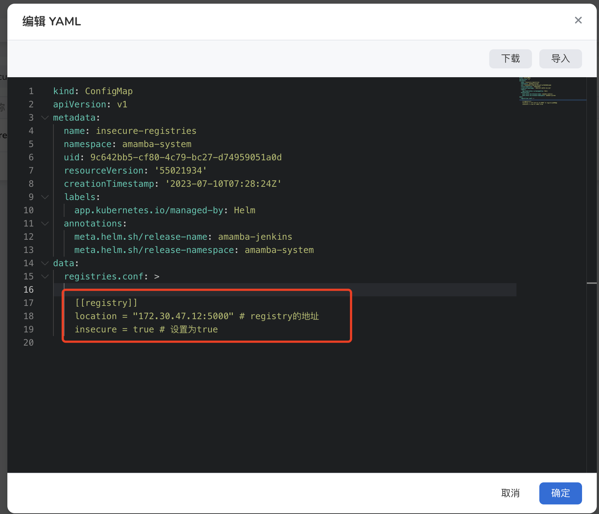

# 流水线相关问题

本页列出使用应用工作台时可能遇到的一些问题并给出相应的解决方案。

## 执行流水线时报错

当 Jenkins 所在集群与应用部署集群跨数据中心时，网络通信延迟会变高，可能遇到如下的报错信息：

```bash
E0113 01:47:27.690555 50 request.go:1058] Unexpected error when reading response body: net/http: request canceled (Client.Timeout or context cancellation while reading body)
error: unexpected error when reading response body. Please retry. Original error: net/http: request canceled (Client.Timeout or context cancellation while reading body)
```

**解决方案**：

在该流水线的 Jenkinsfile 中将部署命令由 `kubectl apply -f` 修改为 `kubectl apply -f . --request-timeout=30m`

## 如何更新内置 Label 的 podTemplate 镜像？

本示例中的 Jenkins 组件部署在 `kpanda-global-cluster` 集群，实际操作中请选择 Jenkins 组件所在的集群。

应用工作台通过 podTemplate 能力声明了 6 个 label：`base`、`maven`、`mavenjdk11`、`go`、`go16`、`node.js` 和 `python`。您可以指定具体的 Agent 标签来使用对应的 podTemplate。

如果内置的 podTemplate 中的镜像不满足您的需求，您可以通过以下方式替换容器镜像或者添加容器镜像，

1. 首先需要您前往`容器管理` ，在`集群列表` 界面选择`kpanda-global-cluster` 集群，进入详情界面。

   

2. 在左侧导航栏依次点击`配置与密钥`→`配置项`，进入配置项目列表界面。

3. 搜索 `jenkins-casc-config` ，在操作列点击`编辑YAML` 。

   

4. 在编辑 YAML 弹窗中， 在`data` 模块中`jenkins.yaml` 文件中`jenkins.clouds.kubernetes.templates`中选择需要更改的 podTemplate 的镜像。

   

5. 更新完成后，需要前往`工作负载`重启 jenkins。

## 流水线中构建环境为 maven 时，如何修改 settings.xml 来修改依赖包来源？

本示例中的 Jenkins 组件部署在 `kpanda-global-cluster` 集群，实际操作中请选择 Jenkins 组件所在的集群。

当流水线构建环境为 maven 时，大多数客户是有需求来对 settings.xml 修改来更换依赖源，请参考以下步骤：

1. 首先需要您前往`容器管理` ，在`集群列表` 界面选择`kpanda-global-cluster` 集群，进入详情界面。

   

2. 在左侧导航栏依次点击`配置与密钥`→`配置项`，进入配置项目列表界面。

3. 搜索 `amamba-devops-agent` ，在操作列点击`编辑YAML` 。

   

4. 在编辑 YAML 弹窗中， 在`data` 模块`MavenSetting`中按需修改即可。

   

5. 更新完成后，需要前往`工作负载`重启 jenkins。

## 通过 Jenkins 构建镜像时，容器无法访问私有镜像仓库

### 当集群运行时设置为 podman 时，参考以下步骤

本示例中的 Jenkins 组件部署在 `kpanda-global-cluster` 集群，实际操作中请选择 Jenkins 组件所在的集群。

1. 首先需要您前往`容器管理` ，在`集群列表` 界面选择`kpanda-global-cluster` 集群，进入详情界面。

2. 在左侧导航栏依次点击`配置与密钥`→`配置项`，进入配置项目列表界面。

3. 搜索 `insecure-registries` ，在操作列点击`编辑YAML` 。

4. 在编辑 YAML 弹窗中， 在`data` 模块`registries.conf` 下配置，修改时注意格式的缩进，并且每个 registry 需要单独的一个 [[registry]]  部分，如下图：

   
