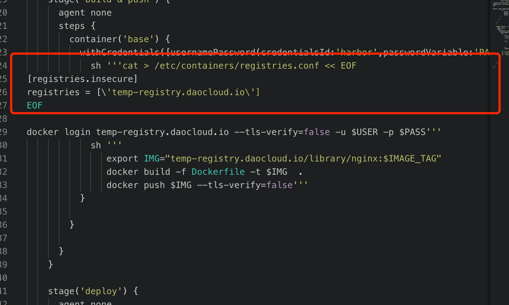

# 常见问题

本页列出使用应用工作台时可能遇到的一些问题并给出相应的解决方案。

## 执行流水线时报错

当 Jenkins 所在集群与应用部署集群跨数据中心时，网络通信延迟会变高，可能遇到如下的报错信息：

```bash
E0113 01:47:27.690555 50 request.go:1058] Unexpected error when reading response body: net/http: request canceled (Client.Timeout or context cancellation while reading body)
error: unexpected error when reading response body. Please retry. Original error: net/http: request canceled (Client.Timeout or context cancellation while reading body)
```

**解决方案**：

在该流水线的 Jenkinsfile 中将部署命令由 `kubectl apply -f` 修改为 `kubectl apply -f . --request-timeout=30m`

## 通过 Jenkins 构建镜像时，容器无法访问私有镜像仓库****

遇到此问题时可以在流水线的 Jenkinsfile 中增加如下命令：

```bash
cat > /etc/containers/registries.conf << EOF
[registries.insecure]
registries = ['temp-registry.daocloud.io']
EOF
```



## 在 GitOps 模块下添加 GitHub 仓库时报错

由于 GitHub 移除了对 username/password 的支持，所以通过 HTTP 方式导入 **GitHub** 仓库时会导入失败，可能出现如下报错信息：

```bash
remote: Support for password authentication was removed on August 13, 2021.
remote: Please see https://docs.github.com/en/get-started/getting-started-with-git/about-remote-repositories#cloning-with-https-urls for information on currently recommended modes of authentication.
fatal: Authentication failed for 'https://github.com/DaoCloud/dce-installer.git/'
```

**解决方案**：

使用 SSH 方式导入 **GitHub** 仓库。

## 在某个工作空间下在 GitOps 模块中添加仓库时提示仓库已经存在

目前一个仓库绑定只能到一个工作空间，不能绑定到不同工作空间。
