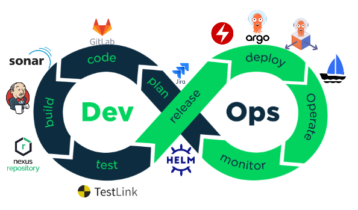
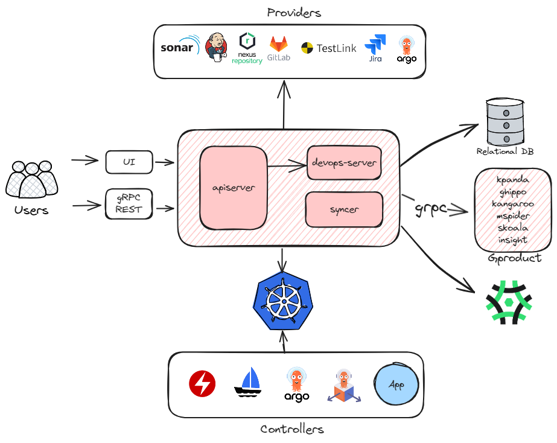
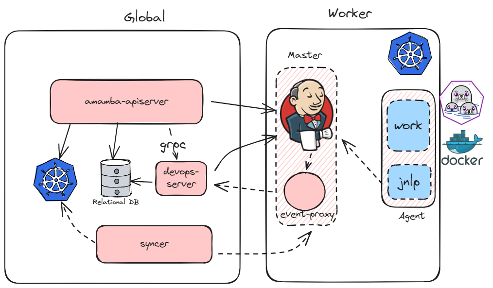

# 应用工作台技术概览

## 目标

- 对应用工作台架构有个整体认识
- 说明包含组件及集成方式
- 示例及引导文档

## 系统组件

amamba-system 主要包含以下三个组件

- apiserver：所有服务的入口，无状态的，提供 gRPC 和 REST 两种方式访问，通过 REST 或 gRPC
  调用 `Providers` 的服务，或者通过 kube-client 或者 kpanda 创建资源与 `Controllers` 交互
- devops-server：主要与 Jenkins 通信，并向 `apiserver` 提供相关接口以支持懒加载，基于事件的同步等功能
- syncer：主要负责维护 `Providers` 和 `Controllers` 的数据与系统的保持一致，确保系统的配置能正确地下发到各个组件当中

## CI

### Jenkins

Amamba [Jenkins](https://github.com/amamba-io/jenkins-agent) 基于
[kubernetes 插件](https://plugins.jenkins.io/kubernetes/)增强，相比于原生的 Jenkins 我们提供了以下优势：

1. 完整的云原生解决方案

    相比于传统的 VM 部署，云原生有着弹性和可伸缩性、高可用和灵活等优点，我们提供了整套的 Jenkins 云原生方案，
    包括在 Kubernetes 中运行、构建镜像和制品、发布、和其他工具链集成、DR 等；

2. 优化的读取速度

    我们提供了基于关系型数据库的缓存，流水线及运行相关的数据都存储在 DB 里，并通过事件机制保证数据及时更新。

3. 一次创建，多处运行

    得益于 DB，Jenkins 的部署位置和持久化不再重要，我们时刻可以接入另一套集群中部署的 Jenkins，并在上面运行之前创建的流水线；

4. 更低的门槛

    [Jenkinsfile](https://www.jenkins.io/doc/book/pipeline/jenkinsfile/)
    强大但有着比较高的理解和使用门槛，我们提供了图形化界面以拖拉拽的方式帮助用户创建和编辑流水线，帮助用户更快地上手；

5. 多租户

    基于 DCE5 的 Workspace 机制，我们对流水线和凭证做了隔离；

此外，目前应用工作台也有着以下问题：

1. 启动慢

    相比于传统的使用注册节点的 Agent，在基于 Kubernetes 的 Jenkins 上运行流水线需要创建
    Pod、等待调度和拉取镜像，这一过程导致启动的速度相对来说要更慢。

2. 缓存

    由于 Pod 的沙箱环境，使得缓存无法被有效利用，我们可以为其挂载持久化存储，但这几乎总是意味着额外的规划和管理成本；

3. 插件

    安装插件依然需要到 Jenkins 的管理界面上操作和配置，并且当迁移到其他集群上时会丢失。
    我们建议通过 fork [amamba-io/jenkins-agent](https://github.com/amamba-io/jenkins-agent)
    并修改 `formula.yaml`后重新构建的方式，将插件持久化到镜像中；

4. Noisy Neighbour

    我们没有对流水线做资源的配额和限制，因为我们认为 CI 和部署的资源不应该放在一起考虑，
    而是依赖于管理员对 CI 系统的前期规划，但这可能导致部分流水线抢占所有资源；

5. 构建镜像慢

    除了前面说的缓存无法被有效利用的原因外，当 Kubernetes 的运行时不是 Dockerd 时，我们只能使用类似
    [dind](https://hub.docker.com/_/docker) 或 [pind](https://podman.io/) 的方式来构建镜像，
    这种在容器里面运行容器的方式会导致[一部分 IO 性能损失](https://www.alibabacloud.com/blog/container-security-a-look-at-rootless-containers_595153)；

基于此，我们也在计划支持使用传统方式部署的 Jenkins。

#### 整体架构

- 利用 [Generic Event 插件](https://plugins.jenkins.io/generic-event/)提供的事件机制，
  我们可以及时地更新流水线的运行情况。为了避免不同网络环境带来的事件丢失的干扰，
  我们以 sidecar 的方式部署了 `event-proxy`，这一组件提供更强的网络流量控制能力和可靠的事件系统。
  当然，对于 Amamba 来说它是完全透明的，如果网络环境可控，可以不部署它；
- 为了保证 `apiserver` 是完全无状态可伸缩的，我们使用 `devops-server` 来处理状态相关的服务——包括接收
  Jenkins 的事件、同步流水线状态、运行数据的懒加载、暴露 Jenkins 事件指标等，并提供了 SDK 给 `apiserver` 调用；
- 由于 Jenkins 的实例可能运行在任一集群上，`syncer` 帮助我们将其中系统的部分同步到不同实例里去，包括：
    - 我们的凭证统一使用`secret`管理，`syncer`会将其中流水线的部分同步到 Jenkins 中；
    - Jenkins 的配置基于 [CasC](https://www.jenkins.io/projects/jcasc/) 生效，
      我们会在系统中保留变更的部分，并使用`syncer` 同步到子集群里面；
- 流水线实际在 Pod 里被执行，通过 [jnlp](https://hub.docker.com/r/jenkins/inbound-agent)
  容器与 Jenkins 通信，这种架构使得即使 Jenkins 挂掉了大部分任务也能继续运行。

#### 更多资源

- 更可靠的用法：
    - HA: [Jenkins 高可用方案 - DaoCloud Enterprise](../quickstart/jenkins-HA.md)
    - 配置和规划：[Jenkins 场景配置 - DaoCloud Enterprise](../quickstart/scenarios-config.md)
- 扩展：
    - 自定义工具：[在 Jenkins 中使用自定义工具链 - DaoCloud Enterprise](../quickstart/jenkins-custom.md)
    - 复用流水线：[自定义模板 - DaoCloud Enterprise](../user-guide/pipeline/template/custom-template.md)
    - 自定义 Agent：[自定义 Jenkins Agent 镜像 - DaoCloud Enterprise](../user-guide/pipeline/jenkins-agent.md)
     （ __缺少 kubernentes 类型 agent 的定义方式__ ）
    - 自定义步骤：WIP
- 加速（WIP，缺一个系统的文档）；
    - [在指定的节点上运行流水线 - DaoCloud Enterprise](../quickstart/pipeline-on-node.md)
    - [在流水线中使用缓存 - DaoCloud Enterprise](../quickstart/job-cacher.md)
- 集成：
    - SornaQube：[使用流水线实现代码扫描 - DaoCloud Enterprise](../quickstart/scan-with-pipeline.md)
    - 使用集成的 Gitlab：WIP（基本原理，如何使用）
- 实践：
    - [基于 Git 仓构建微服务应用 - DaoCloud Enterprise](../user-guide/wizard/create-app-git.md)
    - [基于 Jar 包构建 Java 应用 - DaoCloud Enterprise](../user-guide/wizard/jar-java-app.md)
    - 结合 ArgoCD 使用：[流水线 + GitOps 实现 CI/CD - DaoCloud Enterprise](../quickstart/argocd-rollout.md)
    - 构建多架构镜像（WIP 有误）：[构建多架构镜像 - DaoCloud Enterprise](../user-guide/pipeline/podman.md)

## CD

### Argo CD

Amamba 使用 [Argo CD](https://argo-cd.readthedocs.io/en/stable/)
作为引擎实现 GitOps 的能力，相比原生的 Argo CD，我们主要在和 DCE 5.0 的集成上做了增强：

1. 应用按照租户的粒度隔离，只能部署到对应的集群和命名空间下；
2. 权限按照全局 RBAC 的策略控制，只有对应权限点的用户才能执行对应操作；

问题：

1. 代码仓库没有做租户隔离：这是 Argo CD 的设计缺陷，我们已经在积极推动社区优化：
   [argoproj/argo-cd #18290](https://github.com/argoproj/argo-cd/pull/18290)
2. 暂不支持 ApplicationSet；

#### 整体架构

- 我们通过 Argo 提供的 SDK 访问`argo-server`，使用 AppProject - Wrokspace 一一映射的方式来为用户创建和更新相应的资源；
- `syncer` 会一直 watch 系统中租户的变化并将变化应用到 Argo 的资源中；

#### 更多资源

- 更可靠地使用:
    - HA：[Argo-CD 高可用部署 - DaoCloud Enterprise](../quickstart/argo-cd-HA.md)
    - [在 GitOps 中启用凭证加密功能 - DaoCloud Enterprise](../user-guide/gitops/gitops-secret.md)
- 多环境推进（Promote）部署（WIP）；
- [How to Model Your GitOps Environments](https://codefresh.io/blog/how-to-model-your-gitops-environments-and-promote-releases-between-them/)
  提供了基于 kustomization 在多个环境间 Promote 的思路；
- [GitHub - cloudogu/gitops-patterns: Collection of patterns, examples and resources for GitOps process design, GitOps repository structures, etc](https://github.com/cloudogu/gitops-patterns)
  总结了一些常见的 GitOps 的模式选择及利弊；

### Argo Rollouts

Amamba 基于 Argo Rollouts 提供渐进式发布的能力，相比于原生的 Argo Rollouts，我们主要在以下方面做了增强：

1. 更加易于使用，提供了 Step By Step 的界面来将当前集群中的工作负载转换成`Rollout` 开始灰度发布；
2. 支持跨集群创建和管理；
3. 与 mspider（使用 istio 作为流量控制工具时）和 skoala（使用 contour 时）有更好的集成；

问题：

1. 现在 mspider 的托管网格模式下，子集群部署的虚拟服务（VirtualService）和目标规则（DesinationRule）不会生效，
   这导致无法再这种场景下使用基于 Istio 的 Rollout，mspider 已经在优化，预计在 v0.26 版本里支持；
2. 基于 Deployment 创建 Rollout 会导致暂时的访问失败，社区已经在着手修复这个问题
   [argoproj/argo-rollouts #3111](https://github.com/argoproj/argo-rollouts/issues/3111)，预计将在 v1.7 版本里解决；

#### 更多资源

- [基于 Argo Rollout 实现灰度发布 - DaoCloud Enterprise](../quickstart/argocd-rollout.md)
- [基于 Contour 的灰度发布 - DaoCloud Enterprise](../quickstart/contour-argorollout.md)

## 应用

我们支持原生应用、Helm 应用、OAM 应用和 OLM 应用。

### 原生应用

原生应用即 Kubernetes 原生的工作负载类型的资源，例如 Deployment，StatefulSet 和 DaemonSet。
我们没有增加任何的心智负担，但为了将相关资源关联起来，我们使用
[kubernetes-sigs/application](https://github.com/kubernetes-sigs/application) 来说明当前应用包含的资源类型和标签。

这个 CRD 对应的 Controller 是可选安装的，需要在每个子集群手动安装，不部署并不会导致资源创建失败，
但是部署后能够不断同步资源状态，返回资源的就绪情况。

### OAM 应用

OAM 应用基于 [kubevela](https://kubevela.io/) 实现，我们主要在多租户方面做了增强：

1. 在当前租户下首次创建 OAM 应用时会提示需要创建或指定一个命名空间作为该 Workspace 下的所有
   `applications.core.oam.dev` 放置的位置，以此实现不同租户下应用的隔离；
2. `syncer`会一直 watch 系统中租户的变化并将变化应用到 KubeVela 的资源中；

### Helm 应用和 OLM 应用

OLM 应用和 Helm 应用主要基于 Kpanda 的相应能力封装。

## 版本信息

Amamba 的所有 Addon 从 v0.21（对应安装器 v0.12）开始，都可以在应用商店以 Helm 的方式部署，
没有版本限制。但是默认版本经过了完整的测试，可以更好地集成到当前系统中，下表是 Addon 和 Amamba 的版本关系：

| Addon                                  | 起始版本 | 结束版本 |
| -------------------------------------- | ----- | ----- |
| amamba-io/Jenkins 0.3.1（2.413）       | v0.21 | v0.24 |
| argocd 5.34.6（2.7.3）                 | v0.21 | -     |
| argo-rollouts 2.32.0（1.6.0）          | v0.21 | -     |
| vela-core 1.7.7（1.7.7）               | v0.21 | v0.23 |
| vela-core 1.9.7（1.9.7）               | v0.23 | -     |
| amamba-io/Jenkins 0.3.2（2.413）       | v0.24 | -     |
| amamba/kube-app-manager 0.1.4（0.8.3） | ?     | -     |
