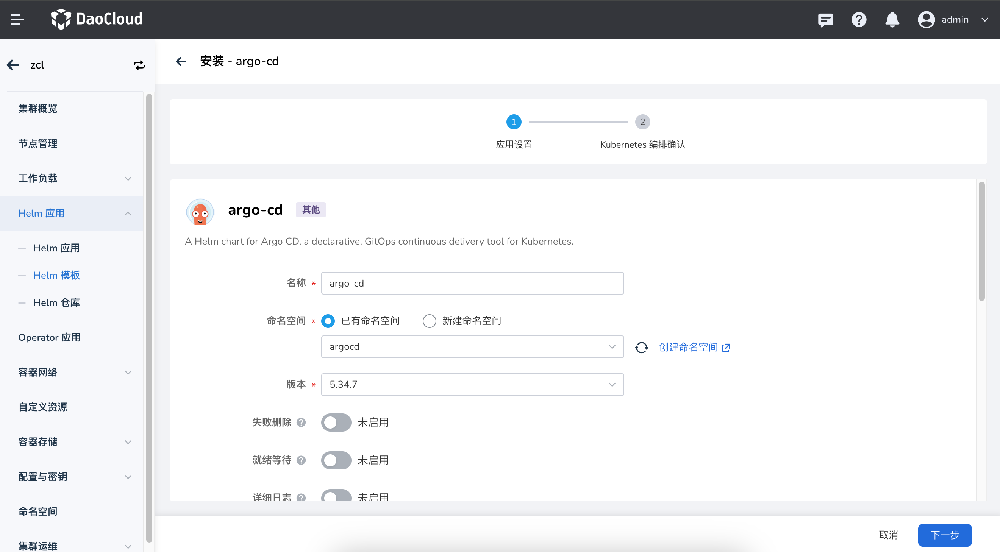

# 部署应用工作台可插拔组件

## 概述

应用工作台中的一些功能借助了开源组件的能力，从应用工作台 v0.21.0 版本开始，采取可插拔的设计模式，解藕了相关的功能组件，
所以在部署应用工作台时，您可以在安装器的 `manifest.yaml` 文件中选择是否开启。如果安装时没有开启，您也可以通过下文指导进行启用。

关于每个组件的对应的功能如下：

|  组件   | 功能模块  |  备注 ｜
|  ----  | ----  | ---- |
| argo-cd  | 持续部署 | 安装时默认安装 ｜
| argo-rollouts  | 灰度发布 | 安装时默认不安装 |
| vela-core  | OAM 应用 | 安装时默认不安装 |

!!! note

    如果需要在安装 DCE 5.0 时开启或关闭应用工作台的相关组件，可以在部署时设置 `manifest.yaml` 中的 `enable` 关键字来通过设置 true 或者 fasle 选择是否启用。

## 部署 argo-cd 组件

如果部署 DCE 5.0 时选择不启用，则按照下述指导进行部署，从而使用应用工作台提供的持续部署能力。

### 操作步骤

1. 在 DCE 5.0 产品模块，进入`容器管理` -> `集群列表`，进入 `kpanda-global-cluster` 集群详情页面。

2. 在集群详情中左侧菜单栏的 `Helm 应用` -> `Helm 模板` -> 选择全部仓库 。搜索 `argo-cd`，点击进入详情页面并安装。

3. 在安装界面，填写所需要的安装参数

    

    参数说明：

    - 名称：请填写 `argocd`，建议。
    - 版本：默认选择为 `5.34.6`，addon 仓库目前仅有改版本。
    - 命名空间：选择 `argocd`，建议。

    !!! note

        其余参数均使用默认值即可。

4. 点击右下角确定按钮即可完成安装。可以查看 `argocd` 命名空间下的 argocd 相关的负载是否均处于 `运行中` 状态判断。

5. 确认上述的负载成功部署后，在当前集群切换到 `amamba-system` 命名空间并点击左侧菜单栏的`配置项与密钥` -> `配置项`，搜索 `amamba-config`，点击`编辑 YAML`。

6. 在 `data->amamba-config.yaml` 中添加如下参数:

    ```yaml
    generic:
      argocd:
        host: argocd-server.argocd.svc.cluster.local:80  # argocd的服务地址，格式为：argocd-server的服务名.命名空间.svc.cluster.local:80
        namespace: argocd  # argocd安装的命名空间
    ```

    

7. 修改完成后，在当前集群详情左侧菜单栏的 `工作负载` -> `容器组`，分别搜索 `amamba-apiserver` 、`amamba-syncer`，并依次进行重启。

8. 重启成功后，即可前往 `应用工作台` 模块使用持续部署能力。

### 注意事项

addon 中的 argo-cd 组件我们基于开源版本做了一些配置，主要更改如下：

- 修改 helm template 中的 image 改为 registry:repository:tag 的三段式结构，可以通过 global.imageRegistry 来设置全局的仓库地址

- 修改了 argo-cd 的下面两个 configmap，用以鉴权，这部分直接安装 addon 中的 argo-cd 即可，不需要手动操作

```shell
[root@demo-dev-master1 ~]# kubectl get cm -n argocd argocd-cm -o yaml
apiVersion: v1
data:
  accounts.amamba: apiKey
  admin.enabled: "true"
kind: ConfigMap
metadata:
  name: argocd-cm

[root@demo-dev-master1 ~]# kubectl get cm -n argocd argocd-rbac-cm -o yaml
apiVersion: v1
data:
  policy.csv: |
    g, amamba, role:admin
  policy.default: ""
  scopes: '[groups]'
kind: ConfigMap
metadata:
  name: argocd-rbac-cm
```

## 部署 vela-core 组件

如果部署 DCE 5.0 时选择不启用，则按照下述指导进行部署，从而使用应用工作台提供的 OAM 应用能力。

### 操作步骤

1. 在 DCE 5.0 产品模块，进入`容器管理` -> `集群列表`，进入 `kpanda-global-cluster` 集群详情页面。

2. 在集群详情中左侧菜单栏的 `helm应用` -> `helm模板` -> 选择 addon 仓库 。搜索 `vela-core`，点击进入详情页面并安装。

3. 在安装界面，填写所需要的安装参数

    

    参数说明：

    - 名称：请填写 `kubevela`，建议。
    - 版本：默认选择为 `1.7.7`，addon 仓库目前仅有改版本。
    - 命名空间：请选择 `vela-system`，建议。

    !!! note

        - 其余参数均使用默认值即可。
        - 注意：`applicationRevisionLimit` 这个参数表示 OAM 应用版本的数量限制，默认是10，可根据选择是否更改。

4. 点击右下角确定按钮即可完成安装。可以查看 `vela-system` 命名空间下的相关的负载是否均处于 `运行中` 状态判断。

5. 确认上述的负载成功部署后，在当前集群详情左侧菜单栏的 `配置项与密钥` -> `配置项`，搜索 `amamba-config`，点击`编辑 YAML`。

6. 在 `data->amamba-config.yaml` 中添加如下参数:

    ```yaml
    generic:
      kubevela:
        namespace: kubevela-system # kubevela安装的命名空间
    ```

    

7. 修改完成后，在当前集群详情左侧菜单栏的 `工作负载` -> `容器`，分别搜索 `amamba-apiserver` 、`amamba-syncer`，并依次进行重启。

8. 重启成功后，即可前往 `应用工作台` 模块使用 OAM 应用能力。

## 部署 argo-rollouts

如果部署 DCE 5.0 时选择不启用，则按照下述指导进行部署，从而使用应用工作台提供的灰度发布能力。

### 操作步骤

1. 在 DCE 5.0 产品模块，进入`容器管理` -> `集群列表`，进入 `kpanda-global-cluster` 集群详情页面（选择部署在应用进行灰度发布的集群中）。

2. 在集群详情中左侧菜单栏的 `helm应用` -> `helm模板` -> 选择 addon 仓库 。搜索 `vela-core`，点击进入详情页面并安装。

3. 在安装界面，填写所需要的安装参数

    

    参数说明：

    - 名称：请填写 `argorollout`，建议。
    - 版本：默认选择为 `2.32.0`，addon 仓库目前仅有改版本。
    - 命名空间：请选择 `argo-rollouts-system`，建议。

    !!! note

        其余参数均使用默认值即可。

4. 点击右下角确定按钮即可完成安装。可以查看 `argo-rollouts-system` 命名空间下的相关的负载是否均处于`运行中`状态判断。

5. 部署成功后，即可前往 `应用工作台` 模块在当前集群使用灰度发布能力。

!!! note

    argo-rollout 是一个用于 Kubernetes 应用的灰度发布和流量管理的工具，它专注于应用程序的部署和更新过程。
    在使用过程中，需要在应用的所在集群部署。如果需要在多个集群中使用灰度发布能力，需要在所对应的集群一一部署 argo-rollout 组件。
