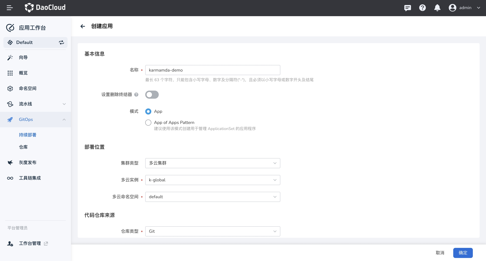
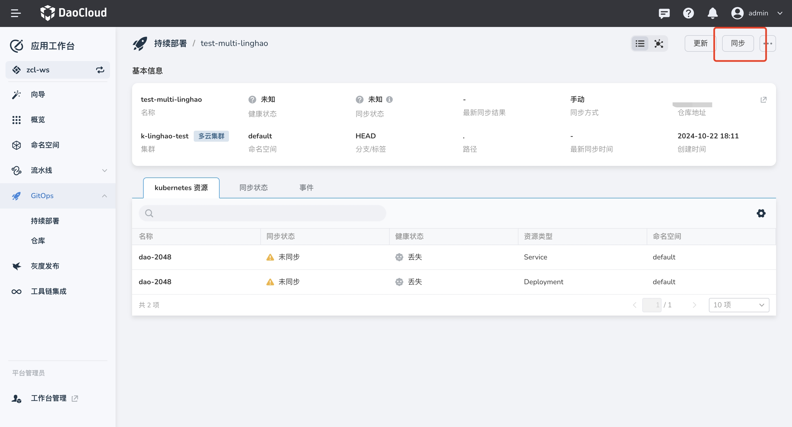

# ArgoCD 与多云编排联动完成多云应用发布

本页说明如何在 DCE 5.0 应用工作台中将多云编排与 ArgoCD 联动，从而发布多云应用。

## 前提条件

- 提前 fork [清单文件](https://github.com/amamba-io/amamba-examples/tree/main/gueskbook-kairship)，
  并对 Karmada 的 [PropagationPolicy](https://karmada.io/zh/docs/userguide/scheduling/resource-propagating)
  资源有一定了解
- 可以正常使用多云编排模块

## 绑定多云实例到工作空间下

1. 绑定多云命名空间，参考文档[绑定/解绑工作空间](../../kairship/workspace.md)。
1. 前往 __应用工作台__ -> __命名空间__ -> __多云命名空间__ 查看是否绑定成功

## 创建应用

1. 参考 [PropagationPolicy](https://github.com/amamba-io/amamba-examples/blob/main/gueskbook-kairship/propagationpolicy.yaml)
   清单文件，根据多云实例中的工作集群信息修改该文件

1. 在 __应用工作台__ -> __GitOps__ -> __创建应用__

1. 填写创建所需的配置信息：

    | 字段 | 示例值 |
    | ------ | ----- |
    | 名称  | `karmamda-demo` |
    | 模式 | `App` |
    | 部署位置 | 选择`多云集群`，`绑定的多云实例->多云命名空间`|
    | 仓库地址 | `https://github.com/amamba-io/amamba-examples.git` |
    | 分之/标签 | `main` |
    | 路径  | `gueskbook-kairship` |

    

1. 创建完成后，同步应用

    

1. 也前往 __多云编排__ 查看应用部署情况，点击 __多云工作负载__ -> __无状态负载__ ，进入 `guestbook-ui` 详情界面

    

1. 可以看到负载被部署到了 3 个工作集群中

    
