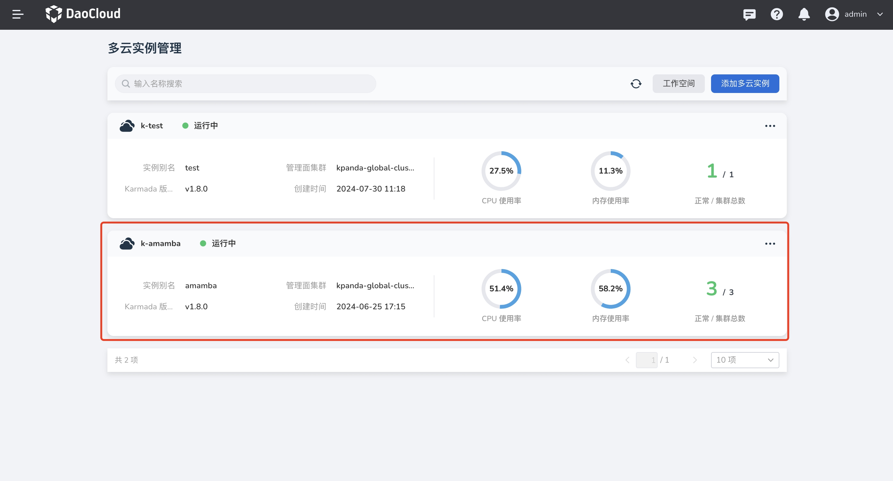
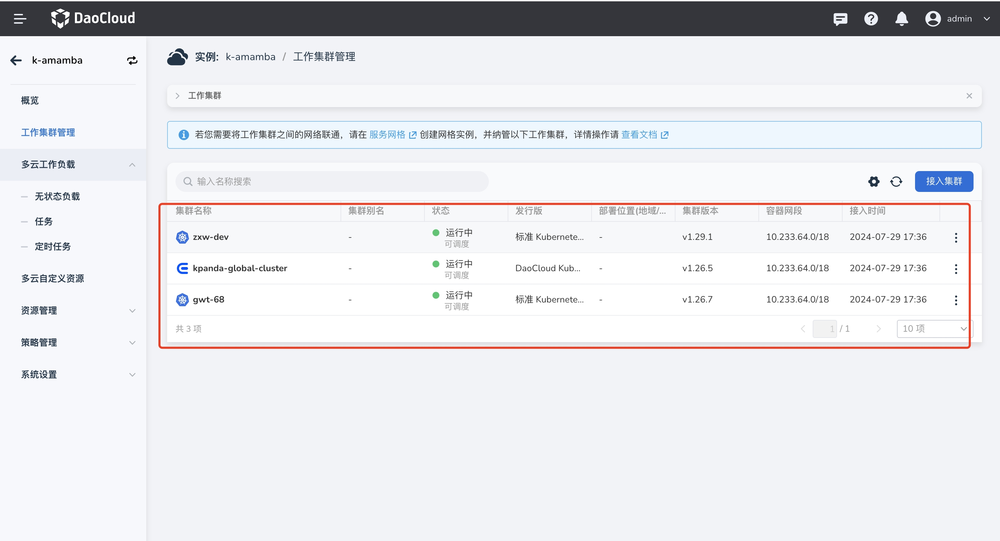
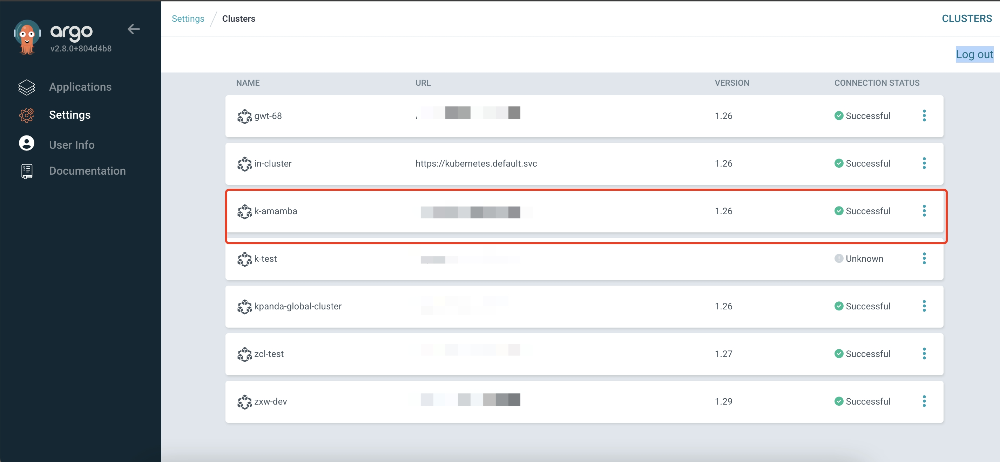
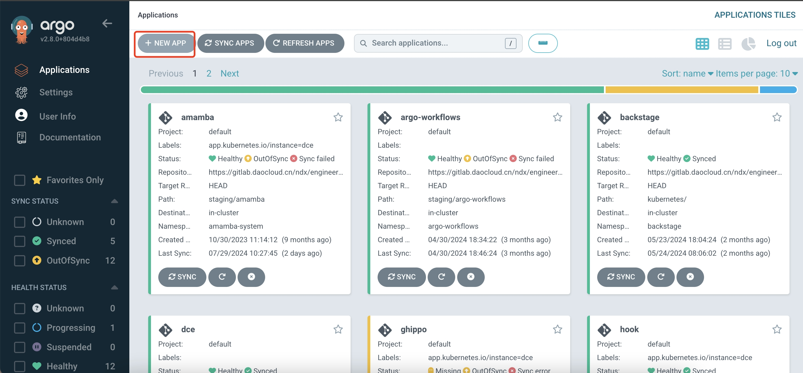
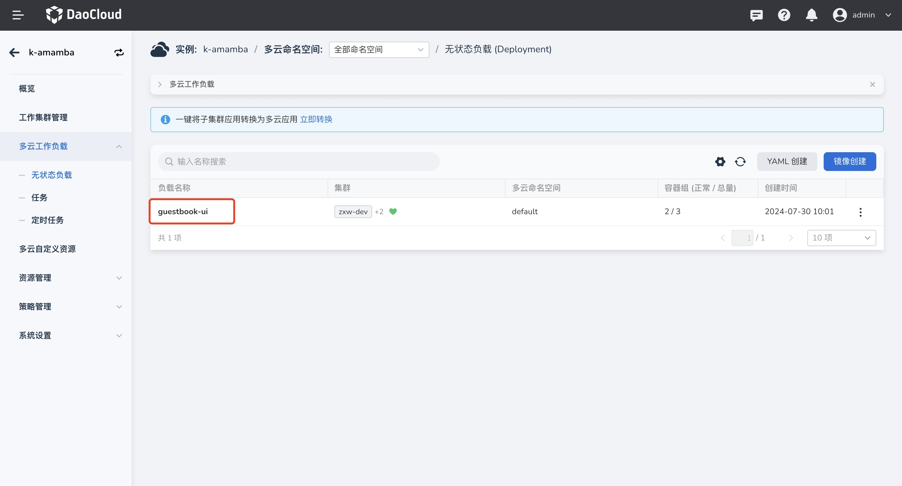
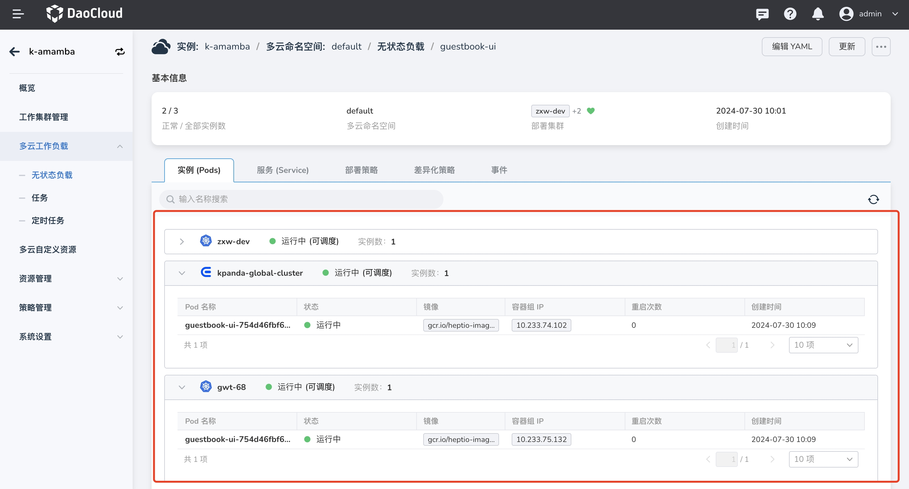

# ArgoCD 与多云编排联动完成多云应用发布

## 前提条件

- 提前 fork [清单文件](https://github.com/amamba-io/amamba-examples/tree/main/gueskbook-kairship)，
  并对 karmada 的 [PropagationPolicy](https://karmada.io/zh/docs/userguide/scheduling/resource-propagating) 资源有一定了解
- 能正常访问 ArgoCD UI 界面
- 可以正常使用多云编排模块

## 注册多云实例到 ArgoCD

1. 前往 __多云编排__ ，参考[添加实例](../../kairship/instance/add.md) 新增一个多云实例，如下创建了一个名为 `k-amamba` 的多云实例：

    

1. 参考[接入集群](../../kairship/cluster.md#_2)为多云实例添加工作集群，如下分别接入了名为
   `zxw-dev`、`kpanda-global-cluster`、`gwt-68` 的工作集群：

    

1. 在当前多云实例的 __概览__ 界面点击 __证书获取__ 获取当前实例的 `kubeconfig`：

    

1. 前往 ArgoCD 所在的环境中，将多云实例注册到 ArgoCD 中：

    ```shell
    argocd cluster add <CONTEXT_NAME> --kubeconfig <KUBECONFIG_NAME>
    ```

1. 添加成功后，ArgoCD UI 中可以看到如下集群信息：

    

## 创建应用

1. 参考 [PropagationPolicy](https://github.com/amamba-io/amamba-examples/blob/main/gueskbook-kairship/propagationpolicy.yaml)
   清单文件，根据多云实例中的工作集群信息修改该文件

1. 在 ArgoCD UI 中点击 __+New APP__

    

1. 填写创建所需的配置信息：

    | 字段 | 示例值 |
    | ------ | ----- |
    | name  | `karmamda-demo` |
    | project | `default` |
    | repository url | `https://github.com/amamba-io/amamba-examples.git` |
    | revision | `main` |
    | path  | `gueskbook-kairship` |
    | cluster url | `k-amamba`  |
    | namespace | `default` |

1. 创建完成后，同步应用

1. 前往 __多云编排__ 查看应用部署情况，点击 __多云工作负载__ -> __无状态负载__ ，进入 `guestbook-ui` 详情界面

    

1. 可以看到负载被部署到了 3 个工作集群中

    
