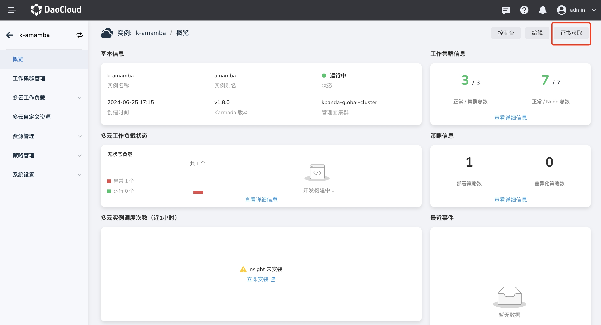

# ArgoCD 与多云编排联动完成多云应用发布

## 前提条件

- 提前 fork [清单文件](https://github.com/amamba-io/amamba-examples/tree/main/gueskbook-kairship)，并对 karmada 的 [PropagationPolicy](https://karmada.io/zh/docs/userguide/scheduling/resource-propagating) 资源有一定了解
- 能正常访问 ArgoCD UI 界面
- 可以正常使用多云编排模块

## 注册多云实例到 ArgoCD

1. 前往 __多云编排__ ，参考 [添加实例](https://docs.daocloud.io/kairship/instance/add/) 新增一个多云实例，如下创建了一个名为 `k-amamba` 的多云实例：

    

2. 参考 [接入集群](https://docs.daocloud.io/kairship/cluster/#_2) 为多云实例添加工作集群，如下分别接入了名为`zxw-dev`、`kpanda-global-cluster`、`gwt-68` 的工作集群：

    

3. 在当前多云实例的 __概览__ 界面点击 `证书获取` 获取当前实例的 `kubeconfig`

    

4. 前往 ArgoCD 所在的环境中，将多云实例注册到 ArgoCD 中：

    ```shell
    argocd cluster add <CONTEXT_NAME> --kubeconfig <KUBECONFIG_NAME>

    ```

5. 添加成功后，ArgoCD UI 中可以看到集群信息，如下：

    

## 创建应用

1. 参考 [PropagationPolicy](https://github.com/amamba-io/amamba-examples/blob/main/gueskbook-kairship/propagationpolicy.yaml) 清单文件，根据多云实例中的工作集群信息修改该文件

2. 在ArgoCD UI 中点击 `+New APP`

    

3. 填写创建所需的配置信息：

    - name：本示例中为 `karmamda-demo`
    - project：本示例中为 `default`
    - repository url：本示例中为 `https://github.com/amamba-io/amamba-examples.git`
    - revision：本示例中为 `main`
    - path：本示例中为 `gueskbook-kairship`
    - cluster url： 本示例中为 `k-amamba`
    - namespace： 本示例中为 `default`

4. 创建完成后，同步应用

5. 前往 __多云编排__ 查看应用部署情况，点击 __多云工作负载__ -> __无状态负载__ ，进入 `guestbook-ui` 详情界面

    

6. 可以看到负载被部署到 3 个工作集群当中

    
