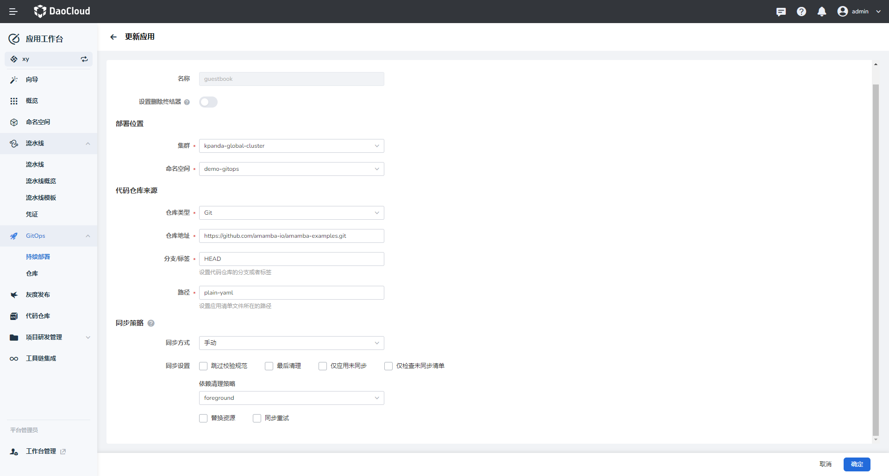
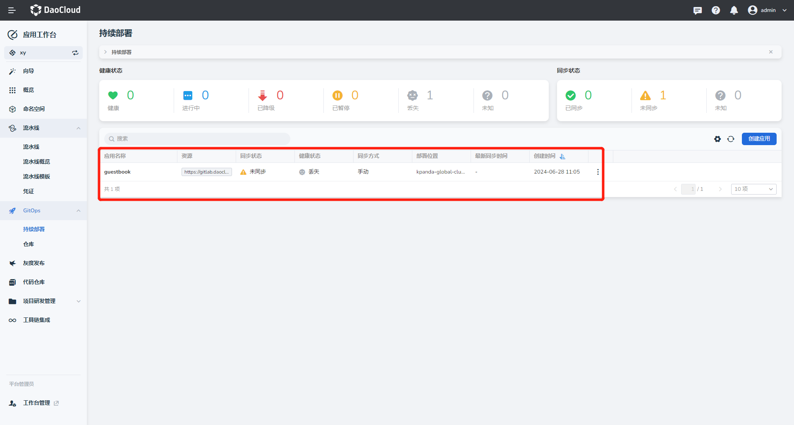
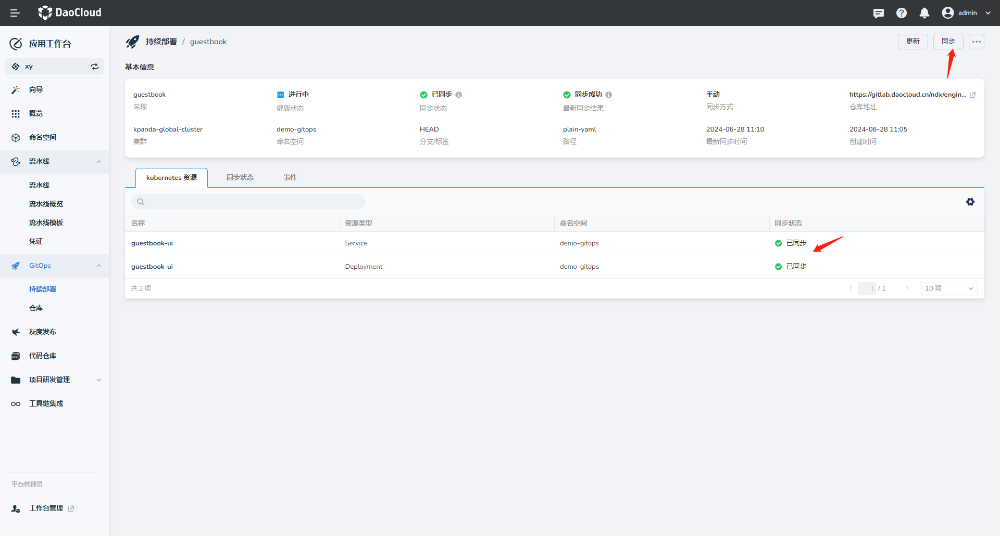
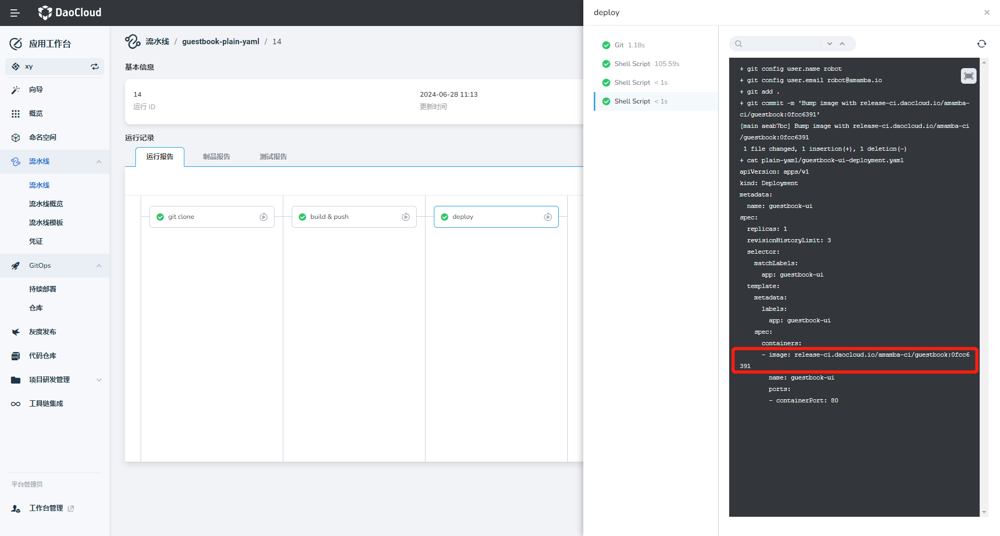
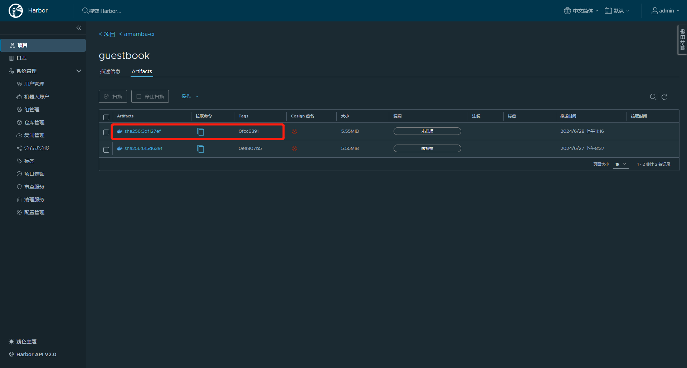
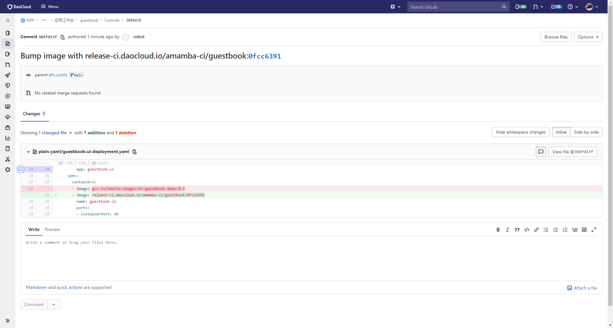
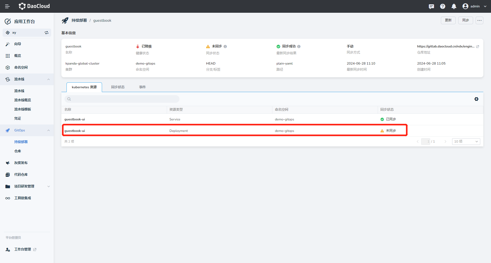
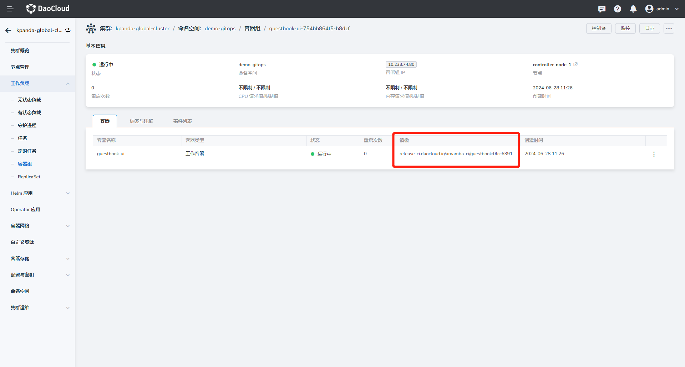
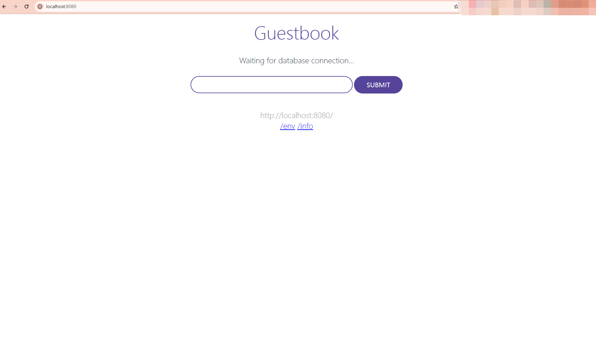

# 基于流水线和 GitOps 实现 CI/CD

本文介绍如何基于应用工作台的流水线与 GitOps 功能实现 CI/CD。

## 整体流程


## 前提条件

基于整体流程，我们需要准备如下信息：

1. 准备两个代码仓库，其中一个作为存业务代码的仓库，一个作为应用的配置文件（yaml）仓库。在这个例子中为了方便我们放在同一个仓库中不同目录下：

    ```console
    可以参考 GitHub 中的配置：
   
    业务代码：https://github.com/amamba-io/amamba-examples/tree/main/guestbook-go
    应用配置：https://github.com/amamba-io/amamba-examples/tree/main/plain-yaml
    ```

2. 准备一个 Harbor 镜像仓库

3. 准备访问上述三个仓库的凭证。此教程中使用的三个凭证分别命为 git-credentials、git-app-credentials、harbor-credentials 

## 创建流水线

此教程主要包含的步骤有：拉取业务代码 -> 构建镜像 -> 更新应用配置文件

当 __更新应用配置文件__ 步骤执行成功后，Argo CD 会监测变化，并会触发更新同步最新的配置文件部署到集群中。

1. 创建流水线的步骤可以参考[创建流水线](../user-guide/pipeline/create/custom.md)。

2. 创建成功后，选择该流水线操作： __编辑 Jenkinsfile__ 

    ??? note "点击查看流水线 Jenkinsfile 样例文件"

    ```groovy
    pipeline {
      agent {
        node {
          label 'base'
        }
      }
      environment {
        SOURCE_REPO          = '<https://github.com/amamba-io/amamba-examples.git>'
        SOURCE_CREDENTIAL_ID = '<source-credential-id>'
        DEPLOY_REPO          = 'github.com/amamba-io/amamba-examples.git'
        DEPLOY_CREDENTIAL_ID = '<deploy-credential-id>'
        DEPLOY_PATH          = 'plain-yaml'
        DOCKERFILE_ROOT      = 'guestbook-go'
        DOCKER_REPO          = 'docker.io/amambadev/guestbook'
        DOCKER_CREDENTIAL_ID = '<docker-credential-id>'
      }
      stages {
        stage('git clone') {
          steps {
            git(branch: 'main', credentialsId: "${SOURCE_CREDENTIAL_ID}", url: "${SOURCE_REPO}")
            script {
                env.COMMIT_ID = sh(script: 'git rev-parse --short=8 HEAD',
                                    returnStdout: true).trim()
                echo "commit id: ${COMMIT_ID}"
            }
          }
        }
        stage('build & push') {
          steps {
            container('base') {
              withCredentials([usernamePassword(passwordVariable:'PASS',usernameVariable:'USER',credentialsId:"${DOCKER_CREDENTIAL_ID}")]) {
                sh 'docker login ${DOCKER_REPO} -u $USER -p $PASS'
                sh 'docker build -f Dockerfile -t ${DOCKER_REPO}:${COMMIT_ID} ${DOCKERFILE_ROOT}'
                sh 'docker push ${DOCKER_REPO}:${COMMIT_ID}'
              }
            }
          }
        }
        stage('update manifest') {
          environment {
            DOCKER_TAG = "${COMMIT_ID}"
          }
          steps {
            container('base'){
              dir('deploy') {
                git(branch: "main", url: "https://${DEPLOY_REPO}", credentialsId: "${DEPLOY_CREDENTIAL_ID}")
                sh 'yum install -y gettext'
                sh 'envsubst < pipelines/templates/guestbook-ui-deployment.yaml.tmpl > plain-yaml/guestbook-ui-deployment.yaml'
                withCredentials([usernamePassword(passwordVariable:'PASS', usernameVariable:'USER', credentialsId:"${DEPLOY_CREDENTIAL_ID}")]) {
                    sh '''
                        git config user.name "robot"
                        git config user.email "<robot@amamba.io>"

                        git add .
                        git commit -m "Bump image with ${DOCKER_REPO}:${DOCKER_TAG}"
                        git push "https://${USER}:${PASS}@${DEPLOY_REPO}"
                    '''
                    }
              }
            }
          }
        }
      }
    }
    ```

### 基于 Kustomize 持续发布

如果部署文件使用 Kustomize 管理，我们可以更新流水线`update manifest`步骤以适配这种情况：

```groovy
environment {
  ...
  DEPLOY_PATH          = 'kustomize-guestbook/'
}
stages{
  ...
  stage('update manifest') {
    environment {
      DOCKER_TAG = "${COMMIT_ID}"
    }
    steps {
      container('base'){
        dir('deploy') {
          git(branch: "main", url: "https://${DEPLOY_REPO}", credentialsId: "${DEPLOY_CREDENTIAL_ID}")
          sh '''
              cd ${DEPLOY_PATH}
              # install kustomize
              curl -s "https://raw.githubusercontent.com/kubernetes-sigs/kustomize/master/hack/install_kustomize.sh"  | bash
              ./kustomize edit set image ${DOCKER_REPO}:latest=${DOCKER_REPO}:${DOCKER_TAG}
          '''
          withCredentials([usernamePassword(passwordVariable:'PASS', usernameVariable:'USER', credentialsId:"${DEPLOY_CREDENTIAL_ID}")]) {
          sh '''
              git config user.name "robot"
              git config user.email "robot@amamba.io"

              git add .
              git commit -m "Bump image with ${DOCKER_REPO}:${DOCKER_TAG}"
              git push "https://${USER}:${PASS}@${DEPLOY_REPO}"
          '''
          }
        }
      }
    }
  }
}

```

### 基于 Helm 持续发布

如果部署文件使用 Helm Chart 管理，我们可以更新流水线`update manifest`步骤以适配这种情况：

```groovy
environment {
  ...
  DEPLOY_PATH          = 'helm-guestbook/values-production.yaml'
}
stages{
  ...
  stage('update manifest') {
    environment {
      DOCKER_TAG = "${COMMIT_ID}"
    }
    steps {
      container('base'){
        dir('deploy') {
          git(branch: "main", url: "https://${DEPLOY_REPO}", credentialsId: "${DEPLOY_CREDENTIAL_ID}")
          sh '''
              yum install -y yq
              yq -i ".image.tag=${DOCKER_TAG}" ${DEPLOY_PATH}
          '''
          withCredentials([usernamePassword(passwordVariable:'PASS', usernameVariable:'USER', credentialsId:"${DEPLOY_CREDENTIAL_ID}")]) {
          sh '''
              git config user.name "robot"
              git config user.email "robot@amamba.io"

              git add .
              git commit -m "Bump image with ${DOCKER_REPO}:${DOCKER_TAG}"
              git push "https://${USER}:${PASS}@${DEPLOY_REPO}"
          '''
          }
        }
      }
    }
  }
}
```

## 创建持续部署应用

1. 用 Https 方式导入 amamba-examples 仓库，[参考步骤](../user-guide/gitops/import-repo.md)。

2. 创建一个 GitOps 应用。

    

3. 创建完成后，会自动生成一条记录，同步状态显示 __未同步__ 。

    

4. 点击 __同步__ ，完成应用部署。

    

## 运行流水线触发 CI/CD

1. 选择上述创建的流水线，点击 __立即运行__ 。

2. 查看运行日志。

    

3. 流水线运行成功后，验证镜像是否上传到 Harbor，Jenkinsfile 中定义的 tag 为当前的`Commit ID`，同时注意到部署仓库的内容也更新了。

    
    

4. 继续验证持续部署应用，发现处于 __未同步__ 状态。看到 Deployment 资源未同步。

    

5. 点击 __同步__ ，等待同步成功后，查看 Deployment 资源，确认目前的镜像版本。

    

6. 通过 `port-forward` 映射本地端口到 guestbook-ui 的服务，并在本地访问：

    ```console
    kubectl port-forward svc/guestbook-ui -n demo-gitops 8080:80
    ```

    

## 其他

在以上流程的基础上，也可以使用 [Argo Rollouts](https://argo-rollouts.readthedocs.io/en/stable/) 替换 Deployment 实现灰度发布和蓝绿发布。我们在示例代码中提供了样例，可以做为**流水线 - GitOps - 灰度/蓝绿发布** 的参考:

- [基于副本数的灰度发布](https://github.com/amamba-io/amamba-examples/tree/main/replicas-rollouts) 和 [流水线](https://github.com/amamba-io/amamba-examples/blob/main/pipelines/replicas-rollouts.jenkinsfile)
- [基于Istio的灰度发布](https://github.com/amamba-io/amamba-examples/tree/main/istio-rollouts) 和 [流水线](https://github.com/amamba-io/amamba-examples/blob/main/pipelines/istio-rollouts.jenkinsfile)
- [蓝绿发布](https://github.com/amamba-io/amamba-examples/tree/main/blue-green) 和 [流水线](https://github.com/amamba-io/amamba-examples/blob/main/pipelines/blue-green.jenkinsfile)