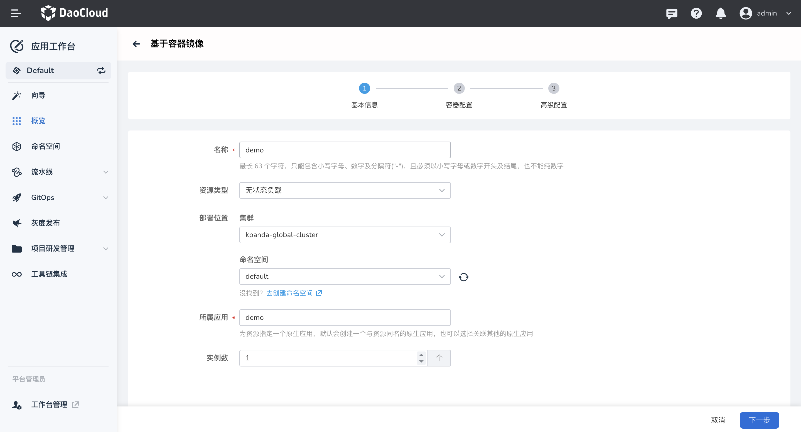
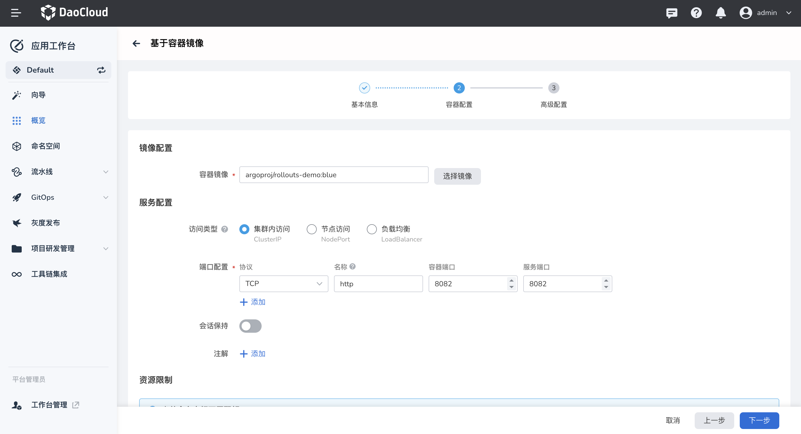
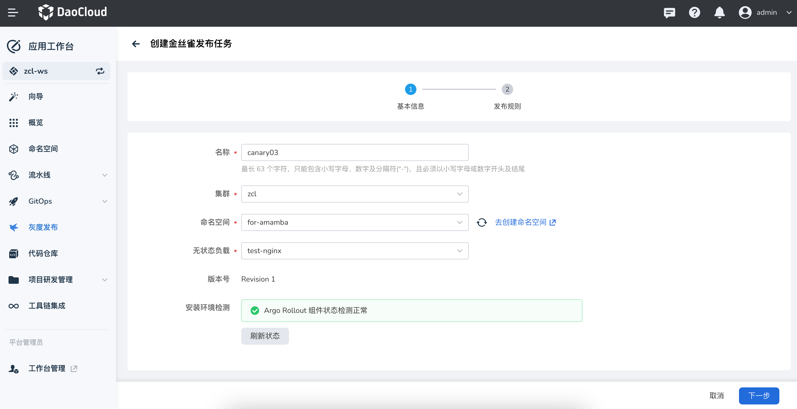
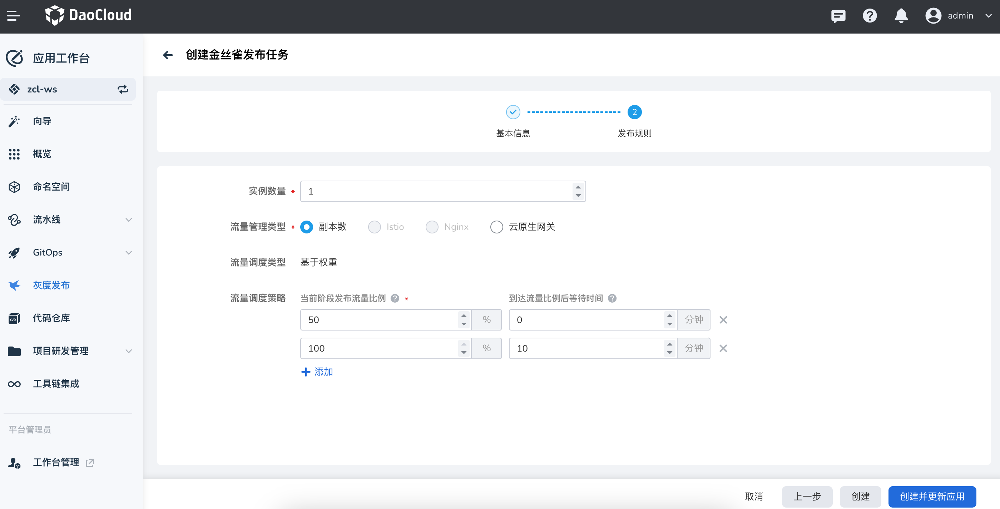

# 基于 Argo Rollout 实现渐进式灰度发布

本文介绍如何基于开源的 [Argo Rollout](https://argoproj.github.io/argo-rollouts/) 实现渐进式灰度发布。

## 前提条件

- 示例中的镜像需要访问公网：`argoproj/rollouts-demo:yellow` 和 `argoproj/rollouts-demo:blue`。

- 仅适用于通过安装器以 metallb 方式部署出来的 DCE 5.0 平台。

- 使用灰度发布能力需要所在集群中安装 Istio 和 Argo Rollout 组件。

## 操作步骤

整个过程分为四个步骤：基于容器镜像构建应用、配置 Istio 相关资源、创建灰度发布任务、验证效果。

### 基于容器镜像构建应用

1. 向导入口选择 `基于容器镜像`。

2. 填写基本信息：

    

3. 填写容器配置，示例为：

    - 容器镜像为：`argoproj/rollouts-demo:blue`

    - 服务端口：名称为 `http`、容器端口为 `8082`、服务端口为 `8082`。

    

4. 填写高级配置，选择开启 `启用网格`

    

5. 创建完成后会在 `概览`->`原生应用` 生成一条应用记录。

### Istio 相关资源配置

在[服务网格](../../mspider/intro/index.md)模块或者控制台创建以下资源。

1. 创建 Gateway

    ```yaml title="gateway.yaml"
    apiVersion: networking.istio.io/v1beta1
    kind: Gateway
    metadata:
      name: rollout-demo
      namespace: rollout-demo # (1)
    spec:
      selector:
        istio: ingressgateway
      servers:
      - hosts:
        - '*'
        port:
          name: http
          number: 8082
          protocol: HTTP
    ```

    1. 部署应用的命名空间

2. 部署 Gateway

    ```shell
    vi gateway.yaml
    kubectl apply -f gateway.yaml
    ```

3. 修改 VirtualService

    ```shell
    kubectl edit vs {#创建应用的名字} -n {#创建应用的命名空间}
    ```

    仅需修改提示的字段，其余字段无需修改。

    ```yaml
    apiVersion: networking.istio.io/v1beta1
    kind: VirtualService
    metadata:
      creationTimestamp: "2022-11-07T10:46:23Z"
      generation: 84
      name: demo
      namespace: default
      resourceVersion: "5741370"
      uid: 8109f754-aa9d-49f1-b8a9-d4daf5108032
    spec:
      gateways:
      - rollout-demo # (1)
      hosts:
      - '*' # (2)
      http:
      - name: primary
        route:
        - destination:
            host: demo
            subset: stable
          weight: 100
        - destination:
            host: demo
            subset: canary
          weight: 0
    ```

    1. 修改此处，需要新增 gateway，指向上一步创建的 gateway 名称
    2. 修改此处，原来 host 为 vs 的名称，需要删除后更改为 `‘*’`

4. 配置 istio-ingressgateway 网关

    ```shell
    kubectl edit svc istio-ingressgateway -n istio-system
    ```

    仅需修改提示的字段，其余字段无需修改。

    ```yaml
    apiVersion: v1
    kind: Service
    metadata:
      labels:
        app: istio-ingressgateway
        app.kubernetes.io/managed-by: Helm
        app.kubernetes.io/name: istio-ingressgateway
        app.kubernetes.io/version: 1.15.0
        helm.sh/chart: gateway-1.15.0
        istio: ingressgateway
      name: istio-ingressgateway
      namespace: istio-system
      resourceVersion: "5775680"
      uid: 53bd7344-ba45-4547-b695-aca2c4dd713d
    spec:
      allocateLoadBalancerNodePorts: true
      clusterIP: 100.66.222.131
      clusterIPs:
      - 100.66.222.131
      externalTrafficPolicy: Cluster
      internalTrafficPolicy: Cluster
      ipFamilies:
      - IPv4
      ipFamilyPolicy: SingleStack
      ports:
      - name: status-port
        nodePort: 32384
        port: 15021
        protocol: TCP
        targetPort: 15021
      # 新增以下内容
      - name: rollout-demo
        port: 8082
        protocol: TCP
        targetPort: 8082
      # --------------
      selector:
        app: istio-ingressgateway
        istio: ingressgateway
      sessionAffinity: None
      type: LoadBalancer
    ```

5. 创建 AuthorizationPolicy 资源

    此步骤的目的是在浏览器访问是可以正常访问到 js 相关的资源。

    ```yaml
    apiVersion: security.istio.io/v1beta1
    kind: AuthorizationPolicy
    metadata:
      name: demo01
      namespace: istio-system
    spec:
      rules:
      - to:
        - operation:
            paths:
            - /*
      - from:
        - source:
            requestPrincipals:
            - '*'
      selector:
        matchLabels:
          app: istio-ingressgateway
    status:
      loadBalancer:
        ingress:
        - ip: 10.29.135.48
    ```

### 创建灰度发布任务

在应用工作台创建灰度发布任务。如需了解更详细的创建说明，可参考[创建金丝雀发布任务](../user-guide/release/canary.md)。

1. 选择开启灰度发布的应用

    

2. 设置发布规则，选择流量管理类型为 `Istio`，流量调度类型为 `基于权重`。

    

3. 点击创建并更新应用，在弹出的对话框中填写镜像地址：`argoproj/rollouts-demo:yellow`

    

### 验证效果

访问地址：`http://{istio-ingressgateway LB IP}:8082`，得到如下所示的访问效果。

此界面会并发调用 `http://{istio-ingressgateway LB IP}:8082/color`，将获取到颜色信息填充到方格中。
在灰度发布对象中，指定的颜色为 **blue、yellow**，会按照定义规则 1:9 的流量比进行展示。


此时可以在应用工作台灰度发布模块选择继续发布应用来调整流量比例，直到最终成功发布。


