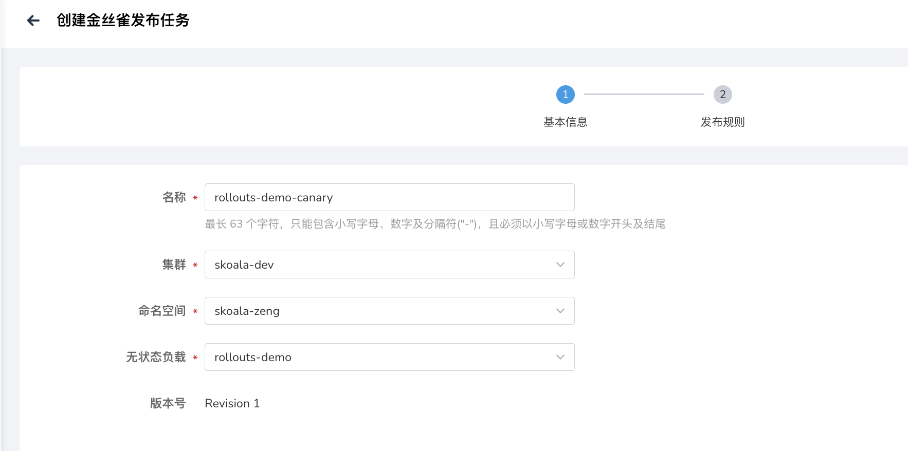
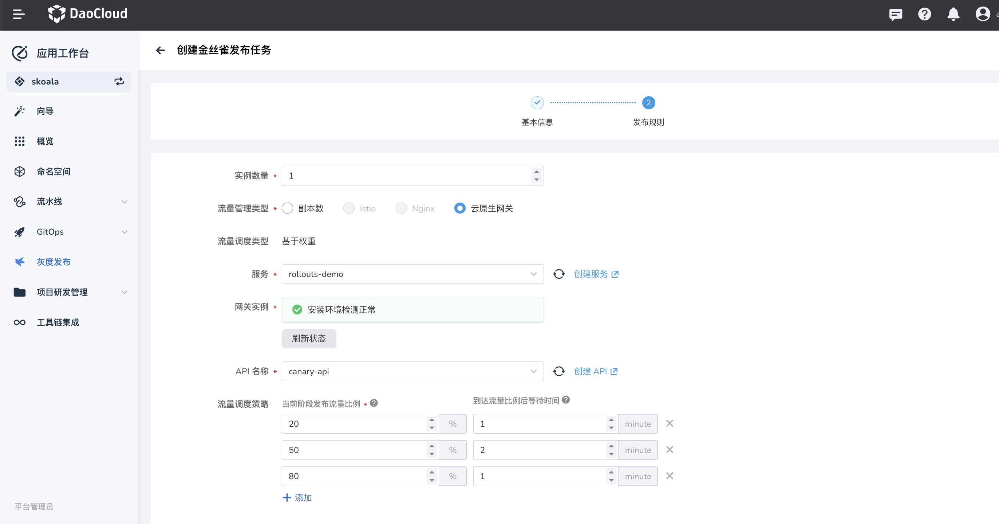
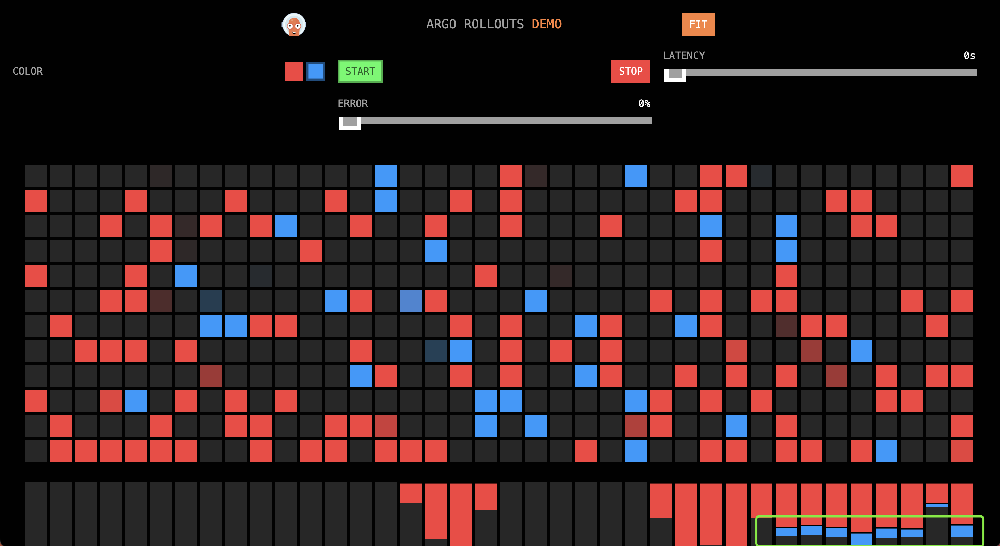

# 基于云原生网关（contour）的灰度发布实践

本文将通过以下步骤来进行基于云原生网关的灰度发布的最佳实践，将分为以下几步：

1. 创建应用资源，用于灰度发布的发布对象
2. 创建微服务引擎相关的网关资源
3. 创建基于云原生网关的灰度发布任务
4. 观察发布任务的发布情况

## 前提条件

- 请在 `argo-rollouts` 添加 `contour-plugin` 配置，参考文档部署[argo-rollouts](../pluggable-components.md)。
- 当前平台部署了`微服务引擎`产品模块

## 创建应用资源

在`应用工作台`的向导选择`基于容器镜像`在目标集群/命名空间创建应用 `rollouts-demo`。

**注意事项：**

- 容器/服务端口：8080
- 容器镜像：argoproj/rollouts-demo:red（镜像 tag 也可以是 blue/green/orange）


## 微服务引擎网关资源

### 创建网关

参考[创建网关文档](../../skoala/gateway/index.md)

**注意事项:**

- 网关的管辖命名空间需要包含灰度发布服务所在的命名空间


### 创建域名

进入网关详情界面，在`域名管理`参考[创建域名文档](../../skoala/gateway/domain/index.md)。

**注意事项：**

输入一个简单的 HTTP 域名，比如 `gateway.canary`


### 创建 API

进入网关详情界面，在 `API管理`参考[创建 API 文档](../../skoala/gateway/api/index.md)。

**注意事项:**

- 域名选择 `gateway.canary`
- 路径匹配规则选择`前缀匹配`，路径填写 `/`
- 请求方法选择 `GET` 和 `POST`，当然也可以`全选`
- 路由配置选择`后端服务`中的`自动发现`服务 `rollouts-demo`


### 通过网关访问灰度发布的 Demo 应用

本地配置域名解析，将 gateway.canary 解析到网关地址上，其中网关地址可在网关详情界面`概览`模块的`网络信息`区域获取。

```shell
$ cat /etc/hosts | grep gateway.canary
10.6.222.21 gateway.canary
```

在浏览器中输入 <http://gateway.canary:30000/> ，可以看到如下界面（流量都是指向 red）

- 需要关闭网络代理，否则访问可能会 502 报错
- 30000 端口是网关的 HTTP 端口，使用的是 HTTP 域名，所以使用 HTTP 端口


## 创建金丝雀灰度发布任务

在应用工作台[创建金丝雀灰度发布任务](../user-guide/release/canary.md)。

1. 第一步的基本信息选择目标位置的 rollouts-demo 应用

    

2. 第二步的发布规则如下：

    - 流量管理类型选择云原生网关（该选项的是否可选取决于微服务引擎是否安装）
    - 服务选择基本信息中选择的无状态负载对应的服务（即灰度发布的服务）
    - 网关实例是由基本信息中目标位置是否是由某个网关管辖决定的
    - API 名称选择对应网关中绑定了灰度发布服务的 API
    - 流量调度策略参考如下

    

## 更新发布任务，观察发布情况

需要在发布界面中更新版本，镜像替换为：argoproj/rollouts-demo:blue，版本更新后，在浏览器中访问 http://gateway.canary:30000/ ，然后观察流量统计：


### 第一阶段

即第一分钟，流量比 red:blue 大概是 4:1



### 第二阶段

即第二三分钟，流量比 red:blue 大概是 1:1


### 第三阶段

即第四分钟，流量比 red:blue 大概是 1:4


### 最后阶段

即发布完成，全部都是 blue 的流量


