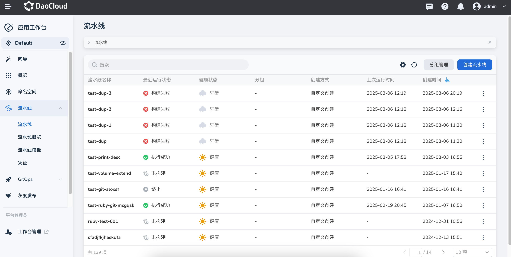
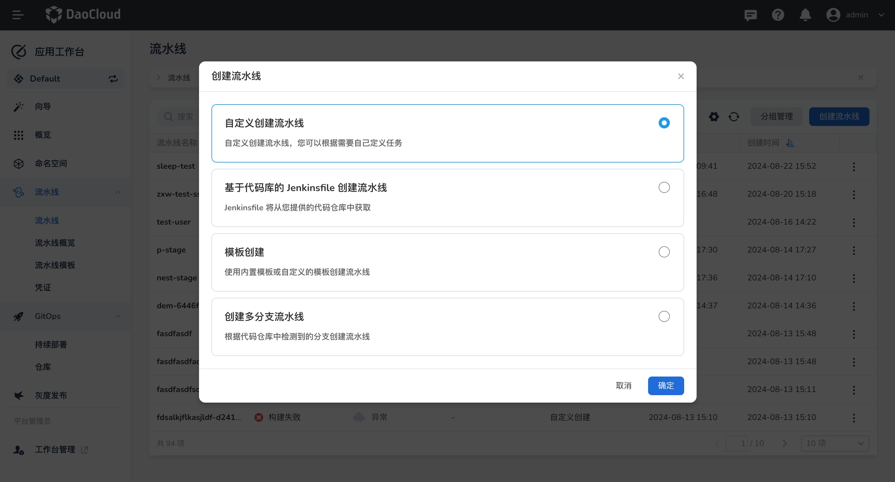
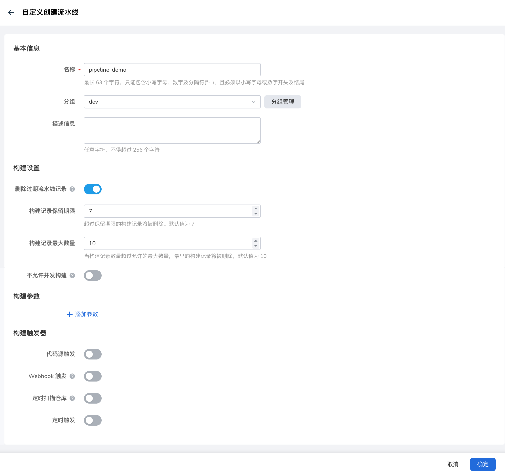
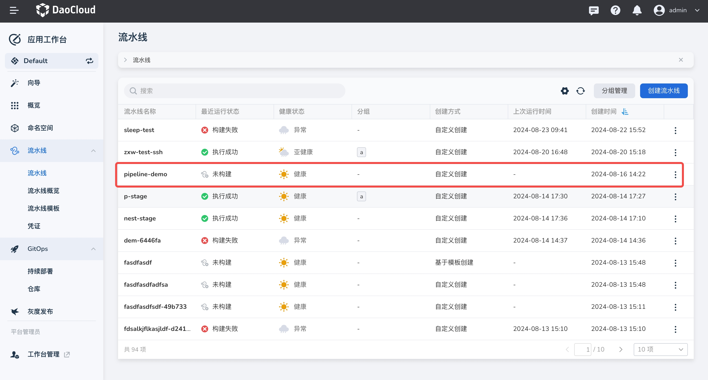
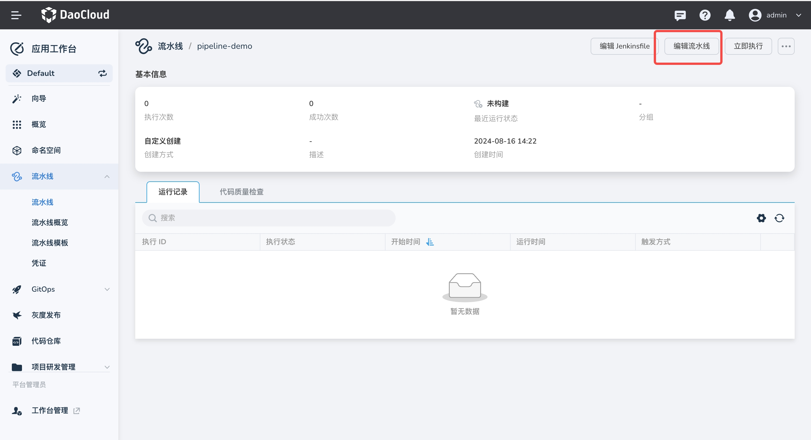
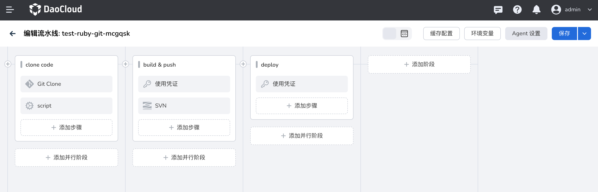
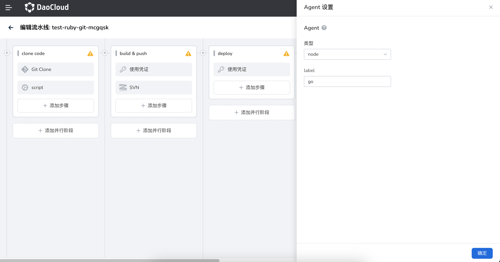
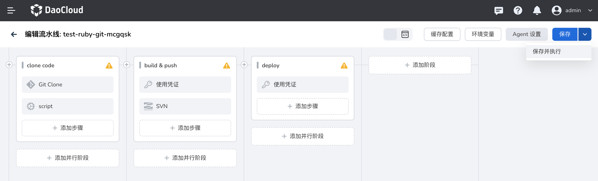

# 快速创建流水线

本节将通过编译、构建、部署来创建流水线，通过详细的步骤操作描述，帮助您快速创建一条流水线。

## 前提条件

- 需创建一个工作空间和一个用户，该用户需加入该工作空间并赋予 __workspace edit__ 角色。
  参考[创建工作空间](../../ghippo/user-guide/workspace/workspace.md)、[用户和角色](../../ghippo/user-guide/access-control/user.md)。
- 创建可以访问镜像仓库、集群的两个凭证，分别命名为： __registry__ 、 __kubeconfig__ 。
  创建凭证的更多信息，请参考[凭证管理](../user-guide/pipeline/credential.md)。
- 准备一个 GitHub 仓库、DockerHub 仓库。

## 创建凭证

1. 在 __凭证__ 页面创建两个凭证：

    - docker-credential：用户名和密码，用于访问镜像仓库。
    - demo-dev-kubeconfig：用于使用这个 kubeconfig 访问 Kubernetes 集群。

1. 创建完成后，可以在 __凭证列表__ 页面看到凭证信息。

## 创建自定义流水线

1. 在流水线列表页点击 __创建流水线__

    

1. 在弹出的对话框中，选择 __自定义创建流水线__ ，点击 __确定__

    

1. 进入 __自定义创建流水页面__ ，输入流水线名称，选择一个分组

    

    - 构建设置：
        - 删除过期流水线记录：删除之前的构建记录，以节省 Jenkins 使用的磁盘空间。
        - 构建记录保留期限：最多保留几天的构建记录，默认值为 7 天，即七天前的构建记录将被删除。
        - 构建记录最大数量：最多保留几条构建记录，默认值为 10， 即最多保留 10 条记录。超过 10 条记录时，时间最早的记录最先被删除。 __保留期限__ 和 __最大数量__ 这两条规则同时生效，只要满足其中之一就会开始删除记录。
        - 不允许并发构建：开启后，一次只能执行一个流水线构建任务
    - 构建参数：
        - registry：镜像仓库地址。示例值： __release.daocloud.io__
        - project：镜像仓库中的项目名称。示例值： __demo__
        - name：镜像的名称。示例值： __http-hello__
    - 构建触发器：
        - 代码源触发：开启后，系统会根据 __定时仓库扫描计划__ 定期扫描仓库代码中用于构建流水线的特定分支，如果有更新内容，则重新运行流水线。
        - Webhook 触发：复制默认的 Webhook 地址，让外部系统通过 Webhook 触发运行当前流水线
        - 定时触发：定时触发构建流水线，无论代码仓库是否有更新，都会在规定时间重新运行流水线。
        - 定时扫描仓库：输入 CRON 表达式定义扫描仓库的时间周期。__输入表达式后下方会提示当前表达式的含义__ 。有关详细的表达式语法规则，可参考 [Cron 时间表语法](https://kubernetes.io/zh-cn/docs/concepts/workloads/controllers/cron-jobs/#cron-schedule-syntax)。

1. 添加完成后，点击 __确定__

## 编辑流水线

1. 在流水线列表页面点击一个流水线的名称。

    

1. 在右上角点击 __编辑流水线__

    

1. 在右上角点击 __Agent 设置__

    

1. 类型设为 node，且 label 设为 go，点击 __确定__

    

1. 添加阶段 - 拉取源代码。

    - 点击画布中的 __添加阶段__ 。在右侧的阶段设置中设置名称：git clone。
    - 点击 __添加步骤__ ，在弹出对话框中步骤类型下选择 git clone，配置相关参数：
        - 仓库 URL：输入 GitLab 仓库地址。
        - 分支：不填写默认为 master 分支。
        - 凭证：如果属于私有仓库，则需要提供一个凭证。

    

1. 添加阶段 - 构建并推送镜像。

    - 点击画布中的 __添加阶段__ 。在右侧的阶段设置中设置名称：build & push。

    - 在步骤模块中选择开启 __指定容器__ ，在弹出的对话框中填写容器名称：go，然后点击 __确定__

        

    - 在步骤模块中选择开启 __使用凭证__ ，在弹出的对话框中填写相关参数，然后点击 __确定__

        - 凭证：选择创建的 Docker hub 凭证，用户访问镜像仓库。
        - 密码变量：PASS
        - 用户名变量：USER

        

    - 点击 __添加步骤__ 进行代码构建，在弹出的对话框中步骤类型下选择 shell，参并在命令行中输入以下命令，然后点击 __确定__

        ```go
        go build -o simple-http-server main.go
        ```

    - 点击 __添加步骤__ 以根据源码中的 Dockerfile 构建 Docker 镜像，在弹出的对话框中步骤类型下选择 shell，参并在命令行中输入以下命令，然后点击 __确定__

        ```docker
        docker build -f Dockerfile . -t $registry/$project/$name:latest
        ```

    - 点击 __添加步骤__ 以登录镜像仓库，在弹出的对话框中步骤类型下选择 shell，参并在命令行中输入以下命令，然后点击 __确定__

        ```docker
        docker login $registry -u $USER -p $PASS
        ```

    - 点击 __添加步骤__ 将镜像推送至镜像仓库中，在弹出的对话框中步骤类型下选择 shell，参并在命令行中输入以下命令，然后点击 __确定__ 。

        ```docker
        docker push $registry/$project/$name:latest
        ```

1. 添加阶段 - 部署至集群

    - 点击画布中的 __添加阶段__ 。在右侧的阶段设置中设置名称：deploy。

    - 在步骤模块中选择开启 __指定容器__ ，在弹出的对话框中填写容器名称：go，然后点击 __确定__

        

    - 在步骤模块中选择开启 __使用凭证__ ，在弹出的对话框中填写相关参数，然后点击 __确定__

        - 凭证：选择 kubeconfig 类型的凭证。

        - kubeconfig 变量：如果您使用的是 kubectl apply 的部署方式，变量值必须为 KUBECONFIG。

        

    - 点击 __添加步骤__ 以进行集群部署操作，在弹出的对话框中步骤类型下选择 shell，参并在命令行中输入以下命令，然后点击 __确定__

        ```shell
        kubectl apply -f deploy.yaml
        ```

## 保存并执行流水线流水线

1. 完成上一步后点击 __保存并执行__

    

1. 在弹出的对话框中输入步骤二中的示例参数。点击 __确定__ 即可成功运行该流水线。

    
