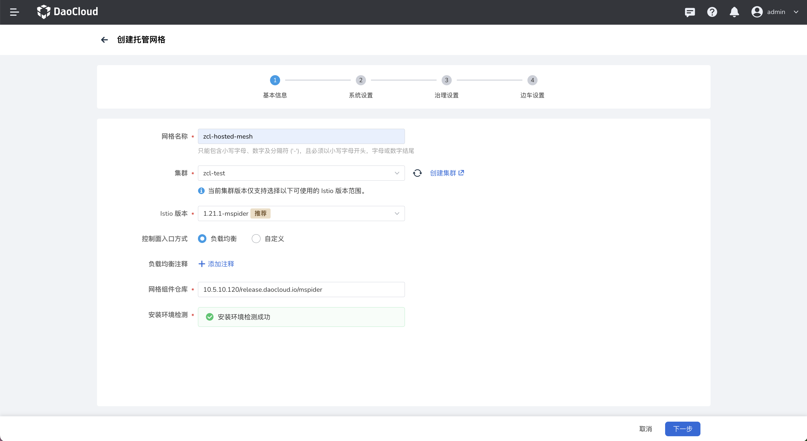
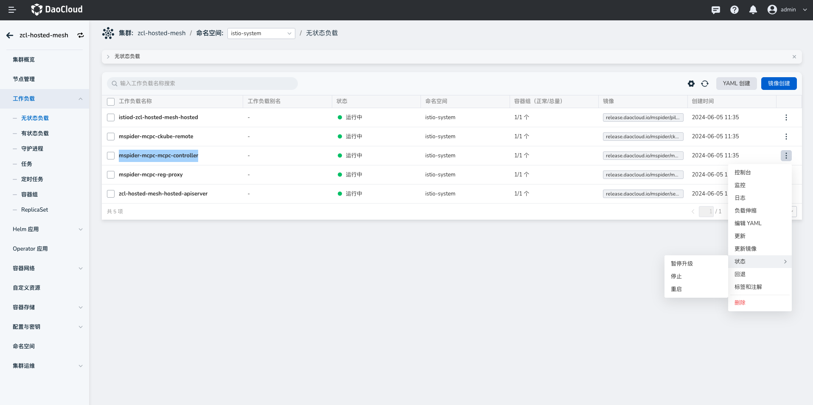

# 基于 GitOps 在托管网格下的工作集群中部署 istio 相关资源

场景：基于 GitOps 的方式客户如何在托管网格下的工作集群中部署 istio 相关资源？

## 前提条件

- 平台开启应用工作台、服务网格，并且服务网格版本需要 ≥ v0.26.0
- 准备一个工作集群

## 创建托管网格并纳管工作集群

### 操作步骤

1. 前往`服务网格`，参考[创建托管网格](../../mspider/user-guide/service-mesh/README.md)

2. 控制面入口方式选择 `负载均衡`，其余默认

    

3. 创建托管网格完成后，将工作集群纳管至托管网格，参考[添加集群](../../mspider/user-guide/cluster-management/join-clus.md)

    

### 注意事项

基于 gitops 直接将 istio 相关资源部署至托管网格下的工作集群时，涉及到工作集群的资源部署到托管网格中才会生效，需要手动进行如下操作：

1. 在全局管理（Global）集群，在命名空间 `mspider-system` 下找到 CRD 资源 `globalmeshes.discovery.mspider.io`，编辑托管网格名称相同的资源 YAML，修改内容如下：

    ```yaml
    # 1. 在 controlPlaneParams 下添加
      enabled_resources_synchronizer: true. #是否开启工作集群同步资源
      sync_resource_worker_cluster: "zcl-98"       #选择监听同步的工作集群名称
 
    # 2. 在 controlPlaneParams 同级添加
    controlPlaneParamsStruct:
      global:
        sync_istio_resources:
          - group: networking.istio.io
            kind: VirtualService
            resource: virtualservices
            version: v1beta1
          - group: networking.istio.io
            kind: DestinationRule
            resource: destinationrules
            version: v1beta1
          - group: networking.istio.io
            kind: Gateway
            resource: gateways
            version: v1alpha3   

    ```

2. 如果当前的`服务网格`版本为 v0.26.0，需要再进行一些手动操作，才可以正常同步 `gateway` 资源。

    a.  在全局管理（Global）集群，在命名空间 `mspider-system` 下的 comfigmap 编辑名称为 `mspider-mcpc` 的 YAML：

    ```yaml
        # 添加如下信息
    sync_istio_resources:
    - group: networking.istio.io
      kind: VirtualService
      resource: virtualservices
      version: v1beta1
    - group: networking.istio.io
      kind: DestinationRule
      resource: destinationrules
      version: v1beta1
    - group: networking.istio.io
      kind: Gateway
      resource: gateways
      version: v1alpha3
    ```

     b.  在全局管理（Global）集群，在命名空间 `mspider-system` 下的 comfigmap 编辑名称为 `mspider-mcpc-ckube-remote` 的 YAML：

    ```yaml
    # 添加如下信息        
    {
      "group": "networking.istio.io",
      "version": "v1alpha3",
      "resource": "gateways",
      "list_kind": "GatewayList",
      "index": {
        "namespace": "{.metadata.namespace}",
        "name": "{.metadata.name}",
        "labels": "{{- range $key, $value := .metadata.labels }}{{- print $key \"=\" $value | quote }},{{- end -}}",
        "createdAt": "{.metadata.creationTimestamp}",
        "port": "{.spec.servers[*].port}",
        "hosts": "{.spec.servers[*].hosts}"
        }
    },
    ```

    !!! note

        服务网格低于 v0.26.0 不支持该能力，大于 v0.26.0 无需操作此步骤

3. 前往托管网格的 host 集群，在命名空间 `istio-system` -> `无状态工作负载` 下选择重启资源 `mspider-mcpc-mcpc-controller`：

    

## 基于 GitOps 部署应用资源并验证

### 介绍

本演示示例仓库地址：https://github.com/amamba-io/rollout-examples

其中 `dubbo3-consumer` 和 `dubbo3-provider`两个服务有关联关系，访问 dubbo3-consumer 的 /hello 接口，dubbo3-consumer 会将请求转发给 dubbo3-provider。

### 操作步骤

1. 在 `GitOps`，[创建 gitops 应用](../user-guide/gitops/create-argo-cd.md)，其中仓库地址：`https://github.com/amamba-io/rollout-examples`，路径设置为 `rollouts/v1`，集群/命名空间选择工作集群下的命名空间即可。

2. 创建成功后，手动`同步`应用资源

3. 前往服务网格，在托管网格查看工作集群中同步的 vs、dr、gateway 资源，如果未查找到，请检测章节**创建托管网格并纳管工作集群** 中的注意事项是否配置正确

4. 默认情况下工作集群的负载均衡暴露的是 `80` 端口，所需要在工作集群中修改服务的 gatway 端口为 80 以便能访问到服务

    

5. 在浏览器访问 http://<工作集群节点IP>/hello?name=test-v1，访问成功即代表 istio 相关资源生效。

    

