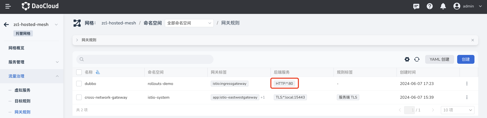
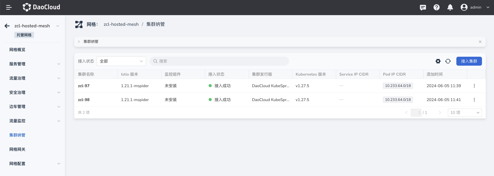
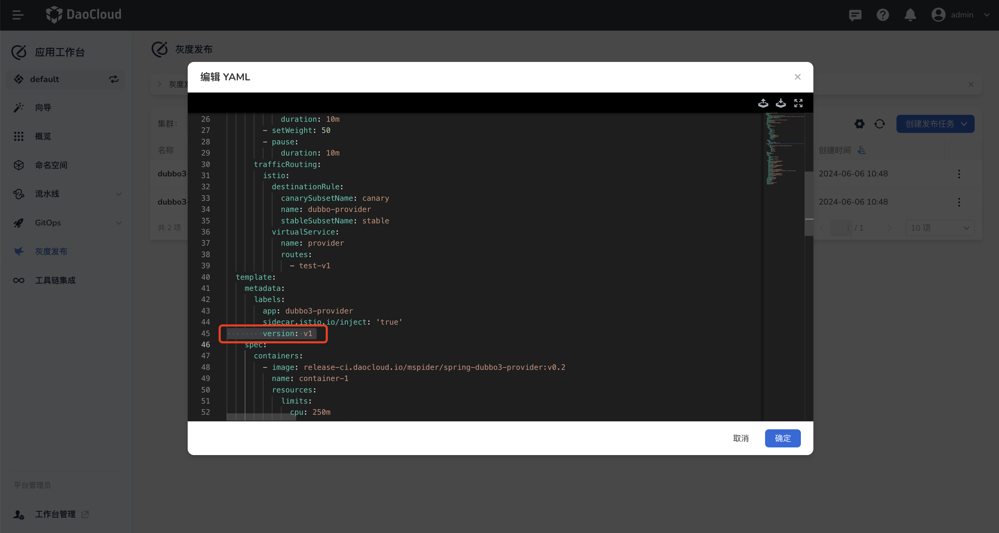
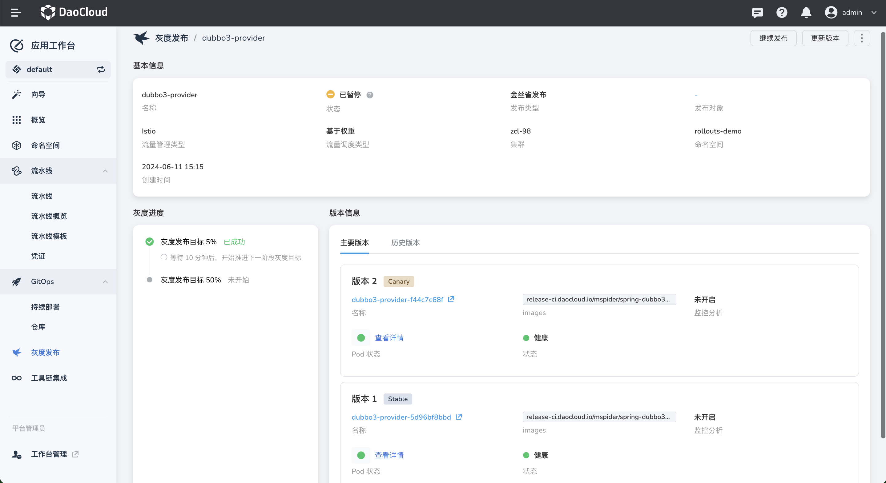
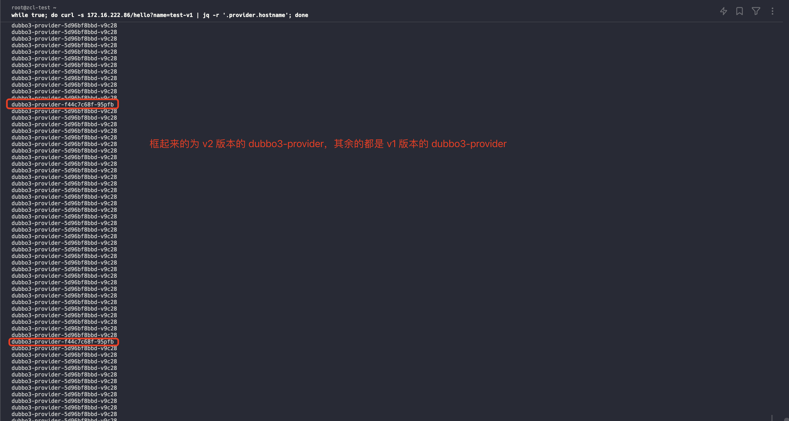
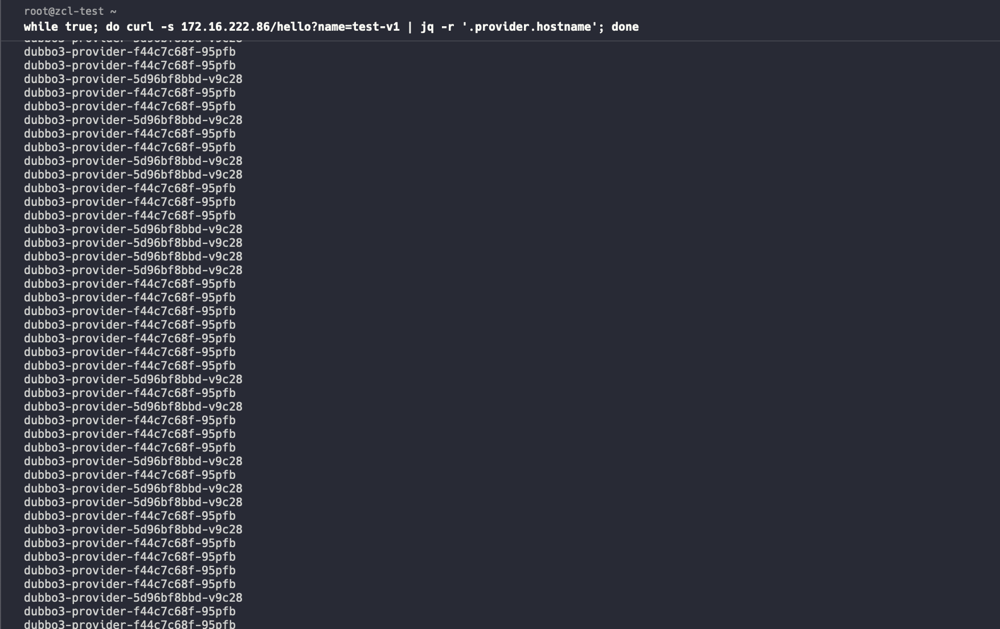
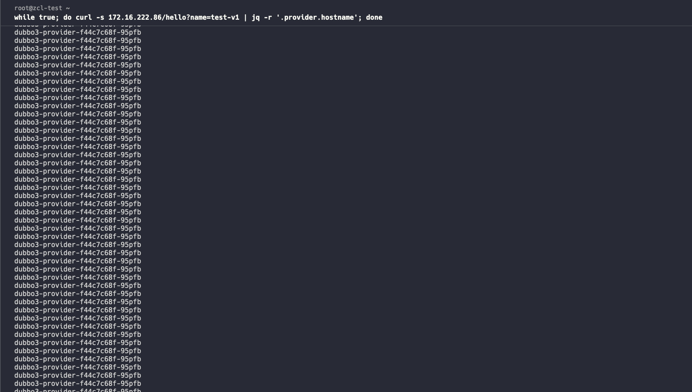
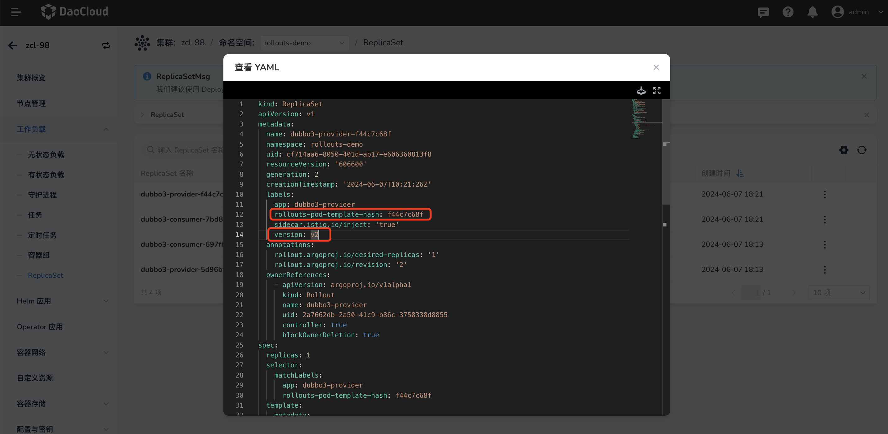
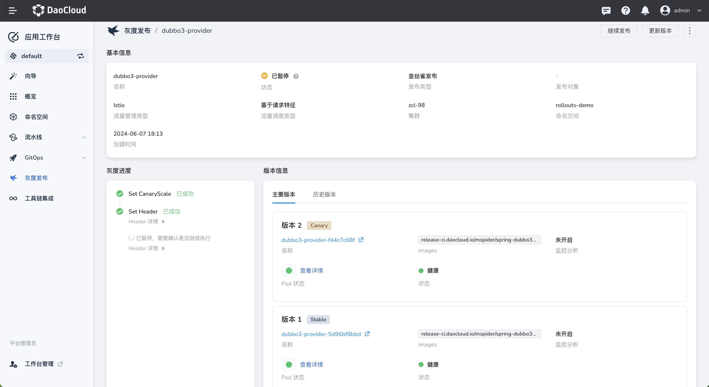
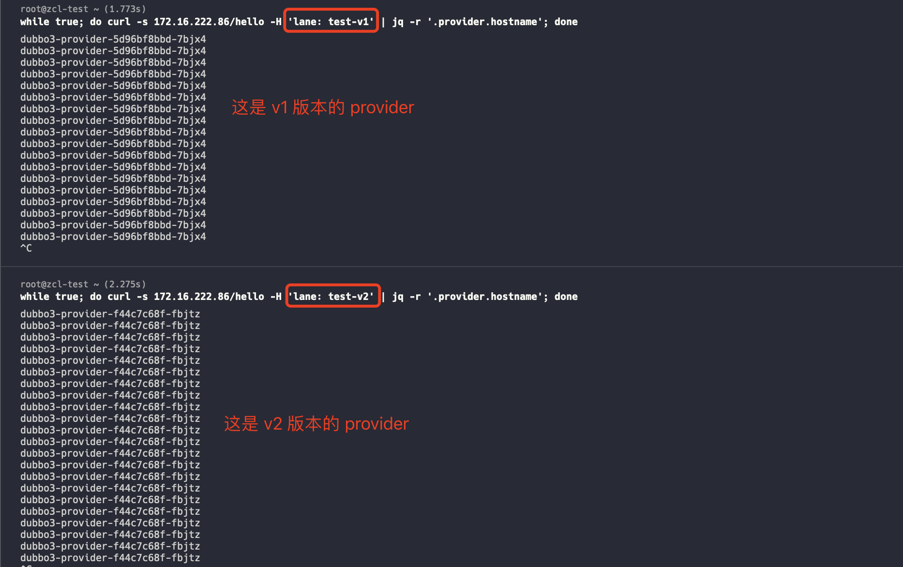

# 基于 GitOps 在托管网格下的工作集群中进行灰度发布

场景：基于 GitOps 的方式客户如何在托管网格下的工作集群中进行灰度发布？

## 前提条件

参考文档[基于 GitOps 在托管网格下的工作集群中部署 istio 相关资源](istio_argocd.md) 完成 `创建托管网格并纳管工作集群` 之前的所有步骤

## 基于 GitOps 实现基于权重的灰度发布

1. 前往应用工作台，在 `GitOps`，[创建 gitops 应用](../user-guide/gitops/create-argo-cd.md)，其中仓库地址：`https://github.com/amamba-io/rollout-examples`，路径设置为 `rollouts/v1`，集群/命名空间选择工作集群下的命名空间即可。

2. 创建成功后，手动`同步`应用资源

3. 前往服务网格，在托管网格查看工作集群中同步的 vs、dr、gateway 资源，如果未查找到，请检测章节**创建托管网格并纳管工作集群** 中的注意事项是否配置正确

4. 默认情况下工作集群的负载均衡暴露的是 `80` 端口，所需要在工作集群中修改服务的 gatway 端口为 80 以便能访问到服务

    

5. 在浏览器访问 http://<工作集群节点IP>/hello?name=test-v1。

    
6. 前往应用工作台，在`灰度发布` 列表，选择 `dubbo3-provider` 进行 yaml 编辑，修改 `version: v1` 为 `version: v2`

    

7. 修改成功后，`dubbo3-provider` 开始进入灰度过程

    

    如上图：可以根据 workload 的标签 rollouts-pod-template-hash 和 version 来进行区分

    !!! note

      - v1 Pod: dubbo3-provider-5d96bf8bbd-v9c28
      - v2 Pod: dubbo3-provider-f44c7c68f-95pfb

8. 灰度规则说明，这部分在 git 仓库 `rollouts-legacy/v1/rollout-provider.yaml` 目录下可以看到

  ```yaml
  ...
  strategy:
    canary:
      trafficRouting:
        istio:
          virtualService:
            name: provider
            routes:
              - test-v1
          destinationRule:
            name: dubbo-provider
            stableSubsetName: stable
            canarySubsetName: canary
      ## 进入灰度发布时，会将新版本的流量全中权重设置为 5%，等待 10 分钟后会将权重设置为 50%
      steps:
        - setWeight: 5
        - pause:
            duration: 10m
        - setWeight: 50
        - pause:
            duration: 10m

  ```

9. 终端模拟访问结果如下：

  - 新版本权重为 5% ，v1 Pod 和 v2 Pod 的流量分配如下：

    

  - 新版本权重为 50% ，v1 Pod 和 v2 Pod 的流量分配如下：

    

  - 发布成功后，全是 v2 Pod 的流量

    

## 基于 GitOps 实现基于请求特征的灰度发布

### 介绍

本演示示例仓库地址：https://github.com/amamba-io/rollout-examples

其中 `dubbo3-consumer` 和 `dubbo3-provider`两个服务有关联关系，访问 dubbo3-consumer 的 /hello 接口，dubbo3-consumer 会将请求转发给 dubbo3-provider，发布过程会对 dubbo3-provider 服务进行更新，并根据预设的 header 信息来进行路由。

### 操作步骤

1. 前往应用工作台，在 `GitOps`，[创建 gitops 应用](../user-guide/gitops/create-argo-cd.md)，其中仓库地址：`https://github.com/amamba-io/rollout-examples`，路径设置为 `rollouts-legacy/v1`，集群/命名空间选择工作集群下的命名空间即可。

2. 创建成功后，手动`同步`应用资源

3. 前往服务网格，在托管网格查看工作集群中同步的 vs、dr、gateway 资源，如果未查找到，请检测章节**创建托管网格并纳管工作集群** 中的注意事项是否配置正确

4. 默认情况下工作集群的负载均衡暴露的是 `80` 端口，所需要在工作集群中修改服务的 gatway 端口为 80 以便能访问到服务

    

5. 在浏览器访问 http://<工作集群节点IP>/hello?name=test-v1。

    

6. 前往应用工作台，在`灰度发布` 列表，选择 `dubbo3-provider` 进行 yaml 编辑，修改 `version: v1` 为 `version: v2`

    

7. 修改成功后，`dubbo3-provider` 开始进入灰度过程

    

    如上图：可以根据 workload 的标签 rollouts-pod-template-hash 和 version 来进行区分

    !!! note

      - v1 Pod: dubbo3-provider-5d96bf8bbd-v9c28
      - v2 Pod: dubbo3-provider-f44c7c68f-95pfb

8. 灰度规则说明，这部分在 git 仓库 `rollouts-legacy/v1/rollout-provider.yaml` 目录下可以看到

  ```yaml
  ...
  strategy:
    canary:
      canaryService: dubbo3-provider-canary
      stableService: dubbo3-provider
      trafficRouting:
        managedRoutes:
          - name: test-v2
        istio:
          virtualService:
            name: provider
            routes:
              - test-v1
      ## 进行灰度发布时，会将 vs 中 header 设置为 test-v2，即请求时如果请求头中带有`lane: test-v2`，将会路由到新版本
      steps:
        - setCanaryScale:
            weight: 100
        - setHeaderRoute:
            name: test-v2
            match:
            - headerName: lane
              headerValue:
                exact: test-v2
        - pause: {}
  ```

9. 终端模拟访问结果如下：

  

## FAQ

### 上述步骤是否支持多集群的灰度？

支持的，需要做以下动作：

1. 首先需要将多个集群都放在同一个托管网格下

2. 需要创建同名的命名空间，并且基于每个集群的命名空间都要部署相同的 gitops 应用

3. 灰度发布时需要在两个集群中对对应的服务分别进行操作。
