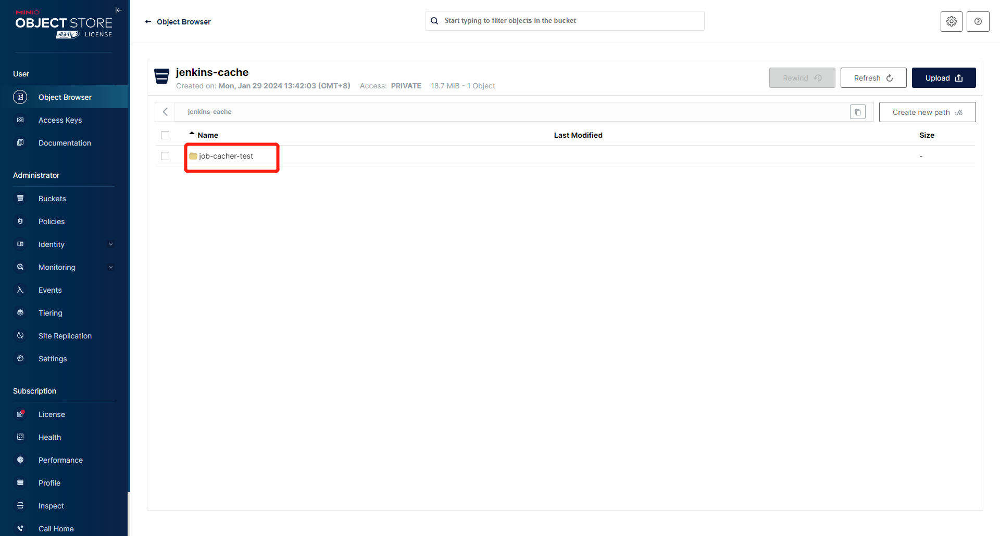
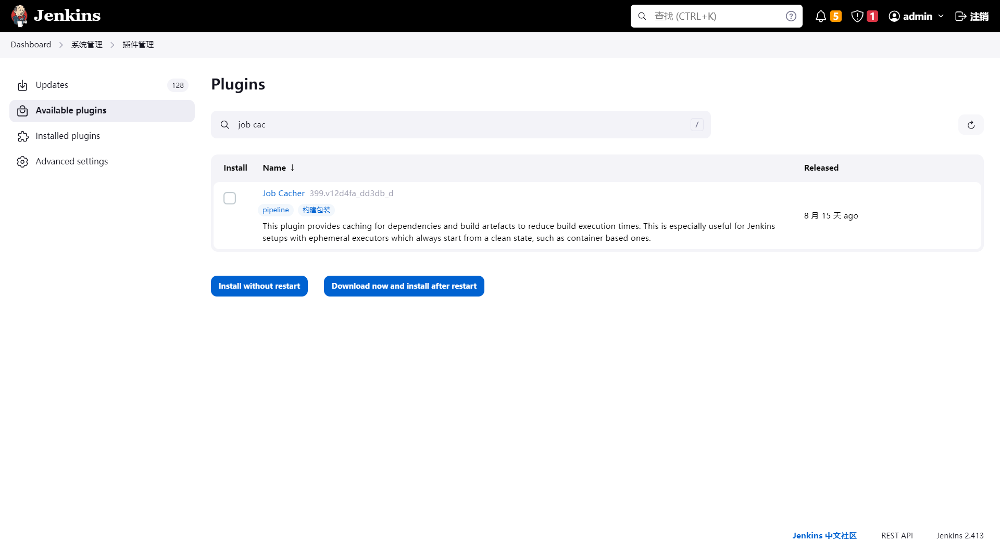
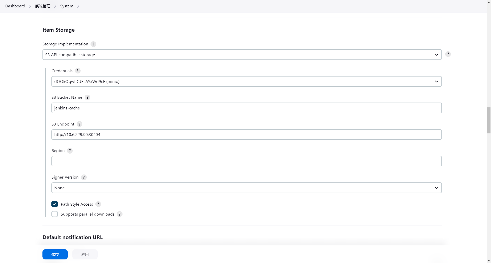
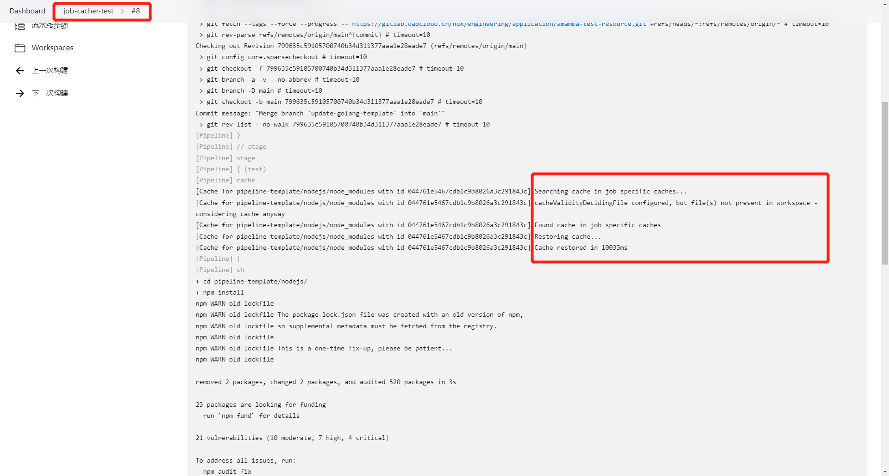
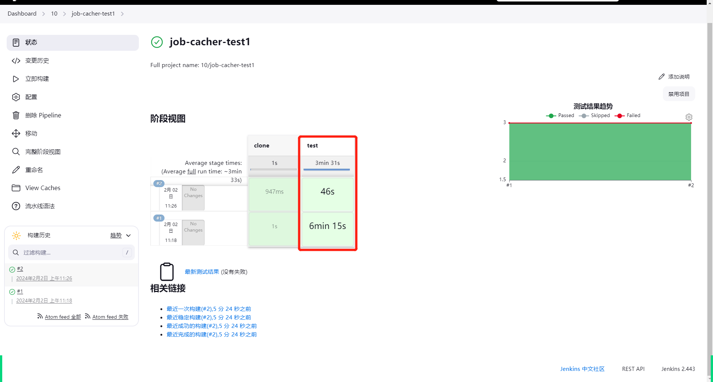

# 在流水线中使用缓存

在 CI 中，流水线常用于执行编译和构建等任务。在现代编程语言中，无论是 Java、NodeJS、Python 还是 Go，
都需要下载依赖来执行构建任务。这个过程往往会消耗大量网络资源，降低流水线构建速度，
成为 CI/CD 的瓶颈，降低生产效率。

同样，还包括语法检查生成的缓存文件、Sonarqube 扫描代码生成的缓存文件。
如果我们每次都从头开始运行这些进程，将无法有效利用工具本身的缓存机制。

应用工作台本身提供了基于 K8s `hostPathVolume` 的缓存机制，使用节点的本地路径来缓存
`/root/.m2`、`/home/jenkins/go/pkg`、`/root/.cache/pip` 等默认路径。

然而，在 DCE 5.0 的多租户场景中，更多用户希望保持缓存隔离，避免侵入和冲突。
这里我们引入基于 Jenkins 插件 [Job Cacher](https://plugins.jenkins.io/jobcacher/) 的缓存机制。

通过 Job Cacher，我们可以使用 AWS S3 或 S3 兼容的存储系统（如 MinIO）来实现流水线级别的缓存隔离。

## 准备工作

1. 提供 S3 或 S3 类存储后端，可以参考
   [创建 MinIO 实例 - DaoCloud Enterprise](../../middleware/minio/user-guide/create.md)
   在 DCE 5.0 上创建 MinIO，创建 bucket，准备 `access key` 和 `secret`。

    

2. 在 Jenkins 中，进入 **Manage Jenkins** -> **Manage Plugins**，安装 job-cacher 插件：

    

3. 如果想使用 S3 存储，还需要安装以下插件：

    ```yaml
      - groupId: org.jenkins-ci.plugins
        artifactId: aws-credentials
        source:
          version: 218.v1b_e9466ec5da_
      - groupId: org.jenkins-ci.plugins.aws-java-sdk
        artifactId: aws-java-sdk-minimal  # (1)!
        source:
          version: 1.12.633-430.vf9a_e567a_244f
      - groupId: org.jenkins-ci.plugins
      artifactId: jackson2-api  # (2)!
        source:
          version: 2.16.1-373.ve709c6871598
    ```

    1. aws-credentials 的依赖
    2. 其他插件的依赖

!!! note

    Amamba v0.3.2 及更早版本提供的 Helm Chart 对应 Jenkins v2.414。
    经测试，这个版本的 Job Cacher 399.v12d4fa_dd3db_d 无法正确识别 S3 配置。
    请注意使用升级版本的 Jenkins 和 Job Cacher。

## 配置

在 **Manage Jenkins** 界面中，按如下配置 S3 参数：



或者，你可以通过 CasC 修改 ConfigMap 来持久化配置。

修正后的 YAML 示例如下：

```yaml
unclassified:
  ...
  globalItemStorage:
    storage:
      nonAWSS3:
        bucketName: jenkins-cache
        credentialsId: dOOkOgwIDUEcAYxWd9cF
        endpoint: http://10.6.229.90:30404
        region: Auto
        signerVersion:
        parallelDownloads: true
        pathStyleAccess: false
```

## 使用

完成上述配置后，我们可以在 Jenkinsfile 中使用 Job Cacher 提供的 `cache` 功能。例如，在以下流水线中：

```groovy
pipeline {
  agent {
    node {
      label 'nodejs'
    }
  }
  stages {
    stage('clone') {
      steps {
          git(url: 'https://gitlab.daocloud.cn/ndx/engineering/application/amamba-test-resource.git', branch: 'main', credentialsId: 'git-amamba-test')
      }
    }
    stage('test') {
      steps {
          sh 'git rev-parse HEAD > .cache'
          cache(caches: [
            arbitraryFileCache(
              path: "pipeline-template/nodejs/node_modules",
              includes: "**/*",
              cacheValidityDecidingFile: ".cache",
            )
          ]){
            sh 'cd pipeline-template/nodejs/ && npm install && npm run build && npm install jest jest-junit && npx jest --reporters=default --reporters=jest-junit'
            junit 'pipeline-template/nodejs/junit.xml'
          }
      }
    }
  }
}
```

这个流水线定义了两个阶段，clone 和 test。在 test 阶段，我们缓存 node_modules 下的所有文件，
以避免每次都获取 npm 包。我们还将 .cache 文件定义为缓存的唯一标识。这意味着，一旦当前分支有任何更新，
缓存将失效，npm 包将被重新获取。

完成后，你可以看到流水线的第二次运行时间显著减少：





更多选项可参考文档：
[Job Cacher | Jenkins plugin](https://plugins.jenkins.io/jobcacher/)

## 其他

- **关于性能**：job-cacher 也是基于 `MasterToSlaveFileCallable` 实现的，
  它基于远程调用直接在 agent 中上传和下载，而不是 agent -> controller -> S3 的方式；
- **关于缓存大小**：job-cacher 支持各种压缩算法，包括 `ZIP`、`TARGZ`、`TARGZ_BEST_SPEED`、`TAR_ZSTD`、`TAR`，
  默认使用 `TARGZ`；
- **关于缓存清理**：job-cacher 支持为每个流水线设置 `maxCacheSize`。
