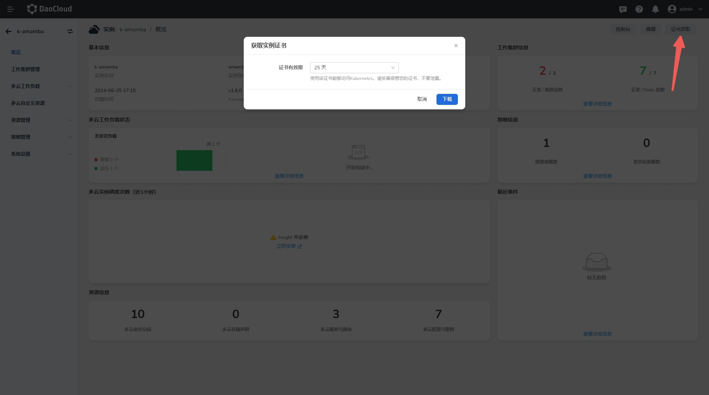
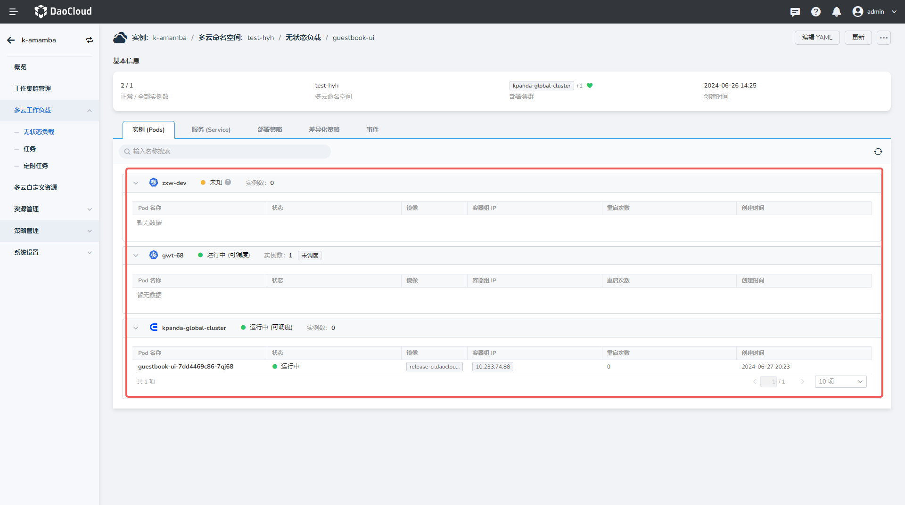

# 使用流水线发布多云资源到多云编排模块

本文介绍如何通过流水线来发布多云资源。

## 环境准备

### 代码仓库准备

1. 需要一个文件夹存放需部署资源的 YAML，并且包含多云编排的 `PropagationPolicy`（在 resourceSelectors 中把期望的资源添加进去）
2. 一个 Dockerfile 用于构建镜像
3. 一个 Token 用于在流水线中访问这个代码仓库（或者设置为公开）

### 多云编排准备

1. 创建一个多云实例，获取到对应实例的 kubeconfig 证书，并把证书添加到应用工作台的流水线凭证当中
2. 在多云实例中创建一个多云命名空间

下图是获取证书的页面：

### 应用工作台准备

1. 确保多云实例的 kubeconfig 证书被创建到应用工作台的流水线凭证中，并且确保已经同步到 Jenkins
2. 确保代码仓库的 token 已经被创建到应用工作台的流水线凭证中，并且确保已经同步到 Jenkins
   （如果代码仓库为公开仓库则不需要，如果为集成进来的 Gitlab，只需要 Gitlab 的连接状态正常即可）
3. 现阶段应用工作台无法获取多云编排创建的多云实例以及对应的多云命名空间（在创建流水线时），现在只能手动编写 JenkinsFile

## 创建流水线

请参阅[本文所用的 JenkinsFile 开源仓库](https://github.com/amamba-io/amamba-examples)。

根据仓库内的 [pipelines/guestbook-karisip.jenkinsfile](https://github.com/amamba-io/amamba-examples/blob/main/pipelines/guestbook-kairship.jenkinsfile)
创建对应的流水线，修改对应的参数后运行。对于部署到多云编排的流水线，本质上与其他流水线相同，关键在于应用工作台无法获取到对应的多云实例和多云命名空间，
所以只能根据多云编排提供的 kubeconfig 证书使用 kubectl 来部署资源。

## 运行结果

