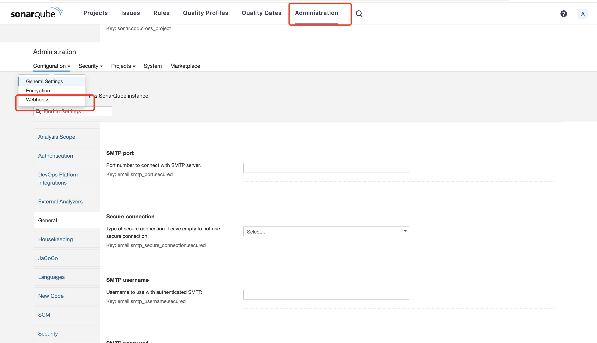
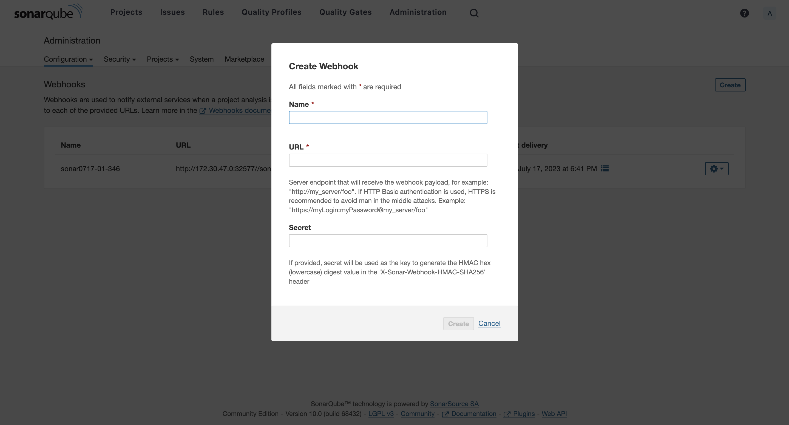

# 使用流水线实现代码扫描

代码仓库中的源代码作为软件的最初原始形态，其安全缺陷是导致软件漏洞的直接根源。
因此，通过代码扫描分析发现源代码中的安全缺陷是降低软件潜在漏洞的一种重要方法。

例如，SonarQube 是一款代码自动审查工具，用于检测项目代码中的 bug 错误，提高测试覆盖率等。
它可以与项目中现有的工作流程集成，以便在项目分支和拉取请求之间进行连续的代码检查。

本文将介绍如何在流水线中集成 SonarQube 来实现代码扫描能力。

## 部署 SonarQube

如果您已有 SonarQube 环境，可以跳过此步骤，但需要保证当前集群可以访问到 SonarQube 服务器。

1. 通过 Helm 安装 SonarQube。

    ```bash
    helm repo add sonarqube <https://SonarSource.github.io/helm-chart-sonarqube>
    helm repo update
    kubectl create namespace sonarqube
    helm upgrade --install -n sonarqube sonarqube sonarqube/sonarqube  --create-namespace --set service.type=NodePort
    ```

2. 查看对应 namespace 下的 Pod STATUS 都为 Running，表明 SonarQube 安装成功。

    ```none
    kubectl get po
    NAME                     READY   STATUS    RESTARTS   AGE
    sonarqube-postgresql-0   1/1     Running   0          3h59m
    sonarqube-sonarqube-0    1/1     Running   0          3h59m
    ```

3. 查看 SonarQube 控制台的访问地址。通常访问地址为 `http://<Node IP>:<NodePort>`，账号和密码为 `admin/admin`。

    ```bash
    export NODE_PORT=$(kubectl get --namespace amamba-system -o jsonpath="{.spec.ports[0].nodePort}" services sonarqube-sonarqube)
    export NODE_IP=$(kubectl get nodes --namespace amamba-system -o jsonpath="{.items[0].status.addresses[0].address}")
    echo http://$NODE_IP:$NODE_PORT
    ```

4. 在 SonarQube 生成管理员令牌（Token），操作路径为：`My Account` -> `Profile` -> `Security` -> `Generate` -> `Copy`

    

    

    

5. 在SonarQube里创建Webhook服务器：

    1. 操作路径为：`Administration` -> `Configuration` -> `Webhooks`。

    2. 点击 `Create`，在弹出的对话框中输入 Name 和 Jenkins Console URL（即 SonarQube Webhook 地址，这个地址是前面获取的SonarQube地址+/sonarqube-webhook/）。

    

    

    

6. 将 SonarQube 地址添加至 Jenkins，请确保可以互通：

    1. 操作路径为 `Manage Jenkins` -> `Configure System` -> `SonarQube servers` -> ` Add SonarQube` 

    2. 在弹出的对话框中输入 `Server URL` 和 `Server authentication token`（即 SonarQube 地址，这个地址是前面获取的 SonarQube 地址 + 管理员令牌）。

    3. 点击 `Save` 完成操作。

    

    

    

    !!! note

        如何访问应用工作台部署的 Jenkins Dashboard？
        
        - 前往容器管理->全局服务集群->无状态负载，在 amamba-system 下找到负载 amamba-jenkins，通过 NodePort 的方式暴露该服务。
        - 默认用户名密码为 admin/Admin01

7. 为新项目创建 SonarQube Token，操作路径为 `Create new project` -> `Set Up` -> `Generate` -> `Continue`。

    

    

## 创建流水线

1. 在流水线页面，点击`创建流水线`。

    

2. 选择`自定义创建`。

    

3. 输入名称，其他可使用默认值，点击`确定`。

    

## 编辑 Jenkinsfile

1. 点击一个流水线进入其详情页面，在右上角点击 `...` -> `编辑 Jenkinsfile`。

    

    

2. 将以下 YAML 代码复制粘贴至 jenkinsfile。

    ```yaml
    pipeline {
    agent {
        node {
        label 'go'
        }
        
    }
    stages {
        stage('git clone') {
        steps {
            git(credentialsId: 'mabing-gitlab', branch: 'master', url: 'https://gitlab.daocloud.cn/bing.ma/jenkins-sonarqube-demo.git')
        }
        }
        
        stage('unit test') {
        steps {
            container('go') {
                sh 'go test -json > test-report.out'
                sh 'go test -coverprofile=coverage.out'
            }
        }
        }
        
        stage("SonarQube analysis") {
        steps {
            container('go') {
            withSonarQubeEnv('demo-dev-sonarqube') {
                sh 'sonar-scanner -Dsonar.projectKey=golang-demo -Dsonar.sources=. -Dsonar.host.url=http://10.6.182.101:32313 -Dsonar.login=4b337cbbafd89ae9bca46a746cddab4c993d2a7a'
            }
            }
        }
        }
        
        stage("Quality Gate") {
        steps {
            container('go') {
            timeout(time: 1, unit: 'HOURS') {
                waitForQualityGate abortPipeline: false // 这里设置为false，表示即使没有通过sonarQube的QUALITY GATE，流水线也可以继续
            }
            }
        }
        }
        
        stage('build & push') {
        steps {
            container('go') {
            withCredentials([usernamePassword(credentialsId:'docker-credential',passwordVariable:'PASS',usernameVariable:'USER')]) {
                sh 'go build -o simple-http-server main/main.go'
                sh 'docker build -f Dockerfile . -t $registry/$project/$name:latest'
                sh 'docker login $registry -u $USER -p $PASS'
                sh 'docker push $registry/$project/$name:latest'
            }
            
            }
            
        }
        }
        
        stage('deply'){
        steps {
            container('go'){
            withCredentials([kubeconfigFile(credentialsId: 'kubeconfig-credential', variable: 'KUBECONFIG')]) {
                sh 'kubectl apply -f deploy.yaml'
            }
            }
        }
        
        }
        
    }
    parameters {
        string(name: 'registry', defaultValue: 'release-ci.daocloud.io', description: '')
        string(name: 'project', defaultValue: 'demo', description: '')
        string(name: 'name', defaultValue: 'http-hello', description: '')
    }
    }
    ```

    !!! note

        在上述代码中，
        
        - waitForQualityGate abortPipeline: false，表示没有通过门禁质量检查也可以继续流水线。如果是 true，则表示放弃
        - 对于 withSonarQubeEnv 下的 shell 语句，可以从上一步的 SonarQube 中复制

3. 保存后立即运行该流水线。

## 前往 SonarQube 查看代码扫描结果

等待流水线运行成功后，前往 SonarQube 查看代码扫描结果。


