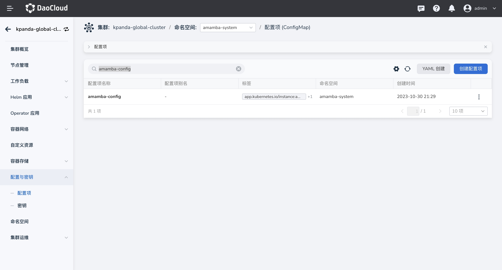
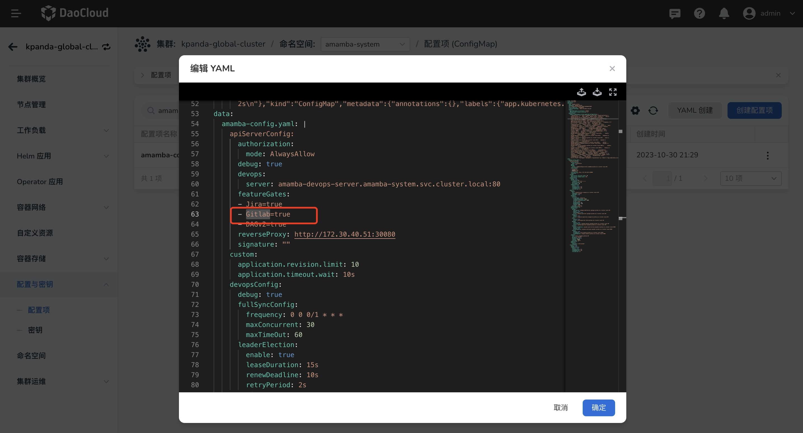
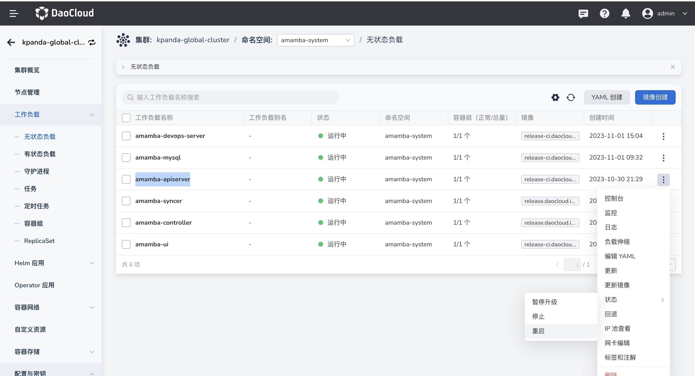
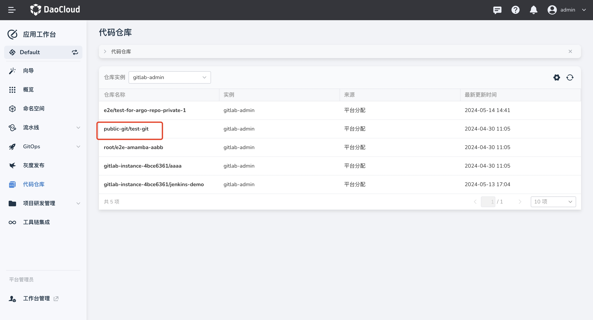
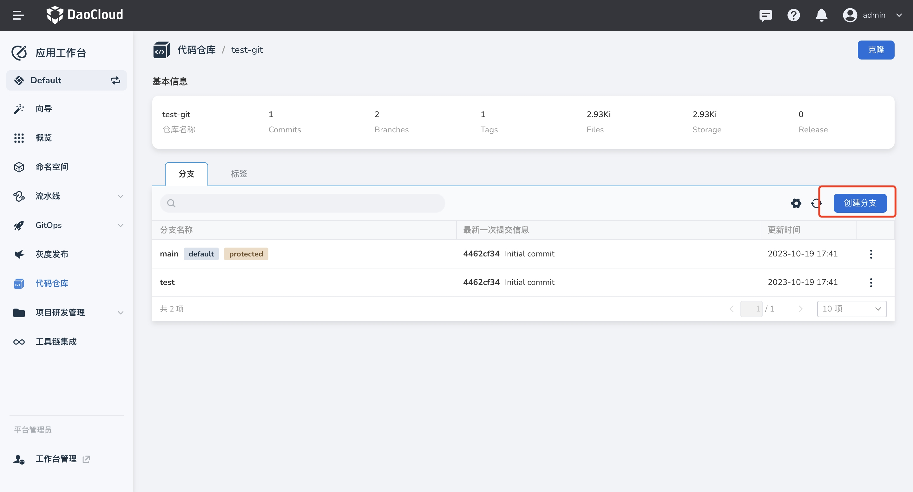
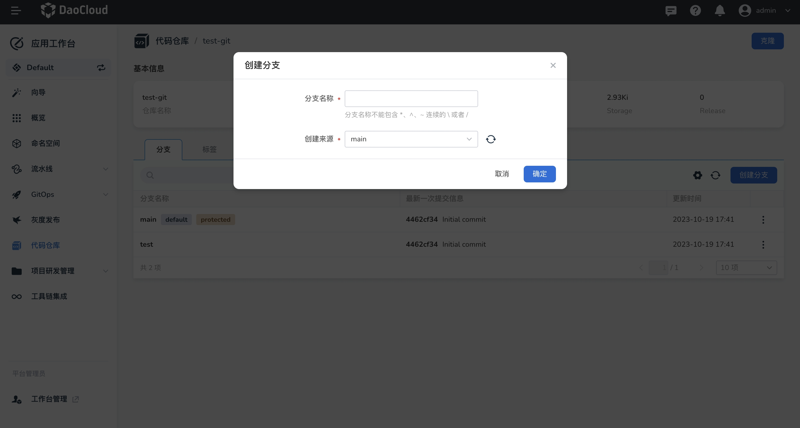
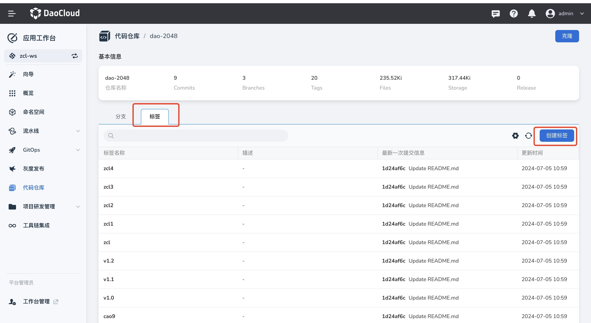
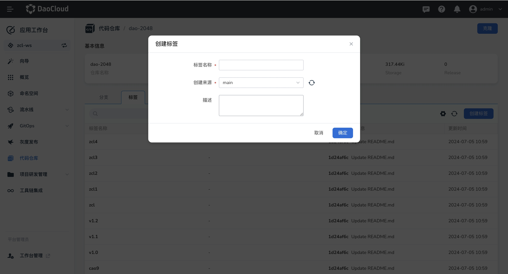

# 代码仓库管理

应用工作台支持了导入外部仓库功能，对于导入的代码仓库提供了基础的管理能力。

## 开启代码仓库导航菜单

平台默认部署后，代码仓库在导航栏中是被隐藏的，您可以通过修改配置文件来开启该能力。

1. 在 __容器管理__ 中，选择 Global 集群，`配置项`中搜索 `amamba-config` 

    

2. 点击`编辑 YAML`，修改 `featureGates` 中 `Gitlab=true`

    

3. 修改成功后，无状态负载中搜索 amamba-apiserver ，点击 `重启`

    

4. 重启成功后，前往 __应用工作台__  即可看到代码仓库导航菜单

## 创建分支

平台已经导入一个代码仓库并且绑定到当前工作空间。

1. 在左侧导航栏中，选择 `代码仓库`

2. 仓库列表选择一个仓库进入到`详情界面`

    

3. 在标签 `分支` 下，点击 `创建分支`

    

4. 填写相关参数，分支名称、来源

    

5. 点击创建

## 创建标签

1. 在标签 `标签` 下，点击 `创建标签`

    

2. 填写相关参数，标签名称、来源、描述

    

3. 点击创建
