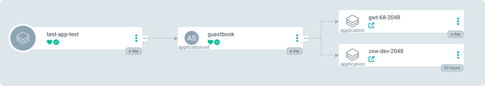

# 使用 ApplicationSet

ArgoCD 支持使用 [ApplicationSet](https://argo-cd.readthedocs.io/en/stable/user-guide/application-set/)
的方式来灵活的生成多个 GitOps 应用，例如多集群应用场景，应用工作台中使用 `AppOfApplicationSet` 的方式来进行支持。
本文将指导您如何在应用工作台中启用 ApplicationSet 功能。

!!! note

    本文假设您的ArgoCD 安装的命名空间和Helm Release名称均为 argocd。这将会影响到后续的搜索和修改操作，如果您的命名空间和Release名称不同，请自行替换。

## AppOfApplicationSet 模式

`AppOfApplicationSet` 是 GitOps 的一种运维模式，通过 **Application** -> **生成ApplicationSet** -> **生成多个Application** 的方式来实现多集群应用的部署：



因此本质上还是创建的 GitOps Application。前提是您的 GitOps 仓库（假设您的仓库名称为 app-set-repo）中需要包含以下一份 ApplicationSet 的定义文件。

```yaml
apiVersion: argoproj.io/v1alpha1
kind: ApplicationSet # 资源类型为 ApplicationSet
metadata:
  name: guestbook # 注意不要定义namespace，否则无法正常创建
spec:
  generators:
    - list:
        elements: # 自定义的元素，是一个map结构，可以任意添加，会被go template的形式替换
          - cluster: "cluster1"
            namespace: "ns1"
            path: "dev"
          - cluster: "cluster2"
            namespace: "ns2"
            path: "staging"
  template: # 本质上是渲染出一个ArgoCD的 Application 资源
    metadata:
      name: "{{cluster}}-2048" # 在template中可以使用上述generators中定义的元素
    spec:
      project: "2" # 代表工作空间的ID
      source:
        repoURL: https://demo-repo.git # 真实创建 Application 的仓库地址，上述elements中的path应该与此URL对应的仓库对应
        targetRevision: HEAD
        path: "{{path}}"
      destination:
        name: "{{cluster}}"
        namespace: "{{namespace}}"
```

!!! note

    注意 Application 中的集群和命名空间需要提前在 **全局管理** 模块中进行绑定。
    project、cluster、namespace 字段请按权限填写，否则会导致创建失败。

后续需要在应用工作台的 GitOps 模块创建一个 GitOps Application，其中的仓库地址为 app-set-repo 对应的地址，
即可生成多个 Application。有关如何创建 GitOps 应用，参阅[创建 GitOps 应用](create-argo-cd.md)。

请按照下面的步骤来启用 ApplicationSet 功能。

## 启用 ApplicationSet 功能

### 应用工作台版本 >= v0.35.0

在工作台升级至v0.35.0后，我们提供了feature开关，可以一键开启/关闭`AppOfApplicationSet`功能。

1. 前往 __容器管理__ -> __集群列表__ -> __kpanda-global-cluster__ -> __配置与密钥__ __配置项__

1. 命名空间选择 amamba 安装的命名空间(默认是`amamba-system`), 选择 `amamba-config` 进行更新

1. 添加或修改以下配置项：
```yaml
argocd.appAnyNamespace.enable: true # 如果关闭则设置为false
```

1. 点击保存即可, 进入应用工作台 -> GitOps 模块即可通过 AppOfApplicationSet 的方式创建 GitOps 应用。

### 应用工作台版本 < v0.35.0

#### 启用配置

1. 配置 ApplicationSet Controller 的 RBAC

    ApplicationSet 依赖于 ApplicationSet Controller 的调谐才能实现控制多个 Application，
    需要在集群中配置相应的 RBAC 角色（默认情况下不会创建，需要手动创建）。分为两种情况：

    - 如果已安装了 ArgoCD

        默认情况下，通过 helm 安装的 ArgoCD 不会创建 ApplicationSet Controller 的
        ClusterRole 和 ClusterRoleBinding，您需要手动创建。推荐通过更新 Helm 应用的方式。

        前往 **容器管理** -> **集群列表** -> **kpanda-global-cluster** -> **Helm 应用** ，
        搜索 `argocd`（您安装 ArgoCD 时的 Helm 应用名称），点击右侧 **更新** ，通过更新以下 YAML 的形式开启：

        ```yaml
        argo-cd:
          applicationSet:
            allowAnyNamespace: true  # 设置为true
        
          configs:
            params:
              application.namespaces: gitops-* # 设置为gitops-*  
        ```

    - 如果您未安装ArgoCD

        在安装时与上述配置 YAML 一致，通过设置 helm value 来实现。

        请确保等待 ArgoCD 更新完成之后再进行下面的操作。

1. 修改 ArgoCD 相关的 ConfigMap 配置

    前往 **容器管理** -> **集群列表** -> **kpanda-global-cluster** -> **配置与密钥** -> **配置项** ，
    需要修改以下两个 ConfigMap，因为需要添加内容，请选择 **编辑YAML** 进行修改：

    - argocd-cm

        在 YAML 的 data 字段中添加如下配置：

        ```yaml
        kind: ConfigMap
        apiVersion: v1
        metadata:
          name: argocd-cm
        data:
          application.resourceTrackingMethod: "annotation+label" # 添加这一行
        ```

    - argocd-cmd-params-cm

        在 YAML 的 data 字段中添加或修改如下配置：

        ```yaml
        kind: ConfigMap
        apiVersion: v1
        metadata:
          name: argocd-cmd-params-cm
        data:
          # 添加下面这两行
          applicationsetcontroller.namespaces: "gitops-*"
          applicationsetcontroller.allowed.scm.providers: "true"
        ```

完成上述更改后，您需要重启 ArgoCD 和应用工作台相关组件。

#### 重启服务

**重启 ArgoCD 组件：**

前往 **容器管理** -> **集群列表** -> **kpanda-global-cluster** -> **工作负载** -> **无状态负载** ，
命名空间选 `argocd` (您安装 ArgoCD 的命名空间) ，搜索 `argocd-applicationset-controller`，
点击右侧 **┇** 中的 **状态** 进行重启。同时在 **有状态负载** 中，找到并重启 `argocd-application-controller`。

**重启应用工作台组件：**

前往 **容器管理** -> **集群列表** -> **kpanda-global-cluster** -> **工作负载** -> **无状态负载** ，
选择命名空间 `amamba-system`，分别重启 `amamba-apiserver` 和 `amamba-syncer` 这两个 Deployment。

等待上述组件重启完成后，前往应用工作台创建 GitOps 应用时选择 `AppOfApplicationSet` 的方式创建。
