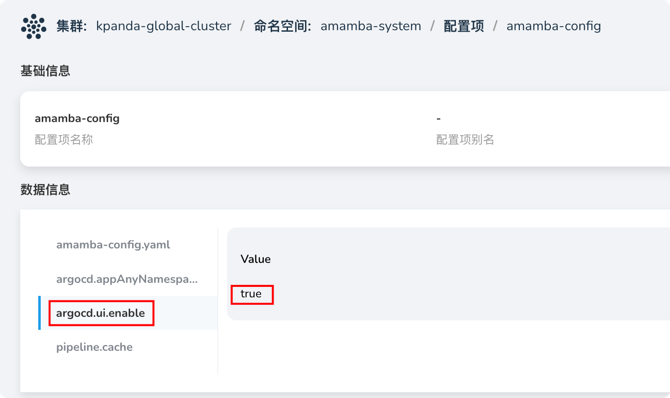
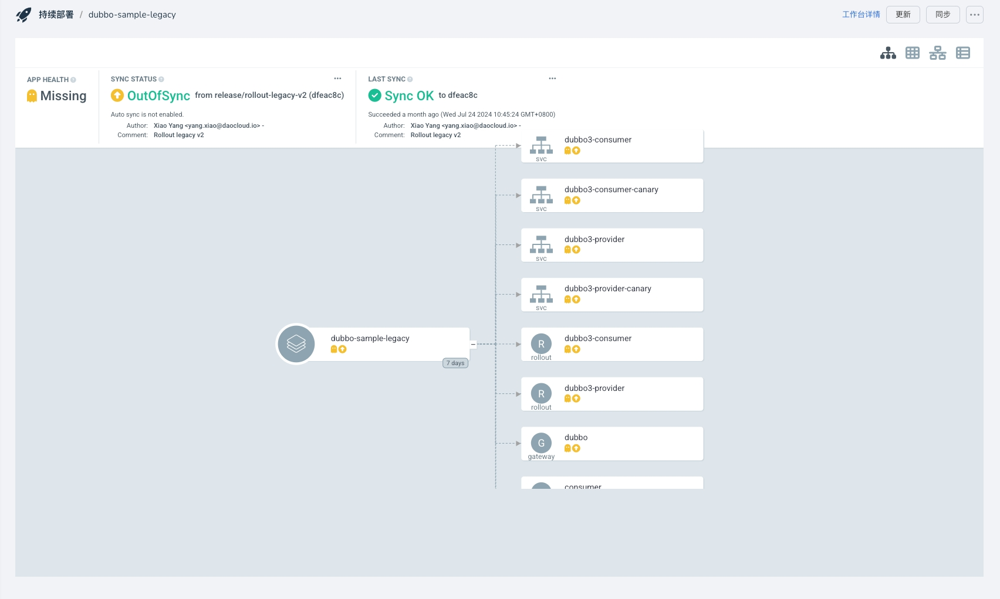

# 开启 ArgoCD UI

为了方便用户直接在应用工作台中利用 ArgoCD 的原生 UI 查看 ArgoCD 的应用详情，
DCE 5.0 应用工作台提供了开启 ArgoCD UI 的功能。本文档将指导您如何开启 ArgoCD UI。

!!! note

    在 UI 中仅有只读权限，如果有其他操作需求，请通过工作台进行操作。

开启 ArgoCD 的 UI 功能需要修改的配置项较多，并且配置项之间是相互影响的，请严格按照下面的步骤进行配置。

## 修改 ArgoCD 配置

### 应用工作台版本 >= v0.35.0

在工作台升级至v0.35.0后，我们提供了feature开关，可以一键开启/关闭ArgoCD的UI功能。

1. 前往 __容器管理__ -> __集群列表__ -> __kpanda-global-cluster__ -> __配置与密钥__ -> __配置项__

1. 命名空间选择 amamba 安装的命名空间（默认是 `amamba-system`），选择 `amamba-config` 进行更新

1. 添加或修改以下配置项：

    ```yaml
    argocd.ui.enable: true # 如果关闭则设置为false
    ```
    
    > 注意是添加一个 key-value 对
   
     

1. 注意：修改过后，您仍需**修改amamba的配置项** [修改应用工作台配置项](#update-config) 才能使 ArgoCD UI 生效。

### 应用工作台版本 < v0.35.0

下述配置均在 `kpanda-global-cluster` 集群中，并假设您的 ArgoCD 安装在 `argocd` 这个命名空间中。

1. 创建 GProductProxy

    前往 __容器管理__ -> __集群列表__ -> __kpanda-global-cluster__ -> __自定义资源__ ，搜索
    `gproductproxies.ghippo.io`，进入自定义资源详情后，在右侧点击 __YAML 创建__ 。

    ```yaml
    apiVersion: ghippo.io/v1alpha1
    kind: GProductProxy
    metadata:
      name: argocd
    spec:
      gproduct: amamba
      proxies:
        - authnCheck: false
          destination:
            host: amamba-argocd-server.argocd.svc.cluster.local
            port: 80
          match:
            uri:
              prefix: /argocd/applications/argocd
        - authnCheck: false
          destination:
            host: amamba-argocd-server.argocd.svc.cluster.local # 如果命名空间不是 argocd，需要更改 svc 的名称
            port: 80
          match:
            uri:
              prefix: /argocd
    ```

    host 中的 `amamba-argocd-server.argocd.svc.cluster.local` 需要根据您的 ArgoCD 的服务名称和命名空间进行修改。
    具体修改路径为 __容器管理__ -> __集群列表__ -> __kpanda-global-cluster__ -> __容器网络__ ，根据 ArgoCD 安装的命名空间搜索关键词 `amamba-argocd-server` 来确定。 

1. 修改 ArgoCD 的相关配置

    前往 __容器管理__ -> __集群列表__ -> __kpanda-global-cluster__ -> __工作负载__ -> __无状态负载__ ，
    选择您安装的 ArgoCD 的命名空间，如 argocd。找到 `amamba-argocd-server`，点击右侧的 __重启__ 按钮。

    修改 `argocd-cmd-params-cm`：

    ```yaml
    kind: ConfigMap
    metadata:
      name: argocd-cmd-params-cm
      namespace: argocd
    data:
      server.basehref: /argocd # 添加这三行
      server.insecure: "true"
      server.rootpath: /argocd
    ```

    修改 `argocd-rbac-cm`：

    ```yaml
    apiVersion: v1
    kind: ConfigMap
    metadata:
      name: argocd-rbac-cm
      namespace: argocd
    data:
      policy.csv: |-
        g, amamba, role:admin
        g, amamba-view, role:readonly   # 添加这一行
    ```

    修改 `argocd-cm`：

    ```yaml
    apiVersion: v1
    kind: ConfigMap
    metadata:
      name: argocd-cm
      namespace: argocd
    data:
      accounts.amamba: apiKey
      accounts.amamba-view: apiKey # 添加这一行
    ```

1. 更改完上述选项后，需要重启 `amamba-argocd-server` 这个 Deployment。

    前往 __容器管理__ -> __集群列表__ -> __kpanda-global-cluster__ -> __工作负载__ -> __无状态负载__ ，
    选择您安装的 ArgoCD 的命名空间，如 argocd。 找到 `amamba-argocd-server`，点击右侧的 __重启__ 按钮。

## 修改应用工作台配置项
<span id="update-config"></span>

经过上述步骤后，还需要更改应用工作台的配置项才能使 ArgoCD UI 生效。

1. 前往 __容器管理__ -> __集群列表__ -> __kpanda-global-cluster__ -> __Helm应用__，
   选择命名空间 `amamba-system`，修改 `amamba` 这个应用，在 YAML 中修改以下配置项：

    ```yaml
    configMap:
      generic:
        argocd:
          host: amamba-argocd-server.argocd.svc.cluster.local:443  # 将端口改为 443
          enableUI: true         # 添加这个选项
    ```

    host 端口保持 443，其中 `amamba-argocd-server.argocd.svc.cluster.local` 需要根据您的 ArgoCD 的服务名称和命名空间进行修改。
    具体修改路径为 __容器管理__ -> __集群列表__ -> __kpanda-global-cluster__ -> __容器网络__ ，根据 ArgoCD 安装的命名空间搜索关键词 `amamba-argocd-server` 来确定。

1. 保存后等待 Helm 应该更新完毕即可。

## 查看拓扑

1. 在 __应用工作台__ -> __持续发布__ 页面中，点击一个应用名称，进入详情界面

1. 详情界面点击 `ArgoCD 拓扑` 即可看到拓扑图：

    
