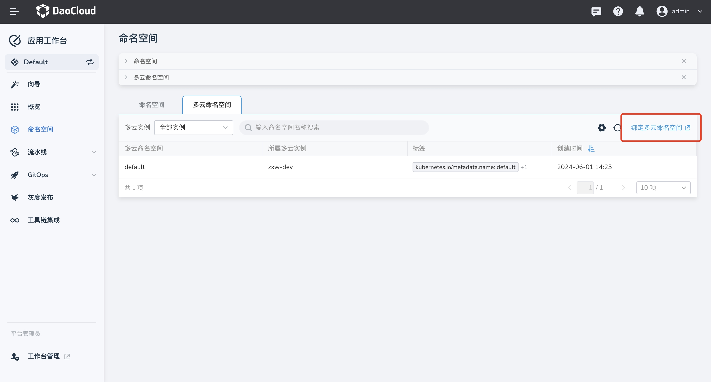

# 多云命名空间

多云命名空间是多云编排平台中的资源，可以跨云、跨集群管理工作负载。

## 绑定多云命名空间

!!! note

    由于目前仅支持在多云编排平台为工作空间绑定多云命名空间资源。

1. 在应用工作台的左侧导航栏中点击 __命名空间__ ，进入 __多云命名空间__ 列表，点击右上角的 __绑定多云命名空间__ 。

    

2. 绑定资源操作查看文档[绑定/解绑工作空间](../../../kairship/workspace.md#_3)。

## 如何使用多云命名空间

- 参考文档 [ArgoCD 与多云编排联动完成多云应用发布](../../quickstart/argo-karmada.md)
