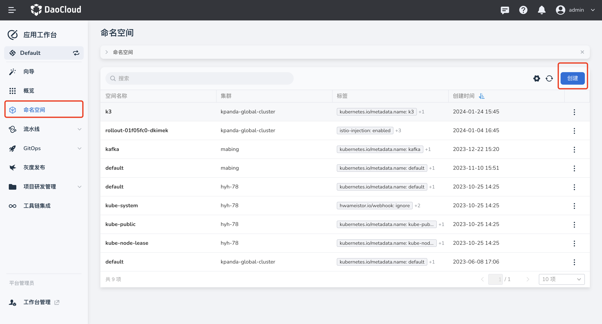
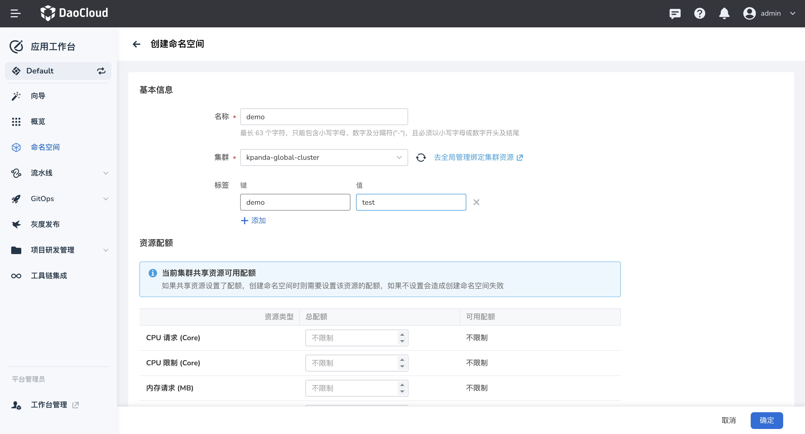
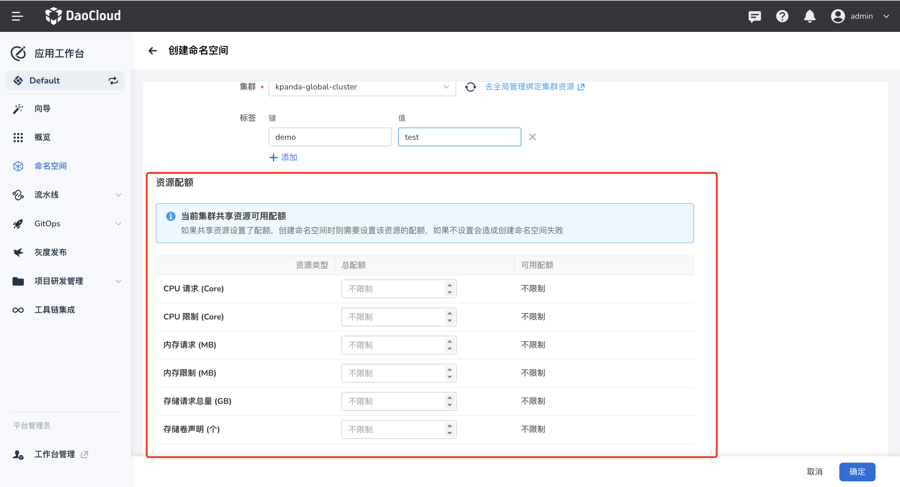
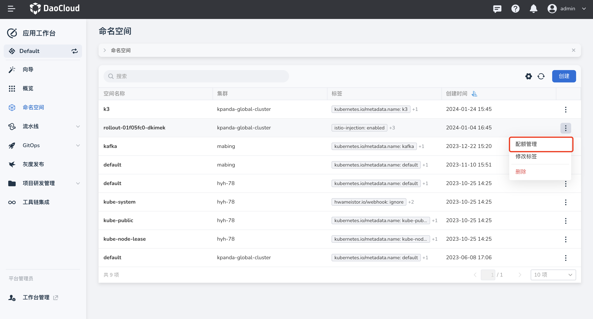
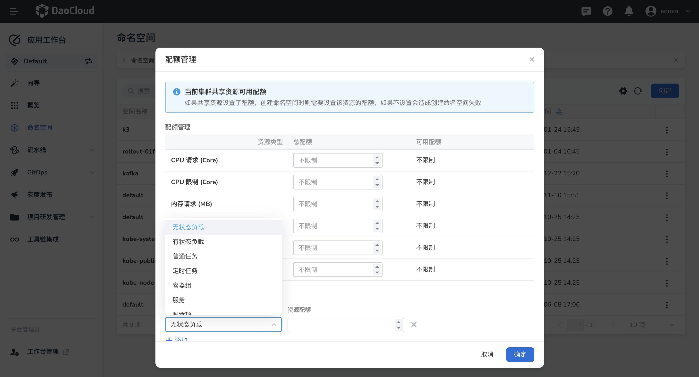

# 命名空间管理

命名空间是 Kubernetes 中用来隔离资源的一种抽象。

## 前提条件

- 当前工作空间已经拥有集群资源，参考[绑定资源](../../../ghippo/user-guide/workspace/quota.md)。
- 当前用户授权为 __Workspace Admin__ 角色，详情参考[工作空间最佳实践](../../../ghippo/best-practice/ws-best-practice.md)。

## 创建命名空间

!!! note

    仅支持 __Workspace Admin__ 创建命名空间，并设置命名空间配额，其他角色均不支持此操作。

1. 在应用工作台的左侧导航栏中点击 __命名空间__ ，进入命名空间列表，点击右上角的 __创建__ 。

    

2. 在 __创建命名空间__ 页面中，配置命名空间的基本信息。

    

    - 名称：设置命名空间的名称
    - 集群：从当前工作空间下绑定的所有集群中选择一个集群
    - 标签：设置命名空间的标签

3. 基本信息设置完成后，还需要配置命名空间的资源配额。

    !!! note

        - 如果当前集群在工作空间设置了任何资源配额，则必须要在创建命名空间时为命名空间设置此资源配额。
        - 设置命名空间的资源配额不能超过当前集群在该工作空间设置的资源使用上限。
        - 资源配额的请求或限制字段为空意味不为当前命名空间设置任何配额。

    目前工作空间中支持的资源配额有：CPU 请求、CPU 限制、内存请求、内存限制、存储请求总量、存储卷声明。其中 CPU、内存资源的限制值必须大于请求值。

    

4. 点击 __确定__ 完成资源创建。屏幕提示创建成功，返回命名空间列表页面。

    

5. 点击列表右侧的 __︙__ ，可以在弹出菜单中选择 __配额管理__ 、 __编辑标签__ 、 __删除__ 等操作。

    !!! warning

        如果删除了某个命名空间，会删除该命名空间下所有的资源，请谨慎操作。

## 命名空间配额

除了在创建命名空间中需要的 CPU 请求、CPU 限制、内存请求、内存限制、存储请求总量、存储卷声明资源配额，在命名空间配额管理中还可以设置其他资源配额，例如命名空间下的容器组、无状态负载、有状态负载、普通任务、定时任务等资源。

1. 在命名空间列表页面，选择某一个命名空间，点击 __配额管理__ 。

    

2. 在弹出的 __资源配额__ 对话框中，可以看到目前命名空间的资源配额信息。在 __应用资源__ 下点击 __添加__ ，
   选择一个资源并设置配额，具体请参阅 [Kubernetes 资源配额](https://kubernetes.io/zh-cn/docs/concepts/policy/resource-quotas/)。

    

3. 点击 __确定__ 完成配额设置。
