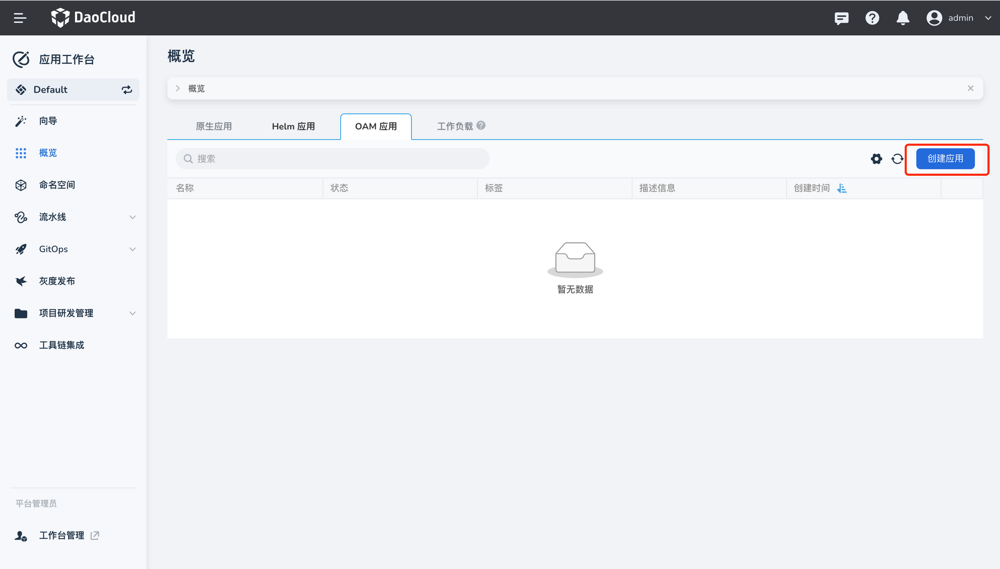
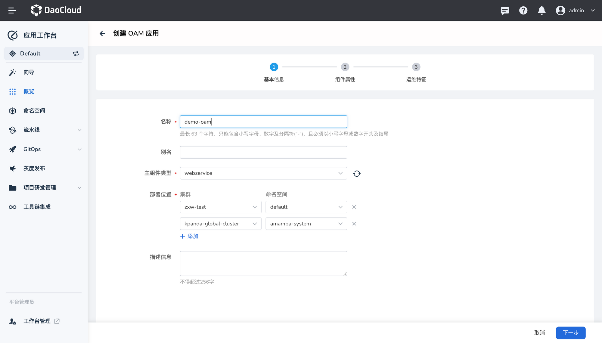
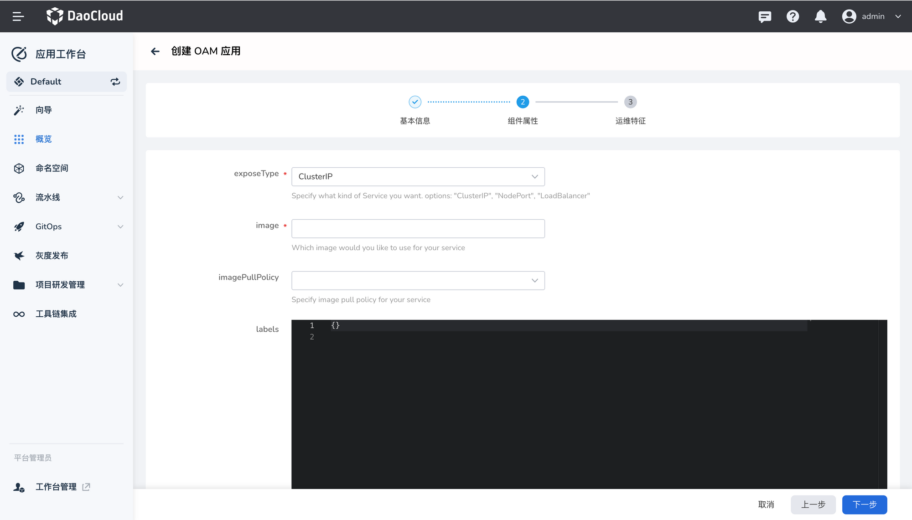
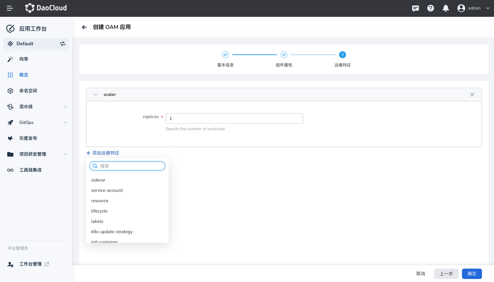
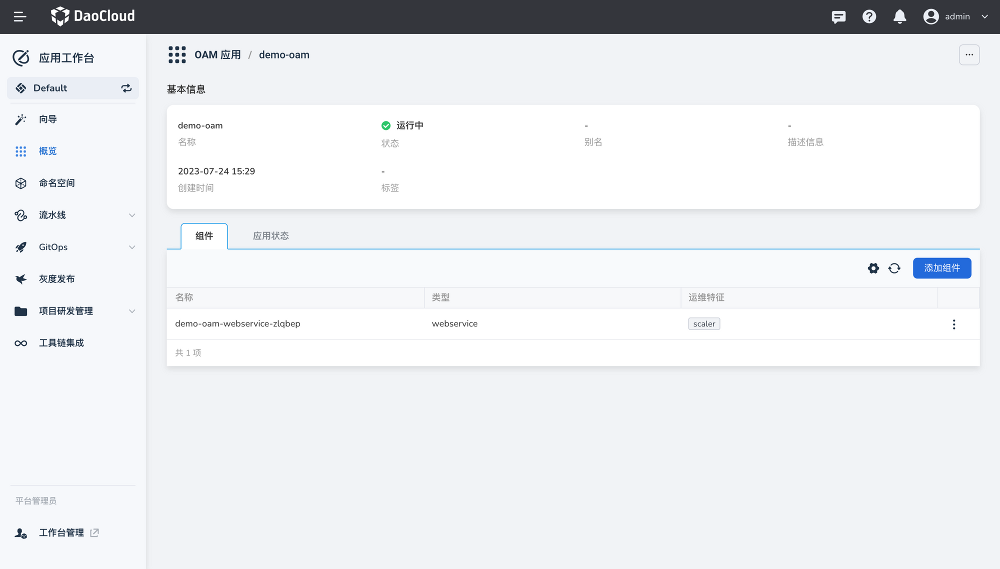

# 创建OAM 应用

OAM 应用功能基于开源软件 [KubeVela](http://kubevela.net/zh/docs/v1.2/) ，通过开放应用模型（OAM）作为应用交付的顶层抽象，主要是对 Kubernetes 的资源的抽象与整合。一个 OAM 应用由一个或多个组件和各项运维动作组成，从而实现在混合环境中标准化和高效率的应用交付。

有关 OAM 的概念介绍可参考 [OAM 概念介绍](concept.md)或参考[KubeVela 官方文档](http://kubevela.net/zh/docs/v1.2/)

## 前提条件

- [创建工作空间](https://docs.daocloud.io/ghippo/user-guide/workspace/workspace/)、[创建用户](https://docs.daocloud.io/ghippo/user-guide/access-control/user/)。
- 将该用户添加至该工作空间，并赋予 `Workspace Editor` 或更高权限。

## 操作步骤

1. 在`应用工作台`->`概览`页面中，`OAM 应用`页签下点击`创建应用`。

    

2. 参考以下说明填写基本信息，然后点击`下一步`：

    - 名称/别名：填写 OAM 应用的名称/别名。
    - 主组件类型：不同组件需要配置的参数有所不同。有关各种组件类型的详细介绍，可参考[内置组件列表](https://kubevela.io/zh/docs/end-user/components/references)。
        - CronTask：定义一个周期性运行代码或者脚本的任务。
        - Task：定义一个只执行一次代码或者脚本的任务。
        - Daemon：定义一个在 Kubernetes 每个节点上都运行的服务。
        - K8s-Object：列表中的元素为完整的 Kubernetes 资源结构体。
        - Webservice：定义一个长期运行的、可伸缩的容器化服务，并且暴露一个服务端点用来接受来自客户的外部流量。
    - 部署位置：选择将应用部署到哪个集群下的哪个命名空间，支持多个集群环境。

        

3. 参考[内置组件列表](https://kubevela.io/zh/docs/end-user/components/references)为所选组件配置参数。

    

4. 参考[内置运维特征列表](https://kubevela.io/zh/docs/end-user/traits/references)为所选组件配置运维特征属性。

    

5. 点击`确定`完成创建，创建成功后返回 OAM 应用列表页面。

    

6. 点击应用名称，进去 OAM 应用详情页面。支持查看 OAM 应用基本信息、包含的组件列表、部署的应用资源状态，以及支持添加组件、添加运维特征等操作。

    
