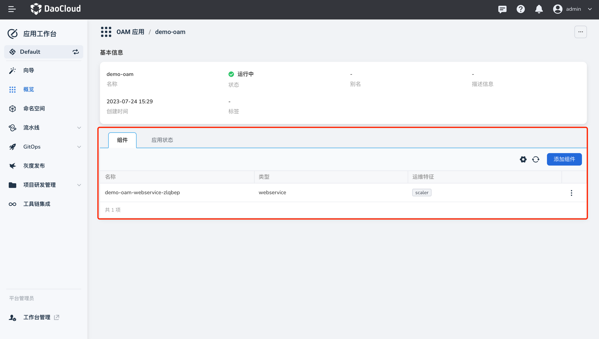
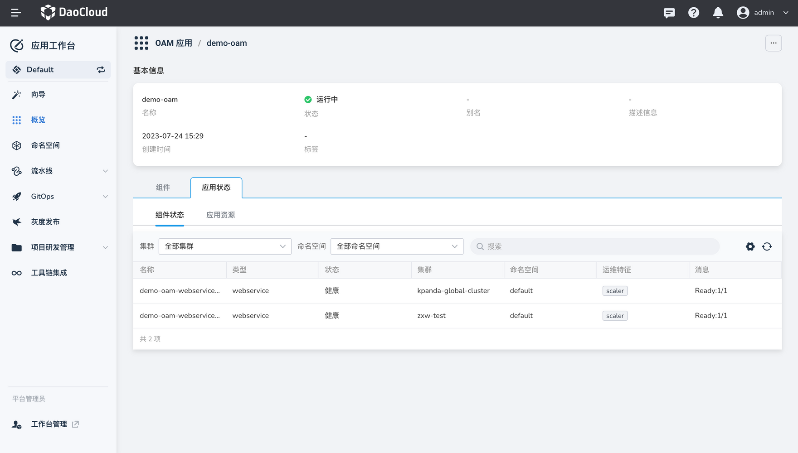
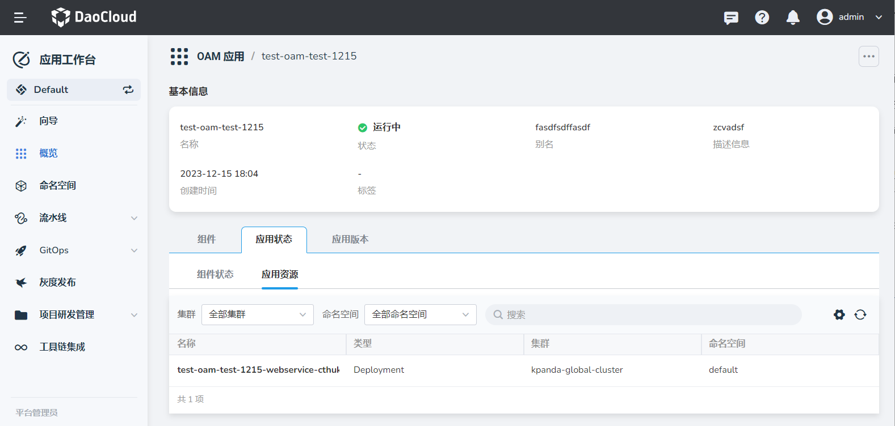
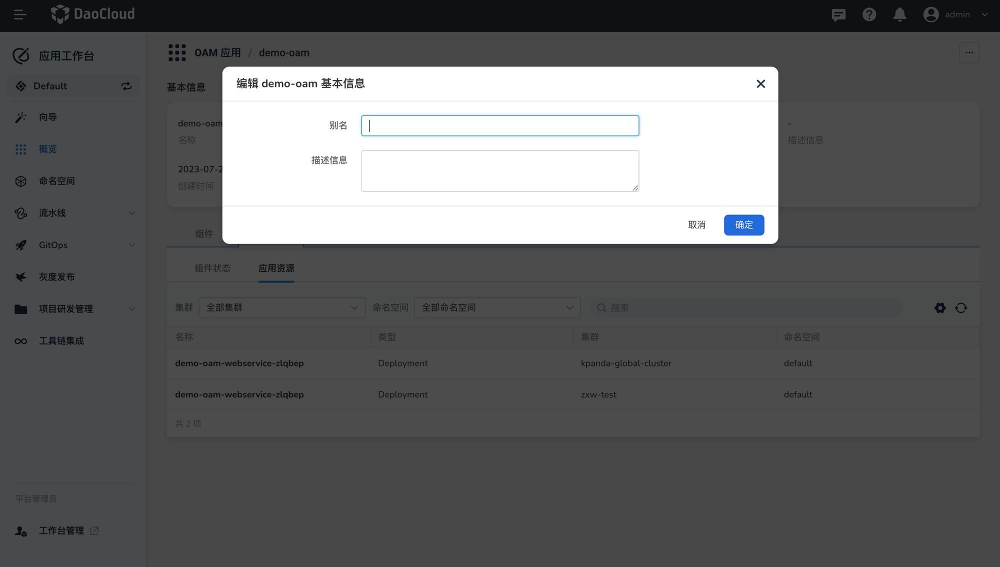
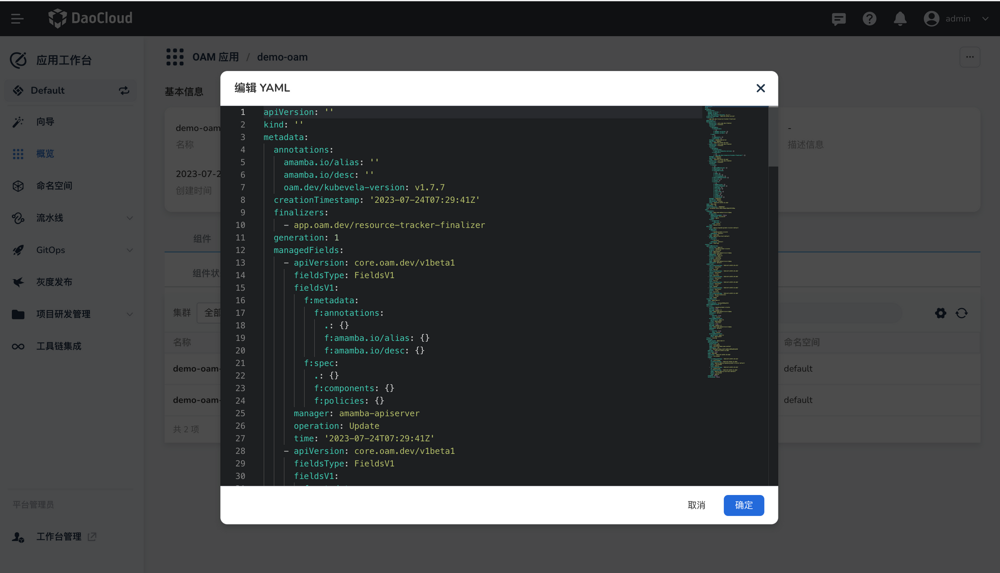
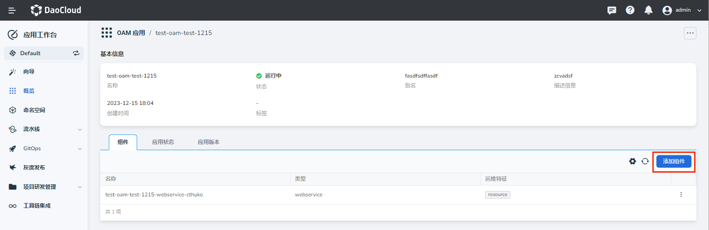
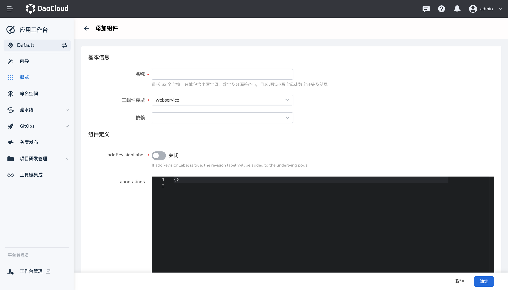
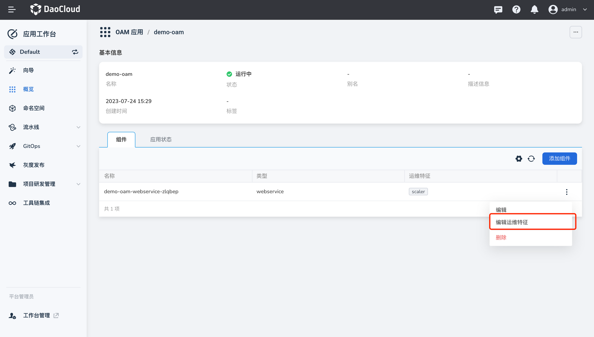
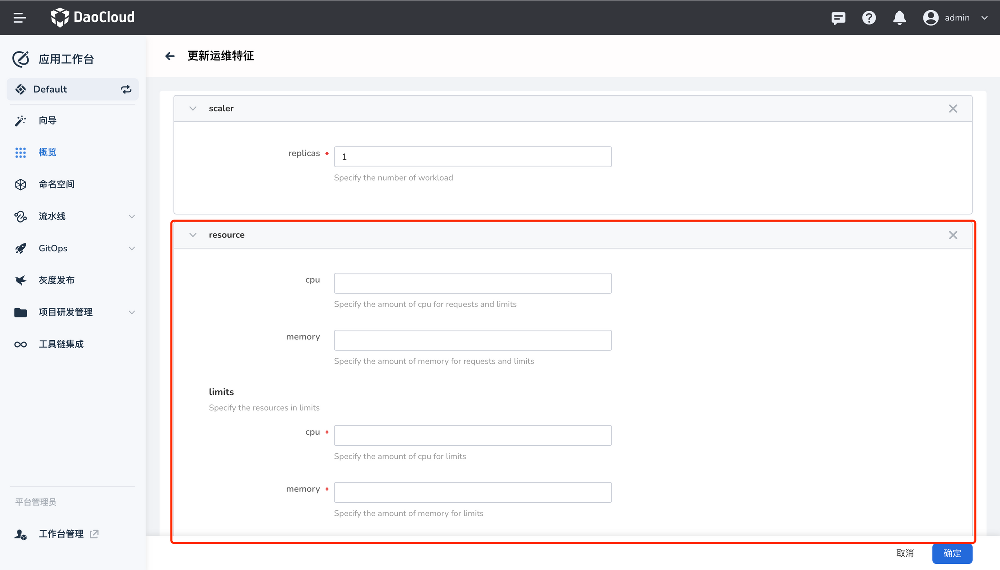

# OAM 应用管理

[创建好 OAM 应用](create.md)之后，可以查看应用详情并更新应用的组件或运维特征。

## 查看应用详情

1. 在`应用工作台`->`概览`页面，点击`OAM 应用`页签，查看 OAM 应用列表
2. 点击应用名称可以查看应用详情，包括应用名称、状态、别名、描述信息、创建时间等字段。
3. 在应用详情页面点击`组件`页签，可以查看当前应用定义的组件数量、类型、运维特征。

    

4. 在应用详情页面点击`应用状态`页签，可以查看组件状态和应用资源。

    - 组件状态：展示当前应用下的每个组件的健康状态。存在不健康的组件时需要及时排查运维。

        

    - 应用资源：当前应用下部署的 Kubernetes 资源的信息。

        

## 编辑 OAM 应用基本信息

1. 点击 OAM 应用名称，然后在页面右上角点击 `ⵈ` 选择`编辑基本信息`。
2. 根据需要设置别名，或补充描述信息描述信息。

    

## 编辑 OAM 应用 YAML 文件

1. 点击 OAM 应用名称，然后在页面右上角点击 `ⵈ` 选择`编辑 YAML`。
2. 根据需要编辑 OAM 应用的 YAML 文件。

    

## 添加组件

1. 点击 OAM 应用名称，点击`组件`页签，然后在右侧点击`添加组件`。

    

2. 选择需要添加的组件类型，参考[内置组件列表](https://kubevela.io/zh/docs/end-user/components/references)填写对应的组件参数。

    

### 添加/更新运维特征

1. 点击 OAM 应用名称，点击`组件`页签，在组件右侧点击 `ⵗ` 选择`编辑运维特征`。

    

2. 参考[内置运维特征列表](https://kubevela.io/zh/docs/end-user/traits/references)更新运维特征属性。

    
