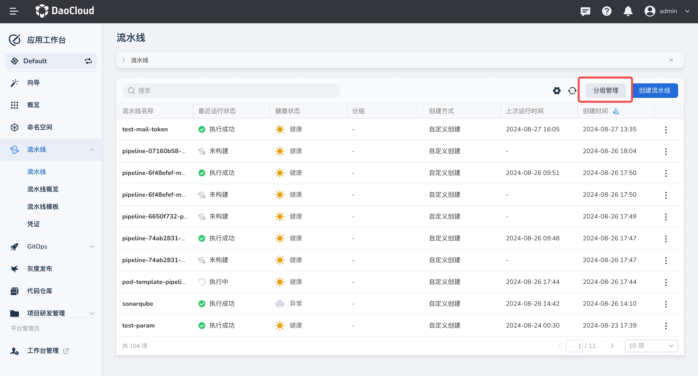
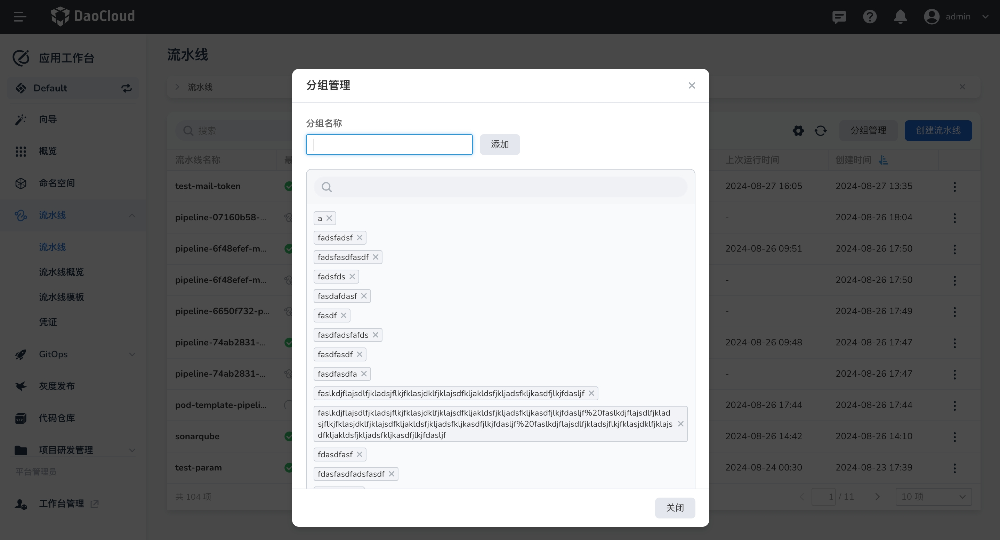
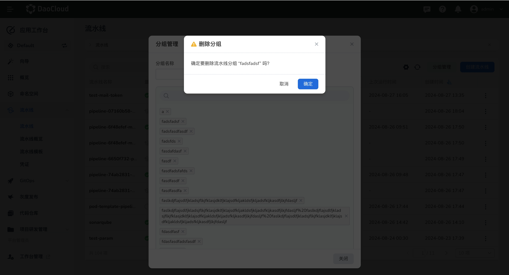
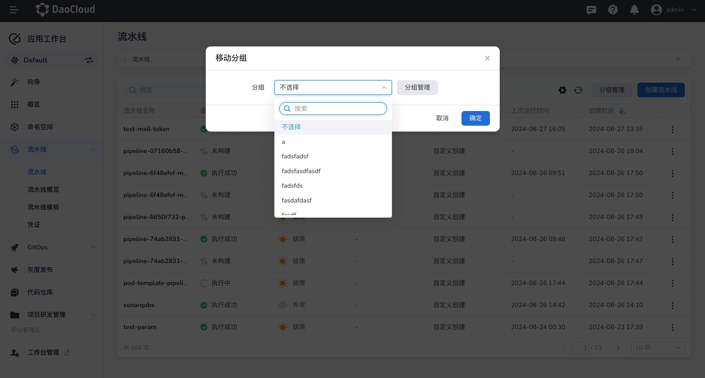
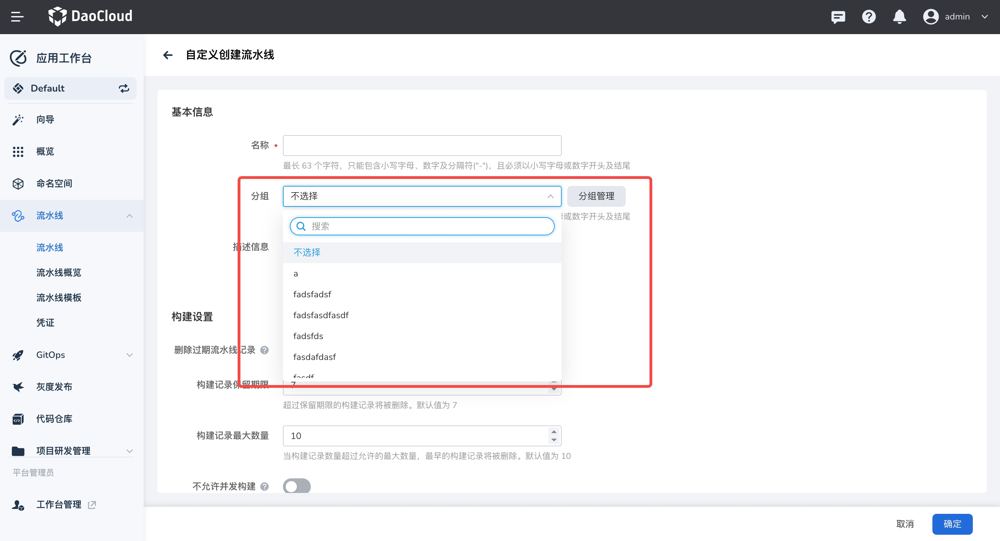
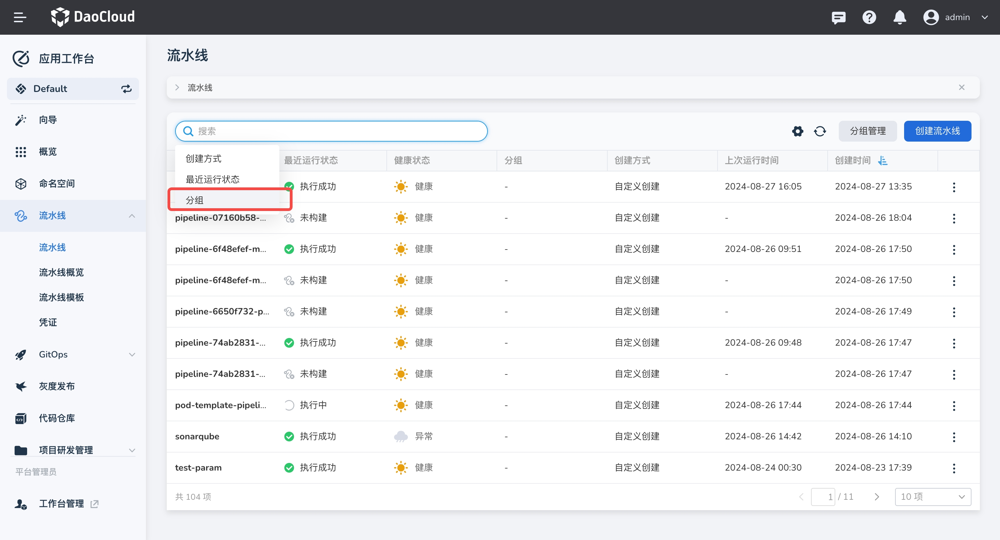

# 流水线分组

通过分组可以对流水线进行分类，方便企业可以管理流水线。

## 分组管理

每个工作空间可以创建多个流水线分组

1. 前往 __流水线__，点击 `分组管理` 按钮

    

2. 在分组管理界面输入分组名称即可创建

    

3. 也可以对分组进行删除，删除该分组后，该分组内的流水线的分组也会被删除

    

## 使用分组

### 移动分组

选择一条流水线， 点击移动分组，可以将当前流水线的分组进行更换，如下：

### 配置分组

创建流水线时，支持为流水线配置分组，如下：

### 分组筛选

在流水线页面的搜索栏中，可以根据分组进行筛选，如下：

