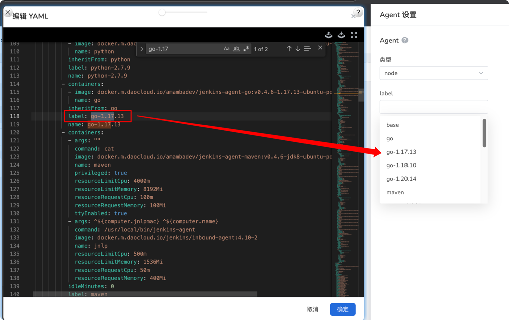

# 迁移 Jenkins Agent 镜像

> 本文适用于：
> - Jenkins v0.5.0 及以上
> - 应用工作台 v0.35 及以上
> - DCE 5.0 安装器 v0.27 及以上

自 Jenkins 升级到 **v0.4.8** 版本以后，我们对 Jenkins 的 Chart 进行了精简，避免在安装 DCE 5.0
时因为镜像体积过大导致安装时间过长，这加快了安装速度，同时提升了系统的稳定性。从 v0.4.8 开始，Jenkins 的 Chart 分为两个：

- Jenkins 精简版，包含 Jenkins 的核心功能。其中，Jenkins Agent 的镜像仅包含：

    - base
    - nodejs (16.20.2)
    - python (3.8.19)
    - golang (1.22.6)
    - maven (jdk8)
  
    除此之外，**不再**提供 CentOS 系统的镜像。

- jenkins-full：完全版的 Jenkins。除了上述的镜像外，还包含不同版本的 Agent 镜像，
  例如 Python 包含 3.8.19、2.7.9、3.11.9 等多个版本的镜像，具体的 Agent 镜像版本查阅
  [Agent 版本列表](https://github.com/amamba-io/jenkins-agent/blob/main/version.yaml)。

为了保证 DCE 5.0 升级的兼容性，Jenkins 升级以后虽然名称不变，但是可选的镜像列表发生了变化（镜像依旧存在于镜像仓库中），需要手动修改 Agent 镜像的映射关系。

如果您仅使用到了 base、golang、nodejs、maven、python，
**不需要** 执行以下操作。本文仅适用于使用了非默认 Agent 镜像的用户。
如您使用了类似于 go-v1.17.13 这样带版本号的 Agent，请按照下面 👇 的步骤进行迁移。

## 迁移步骤

Jenkins 可用的 Agent 镜像通过 ConfigMap 进行映射，修改步骤如下：

1. 在 DCE 5.0 的界面中，点击左上角的 **≡** 打开导航栏，选择 __容器管理__ -> __集群列表__ ，找到并点击集群名称 `kpanda-global-cluster`。
1. 在左侧导航栏中选择 __存储和密钥__ -> __配置项__ ，命名空间选择 `amamba-system` 集群，名称搜素 `global-jenkins-casc-config`
1. 进入详情，点击右上角的 **编辑 YAML** , YAML 的路径为 data -> jenkins.yaml -> jenkins -> clouds -> kubernetes -> templates

    > 如果对应的 key 不存在，您需要新建一份，格式参考 Jenkins 安装的 namespace 下的配置项：jenkins-casc-config

1. 其中 label 字段表示的是在 UI 或者 JenkinsFile 中使用的 agent label 名称。

    

1. 选择您需要修改的 agent label，将 `containers` 字段中的对应的 container（例如 go、python 等）的 `image` 修改为对应版本的镜像

例如，升级前使用的 agent label 是 `go-1.17.13`，对应的镜像为 `https://my-regiestry.com/go-v1.17.13`。
升级之后，configmap 中只有 label 为 `go` 的 template，您需要将 `go` 对应的 image 改为 `https://my-regiestry.com/go-v1.17.13`

```yaml
    kind: ConfigMap
    apiVersion: v1
    metadata:
      name: global-jenkins-casc-config
      namespace: amamba-system
    data:
      jenkins.yaml: |
        jenkins:
          clouds:
          - kubernetes:
              templates:
              - containers:
                - args: ""
                  image: amambadev/jenkins-agent-go:v0.4.6-1.17.13-ubuntu-podman  # 修改为对应agent版本的镜像地址
                  name: go                  
                - args: ^${computer.jnlpmac} ^${computer.name}
                  image: docker.m.daocloud.io/jenkins/inbound-agent:4.10-2        # jnlp的配置不需要改动
                  name: jnlp
                label: go   # 对应的label
                name: go
```
