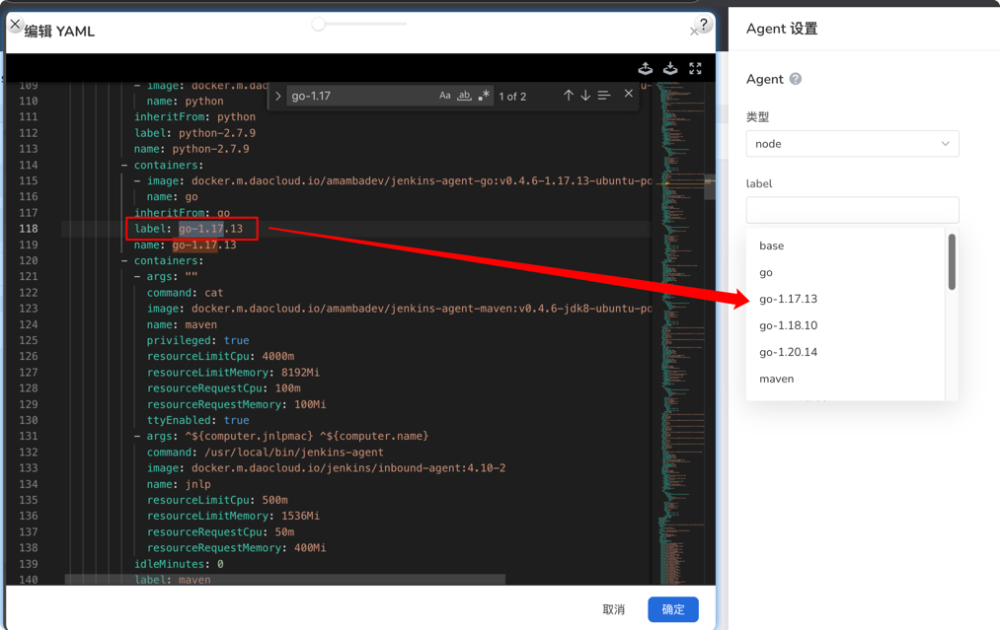

# 迁移Jenkins Agent镜像

> 本文适用 jenkins 版本 v0.4.8 及以上，或者应用工作台 v0.35 及以上，DCE5的安装器 v0.27 及以上

自 Jenkins 升级到 **v0.4.8** 版本以后，我们对 Jenkins 的 chart 进行了精简，避免在安装 DCE5 时因为镜像体积过大导致安装时间过长, 加快了安装速度，同时提升了系统的稳定性。从v0.4.8开始，jenkins的chart分为两个:
- jenkins: 精简版，包含jenkins的核心功能。其中，jenkins agent的镜像仅包含：
  - base
  - nodejs (16.20.2)
  - python (3.8.19)
  - golang (1.22.6)
  - maven (jdk8)
  除此之外，**不再**提供centos系统的镜像
- jenkins-full: 完全版的jenkins，除了上述的镜像外，还包含不同版本的agent镜像，例如python包含3.8.19, 2.7.9, 3.11.9等多个版本的镜像，具体的agent镜像版本请看：[agent版本列表](https://github.com/amamba-io/jenkins-agent/blob/main/version.yaml)

为了保证DCE5升级的兼容性，jenkins升级以后虽然名称不变，但是可选的镜像列表发生了变化（镜像依旧存在于镜像仓库中），需要手动修改下agent镜像的映射关系。

如果您仅使用到了`base`, `golang`, `nodejs`, `maven`, `python`,**不需要**进行以下操作。本文仅适用于使用了非默认agent镜像的用户，如您使用了类似于`go-v1.17.13`这样带版本号的agent，请按照下面👇的步骤进行迁移。

## 迁移步骤

jenkins可用的agent镜像通过configmap进行映射，修改步骤如下：
1. 在DCE5的页面中，点击左上角的 **≡** 打开导航栏，选择 __容器管理__ -> __集群列表__ -> `kpanda-global-cluster`，点击该集群的名称。
2. 在左侧导航栏中选择 __存储和密钥__ -> __配置项__ ，命名空间选择 `amamba-system` 集群，名称搜素 `global-jenkins-casc-config`
3. 进入详情，点击右上角的「编辑yaml」, yaml的路径为 `data -> jenkins.yaml -> jenkins -> clouds -> kubernetes -> templates`
> 如果对应的key不存在，您需要新建一份，格式参考 jenkins 安装的namespace下的配置项：jenkins-casc-config
4. 其中label字段表示的是在 UI 或者 JenkinsFile 中使用的 agent label名称。如：

5. 选择您需要修改的agent label，将 `containers` 字段中的对应的container（例如go, python等）的`image`修改为对应版本的镜像

例如：升级前使用的agent label是：`go-1.17.13`, 对应的镜像为: `https://my-regiestry.com/go-v1.17.13`. 升级之后，configmap中只有label为`go`的template, 您需要将`go`对应的image改为`https://my-regiestry.com/go-v1.17.13`
  ``` yaml
    kind: ConfigMap
    apiVersion: v1
    metadata:
      name: global-jenkins-casc-config
      namespace: amamba-system
    data:
      jenkins.yaml: |
        jenkins:
          clouds:
          - kubernetes:
              templates:
              - containers:
                - args: ""
                  image: amambadev/jenkins-agent-go:v0.4.6-1.17.13-ubuntu-podman  # 修改为对应agent版本的镜像地址
                  name: go                  
                - args: ^${computer.jnlpmac} ^${computer.name}
                  image: docker.m.daocloud.io/jenkins/inbound-agent:4.10-2        # jnlp的配置不需要改动
                  name: jnlp
                label: go   # 对应的label
                name: go
  ```


