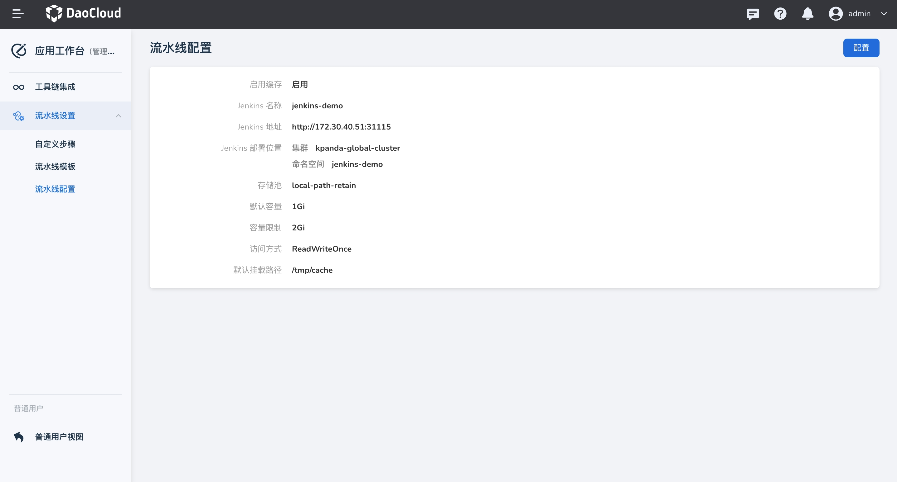

---
hide:
  - toc
---

# 流水线缓存

应用工作台 v0.32.0 版本支持了 Jenkins 流水线的缓存功能，其中需要为流水线配置 SC、PVC 等资源，所以需要工作台管理员启用流水线后才可进行使用。

## 管理员启用流水线缓存

1. 前往 应用工作台 -> 工作台管理 -> 流水线设置 -> 流水线配置。

2. 点击 `前往配置` 启用流水线缓存。

    

3. 填写相关参数，目的是为平台流水线配置好后端存储类，以方便后续创建 PVC 资源。

    - Jenkins 名称：默认读取当前平台集成的 Jenkins 实例名称
    - Jenkins 地址：默认读取当前平台集成的 Jenkins 实例地址
    - Jenkins 部署位置：默认读取当前平台集成的 Jenkins 实例部署位置，如果未设置部署位置，无法启用流水线缓存
    - 存储池：选择 Jenkins 所在集群提供的存储类
    - 默认容量：在流水线中配置缓存时默认的容量值
    - 容量限制：在流水线中配置缓存时可设置的最大容量值
    - 访问方式：支持 ReadWriteOnce、ReadWriteMany、ReadOnlyMany、ReadWriteOncePod
    - 默认挂载路径：在流水线中配置缓存时数据卷挂载到目录的默认值。

    

4. 完成配置后，前往流水线为单条流水线启用缓存。

    

## 流水线启用缓存能力

1. 在 应用工作台 -> 流水线 页面，选择某一条流水线，点击流水线的名称。

2. 流水线详情界面，在右上角点击`编辑流水线` ，进入图形化编辑页面，点击 `缓存配置`。

    

3. 为当前流水线开启缓存能力，并配置相关参数.

    - 访问方式：支持 ReadWriteOnce、ReadWriteMany、ReadOnlyMany、ReadWriteOncePod
    - 容量：不得高于管理员设置的最大值
    - 缓存目录：挂载路径，将数据卷挂载在容器的某个目录下，用于缓存数据

    

4. 配置成功后，会为当前流水线创建一个 PVC 资源，另外暂时不支持二次更新。

## 流水线使用缓存能力

!!! note

    注意：启用流水线缓存后，需要在 Agent 设置，类型选择 Kubernetes，其他类型暂不支持！

1. 流水线详情界面，在右上角点击`编辑流水线` ，进入图形化编辑页面，点击 `Agent 设置`。

    

2. 类型选择 `Kubernetes`，并且开启`启用缓存`。

    

3. 配置好 Agent 的容器镜像后，即可在流水线中使用缓存能力。

    

## 缓存示例

如下是通过开启缓存后，使用 go 语言非首次触发流水线进行构建时，会利用在容器挂载的缓存目录下的缓存：

```groovy

pipeline {
  agent {
    kubernetes {
      defaultContainer 'base'
      yaml '''apiVersion: v1
kind: Pod
spec:
  containers:
    - name: builder
      image: docker.m.daocloud.io/library/golang:1.22.3
      resources:
        requests:
          cpu: \'0.5\'
          memory: 512Mi
        limits:
          cpu: \'1\'
          memory: 1Gi
      volumeMounts:
        - name: agent-cache-1730346511327
          mountPath: /var/lib/containers
          subPath: container
        - name: agent-cache-1730346511327
          mountPath: /go/pkg
          subPath: gocache
      tty: true
      env:
        - name: GOPROXY
          value: https://goproxy.cn,direct
        - name: GO111MODULE
          value: on
  volumes:
    - name: agent-cache-1730346511327
      persistentVolumeClaim:
        claimName: agent-cache
metadata:
  annotations:
    amamba.io/enable-cache: \'true\'
'''
      inheritFrom 'base'
    }
  }
  stages {
    stage('clone') {
      steps {
        container('base') {
          git(branch: 'main', url: 'https://github.com/amamba-io/amamba-examples.git', credentialsId: '', changelog: true, poll: true)
        }
      }
    }
    stage('build') {
      steps {
        container('builder') {
          sh '''cd guestbook-go/pkg
go mod vendor
CGO_ENABLED=0 GOOS=linux go build -buildvcs=false -o main .'''
        }
      }
    }
  }
}

```
