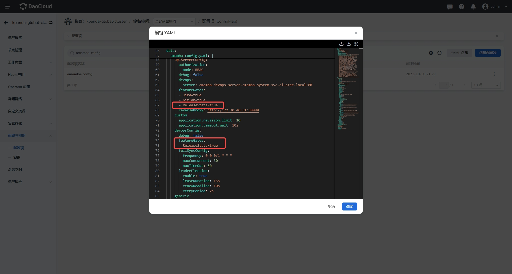
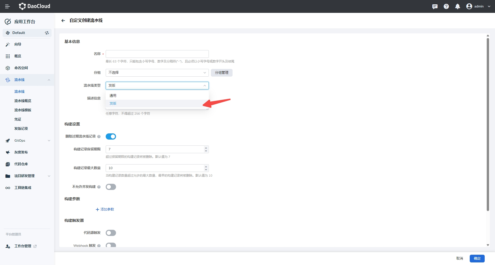
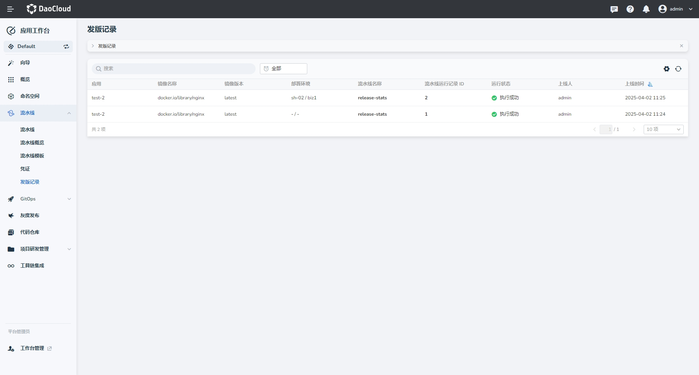

# 发版记录

> 此功能从v0.36版本开始支持

## 功能介绍

发版记录（ReleaseStats）功能用于展示流水线中 **发版** 类型流水线的执行情况，帮助用户更直观地了解版本发布历史和状态。

## 开启发版记录功能

默认情况下，发版记录功能是关闭的。您可以通过修改配置文件来开启该功能。

### 1. 修改配置文件

1. 在 **容器管理** 中，选择[全局服务集群](../../../kpanda/user-guide/clusters/cluster-role.md#_2)，在 **配置项** 中搜索 `amamba-config`。

    

2. 点击 **编辑 YAML** ，在 apiServerConfig 和 devopsConfig 的 `featureGates` 增加 `ReleaseStats=true`。

    ```yaml
    amamba-config.yaml: |
      apiServerConfig:
        featureGates:
        - ReleaseStats=true
      devopsConfig:
        featureGates:
        - ReleaseStats=true
    ```

    

3. 修改成功后，在无状态负载中搜索 `amamba-apiserver` 和 `amamba-devops-server`，点击 **重启**。

    

### 2. 确认功能开启

重启成功后，进入 **应用工作台**，在相关页面中即可看到发版功能。

## 使用发版记录功能

1. 创建流水线

    选择流水线类型为 `发版`，

    


2. 编辑并执行流水线

    由于我们通过 **环境变量** 和 **运行参数** 的方式来识别业务相关的信息，所以流水线中需要包含以下的关键字（不区分大小写，同时包含时以运行参数的信息为准）:

    - `application`：应用名称
    - `image`：镜像名称和版本
    - `cluster`：集群名称
    - `namespace`：命名空间名称

    更新jenkinsfile如下：

    ```groovy
    pipeline {
      agent {
        node {
          label 'base'
        }
      }
      parameters {
        choice(name: 'cluster', choices: ['sh-02', 'eu-01'], description: '')
        choice(name: 'namespace', choices: ['biz1', 'biz2'],, description: '')
      }
      
      stages {
        stage('Stage-RnIJL') {
          steps {
            container('base') {
              echo "123"
            }

          }
        }
      }
      environment {
        application = 'test-2'
        image = 'docker.io/library/nginx:latest'
      }
    }
    ```

    执行流水线。

3. 查看发版记录

    在左侧导航栏中，选择 **发版记录**。在列表页面，系统将展示当前流水线相关的所有版本发布情况。

    

