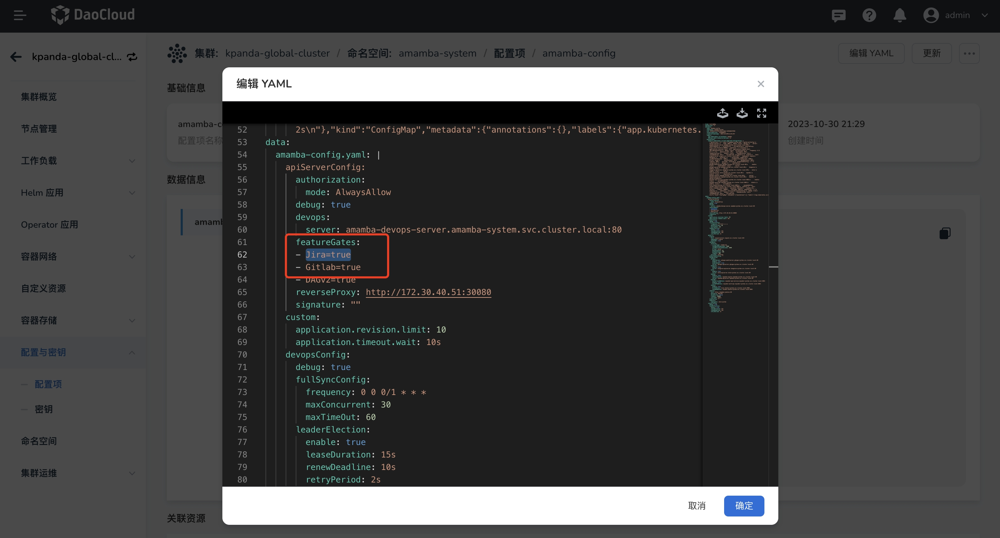

# 查看缺陷

查看 Jira 实例中项目内的缺陷信息。

## 开启项目管理导航菜单

默认部署 DCE 5.0 应用工作台后，项目管理在导航栏中是被隐藏的，您可以通过修改配置文件来开启该能力。

1. 在 __容器管理__ 中，选择[全局服务集群](../../../kpanda/user-guide/clusters/cluster-role.md#_2)，
   在 __配置项__ 中搜索 `amamba-config`

    

2. 点击 __编辑 YAML__ ，修改 `featureGates` 中 `Jira=true`

    

3. 修改成功后，无状态负载中搜索 amamba-apiserver ，点击 __重启__

    

4. 重启成功后，前往 __应用工作台__ 即可看到项目管理导航菜单

## 前提条件

- 在当前应用工作台已经成功集成一个 Jira 实例，参考[集成工具链](../tools/integrated-toolchain.md)。

- 将集成的 Jira 实例下的项目分配到当前工作空间内，参考[管理工具链实例](../tools/toolchain-instances.md)

## 操作步骤

1. 在应用工作台选择一个工作空间，进入 __项目研发管理__ -> __缺陷__ 页面。

2. 在缺陷页面查看 Jira 项目下的 Issues 信息，一个工作空间可以绑定多个已集成的 Jira 实例下的项目。

    

3. 支持通过状态、优先级、类型、创建人、指派人来进行筛选 Issues。

    
