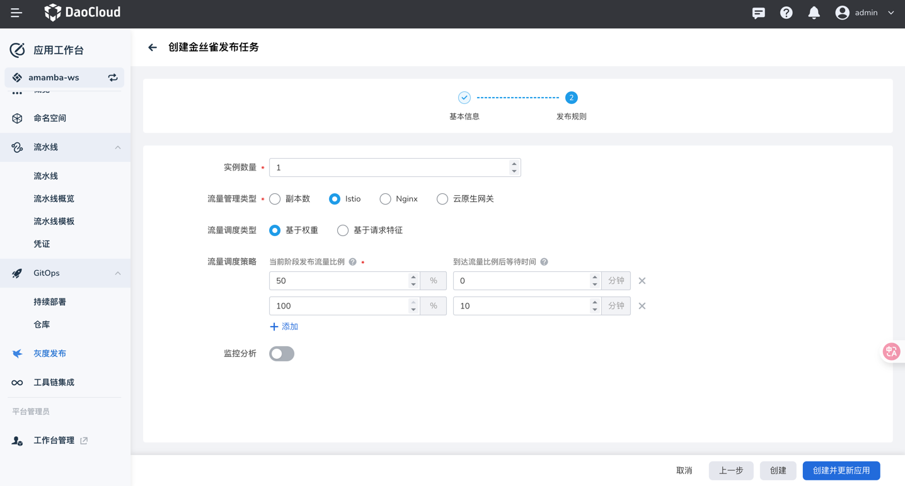
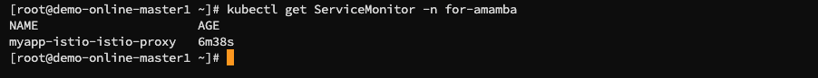

# 金丝雀发布示例操作

本节介绍 基于不同流量管理类型 进行金丝雀发布的全流程示例操作

# 金丝雀发布 - 基于Istio

## 前置操作

### 准备应用

可通过【应用工作台】-【向导】中的「基于Git仓构建」和「基于容器镜像」创建，最后一步高级配置页开启 **启用网格**


开启 **启用网格** 的应用创建后，会自动创建 同名 `VirtualService` 和 `DestinationRule`


具体 YAML 如下：

```yaml
# VirtualService
apiVersion: networking.istio.io/v1
kind: VirtualService
metadata:
  labels:
    app.kubernetes.io/part-of: myapp-istio
  name: myapp-istio
  namespace: for-amamba
...
spec:
  hosts:
    - myapp-istio
  http:
    - name: primary
      route:
        - destination:
            host: myapp-istio
            subset: stable
          weight: 100
        - destination:
            host: myapp-istio
            subset: canary
```

```yaml
# DestinationRule
apiVersion: networking.istio.io/v1
kind: DestinationRule
metadata:
  labels:
    app.kubernetes.io/part-of: myapp-istio
  name: myapp-istio
  namespace: for-amamba
...
spec:
  host: myapp-istio
  subsets:
    - labels:
        app: myapp-istio
      name: stable
    - labels:
        app: myapp-istio
      name: canary
```

### 准备 Gateway
手动下发以下 yaml，创建 Gateway
```yaml
# Gateway
apiVersion: networking.istio.io/v1
kind: Gateway
metadata:
  name: myapp-istio # 自定义的网关名称
  namespace: for-amamba # 部署应用所在的命名空间
spec:
  selector:
    istio: ingressgateway # istio的默认网关
  servers:
    - hosts:
        - '*'
      port:
        name: http
        number: 8081 # 部署应用的服务中的服务端口，即Service中的port，需要与之保持一致
        protocol: HTTP
```


### 准备 VirtualService

因为已自动创建同名 `VirtualService` ，所以更新该 `VirtualService` 的2个字段即可： `spec.gateways` 和 `spec.hosts` 。需要注意的是，如果是其他模式创建的应用，需要按照「准备应用」中的 YAML 手动再去创建 `VirtualService` 和 `DestinationRule`

```yaml
spec:
  gateways:
  - myapp-istio # 准备的自定义Gateway名称
  hosts:
  - '*' # 原来为部署应用的名称，需要更新为 '*'
  http:
  - name: primary
    route:
    - destination:
        host: myapp-istio
        subset: stable
      weight: 100
    - destination:
        host: myapp-istio
        subset: canary
```

### 配置 istio-ingressgateway 网关

```shell
kubectl edit svc istio-ingressgateway -n istio-system

# 在 spec.ports 中增加如下字段
  - name: myapp-istio # 任意名称
    port: 18081      # 任意端口，不要与istio-ingressgateway中其他端口冲突
    protocol: TCP    # 部署应用的 protocol
    targetPort: 8081 # 部署应用的 port
```

### 验证可通过 istio-ingressgateway 访问应用

更新完成后，执行命令 `curl ${node_ip}:${istio-ingressgateway中新增加port对应的nodePort}` 校验是否可以通过 `istio-ingressgateway` 访问到该部署应用


## 基于权重

创建发布任务 - 金丝雀发布，选择流量管理类型为Istio，流量调度类型为「基于权重」



在灰度发布过程中，访问 `${node_ip}:${istio-ingressgateway中新增加port对应的nodePort}`

## 基于请求特征

创建发布任务 - 金丝雀发布，选择流量管理类型为Istio，流量调度类型为「基于请求特征」


在灰度发布过程中，访问 `${node_ip}:${istio-ingressgateway中新增加port对应的nodePort}`。需要注意的是，增加 满足流量调度策略 的请求头情况下访问，可访问到新版本，不满足则访问到原版本。
```shell
curl -H 'pre-key:pre-value'  10.6.14.20:31406  
curl -H 'pre-key:test'  10.6.14.20:31406       
curl -H 'reg-key:reg-value'  10.6.14.20:31406  
curl -H 'reg-key:test'  10.6.14.20:31406       
curl -H 'key:value'  10.6.14.20:31406          
curl -H 'key:test'  10.6.14.20:31406           
```


## 开启监控分析

⚠️ 开启监控分析后，`argo-rollouts` 会持续地按照 `AnalysisRun` 里的指标来计算当前发布的成功率/失败率，如果一直没有请求该指标计算出来的结果也会出错，导致发布回滚。所以需要在发布过程中保证有请求在持续不断地访问服务。


开启监控分析的情况下，会自动创建 `ServiceMonitor`



在执行灰度发布过程后，会自动创建 `AnalysisRun`。在灰度发布过程中，应用的调用记录由可观测模块采集，由 `AnalysisRun` 根据表达式计算是否满足条件，表达式如下：


在「可观测性」-「指标」-「高级查询」，输入以上表达式可查询对应的指标情况。`destination_service` 为对应灰度发布的服务 


监控分析成功则会展示如下：


# 金丝雀发布 - 基于Nginx

## 前置操作

### 安装 ingress-nginx

首先需要在当前集群安装 `ingress-nginx`


当前使用NodePort的类型。需要注意的是，如果 Type 选择 `LoadBalancer` ，则需要当前集群安装 `metallb`


### 准备应用

可通过【应用工作台】-【向导】中的「基于Git仓构建」和「基于容器镜像」创建。


### 应用创建路由


创建完成后，访问 ingress-nginx 80端口对应的 NodePort ，正常返回即可


## 基于Nginx


更新镜像版本为 v2 后，访问 ingress-nginx 80端口对应的 NodePort 

```shell
i=0; while true; do curl www.test-myapp.com:30828; i=$((i+1));echo ${i}; sleep 1; done
```

在发布后，v1 和 v2 的比例大致分别占 50%，在手动继续发布后，流量均流向 v2 版本


继续发布后等待10分钟，则发布完成


