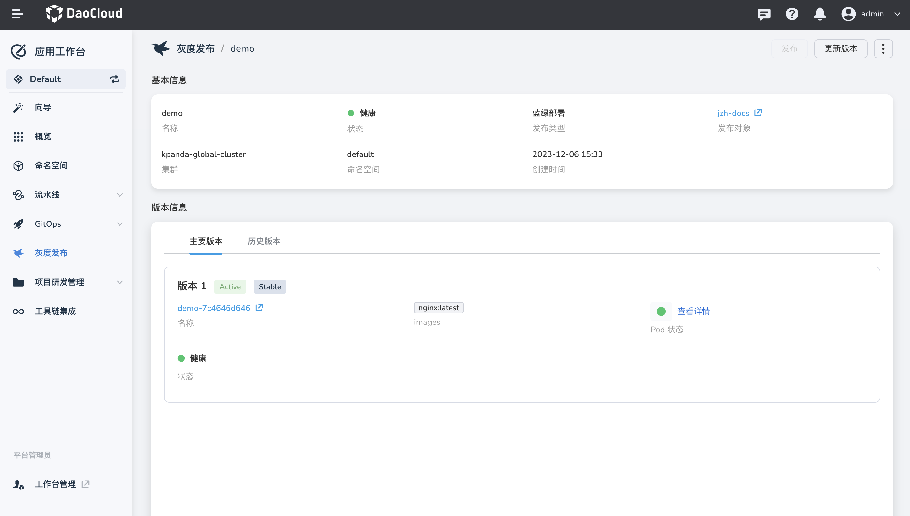
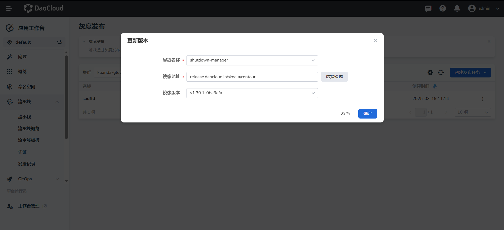
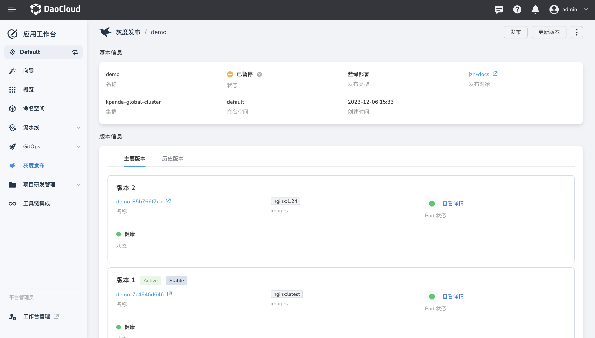
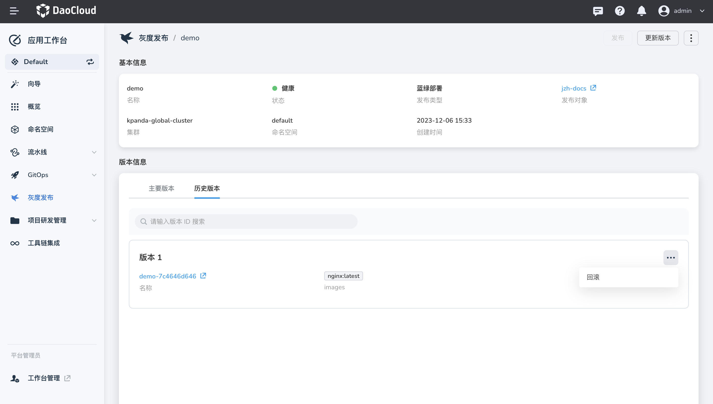

# 查看蓝绿发布任务

本文主要介绍查看蓝绿发布任务，及相关操作。

## 查看任务详情

1. 进入 __应用工作台__ 模块，在左侧导航栏点击 __灰度发布__ ，点击目标任务的名称。

    

2. 查看蓝绿发布任务详情页面。

    - __基本信息__ 区域：查看任务的名称、状态、发布类型、发布对象（点击会跳转到容器管理查看发布对象更详细的信息）等信息。

    - __版本信息__ 区域：

        - 主要版本：展示蓝/绿两个版本信息，其中带有 Active、Stable 标签代表当前接收流量的版本。
        - 历史版本：展示历史版本记录。

          

## 更新版本

1. 点击目标任务的名称，然后在右上角点击 __更新版本__ 。

2. 设置金丝雀发布的镜像。

    

3. 应用更新成功后会在主要版本中存在两个版本的信息，并且此时蓝绿发布任务的状态为「暂停中」 。

    

## 发布/终止发布

对于蓝绿发布任务状态为「暂停中」时可以对其进行 发布、终止发布的操作。

- 发布：点击后，会将新版本作为接收流量，并会删除旧版本。

- 终止发布：点击后终止当前蓝绿发布任务，并删除新版本。

## 回滚

支持查看以往发布过的历史版本，可以一键回滚到之前的某个版本。

1. 在 __灰度发布任务__ 详情页面，点击 __历史版本__ 标签。

2. 选择目标版本，点击 __回滚__ 。

    

3. 回滚成功后会触发一次新的蓝绿发布过程，并且蓝绿发布任务的状态为「暂停中」。
